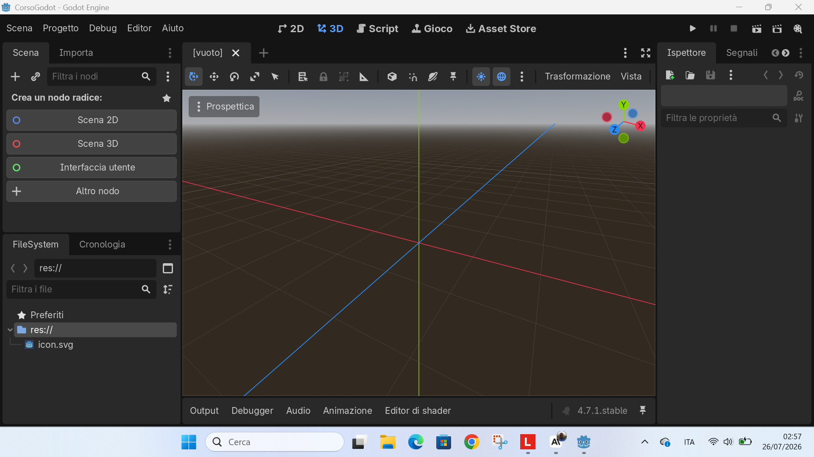
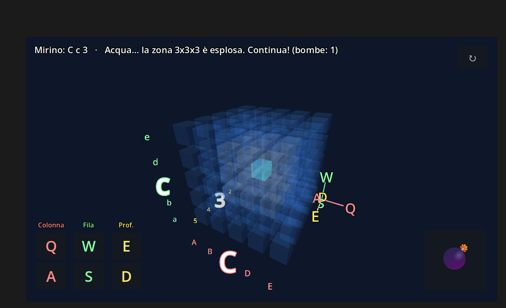
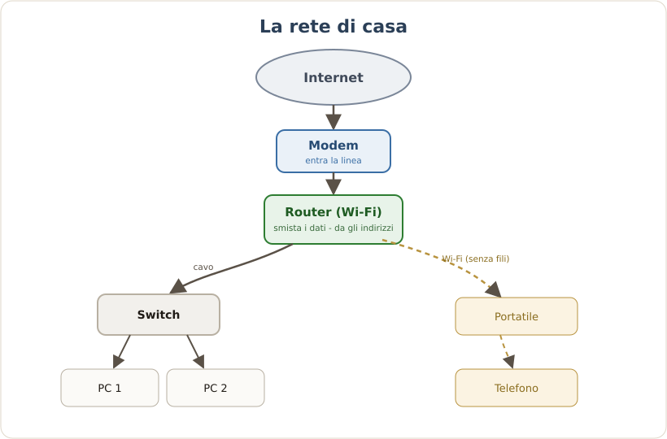
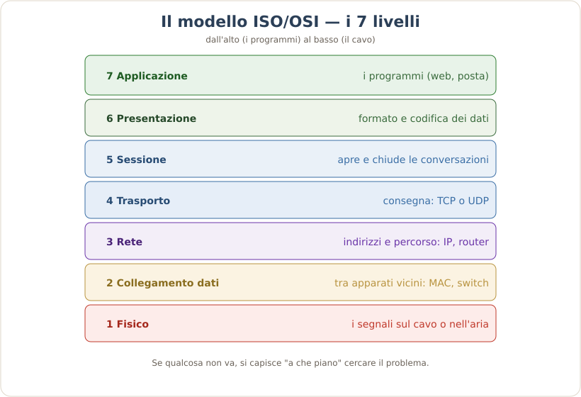
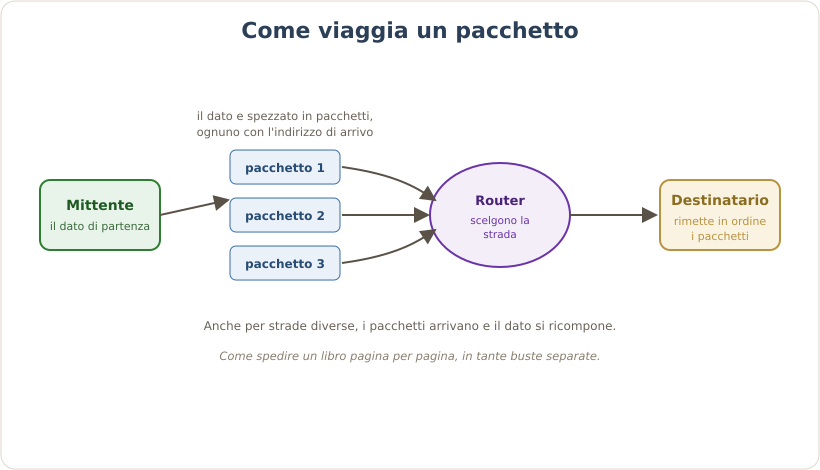

# Il Libro del Corso

**Versione 1.53** — 18/08/2026
*Corso di Informatica — tutti i documenti in uno. Fonte unica generata automaticamente da `classe-1/_build/assembla_libro.py`: **non modificare a mano**, si rigenera dai singoli documenti.*

---

# Stato del Corso {#doc1}
*Versione 2.2 · 18/08/2026 · Parte: Riferimento*

## 1. Missione {#doc1-sec1}
1. Corso di informatica pluriennale (classi 1-4) di istituto professionale, indirizzo Operatore Informatico; taglio pratico e tecnico.
2. Studenti spesso in situazione di svantaggio: si lavora con dignita e qualita, per aprire sbocchi lavorativi migliori. Qui non sono scarti: si da loro una cosa fatta bene.
3. Motore del coinvolgimento: "Vinci subito, Fallo tuo, Mostralo". L'errore non fa vergogna; si celebra ogni piccola vittoria.
4. La prova del nove: se lo sanno spiegare a voce con parole loro, la competenza c'e davvero.

## 2. Decisioni confermate (vincolanti) {#doc1-sec2}
1. Ogni documento esiste in due forme: MD (sorgente versionata) e PDF (consegnabile), con il numero di versione nel nome del file.
2. Tutti i documenti seguono lo standard unico di formattazione (vedi Regole di Formattazione): liste numerate, niente emoji, box colorati, tutto cio da copiare in blocchi di codice.
3. Con gli studenti tutto e visuale (browser e GitHub Desktop): mai la riga di comando. A scuola niente installazioni: si predilige browser e software portable.
4. Carta e penna in OGNI lezione (tassativo): appunti e schemi a mano, sempre; se un allievo non li ha, il docente glieli fornisce e segna una nota. Confluiscono nel quaderno personale.
5. Git a due fasi: Fase 1 (in 1a) esercizi separati con un commit ciascuno nel proprio repository; Fase 2 (3a-4a) progetto di gruppo che evolve con ramo, Pull Request e release.
6. Repository degli allievi: un'organizzazione GitHub della classe con un repository PRIVATO per ogni allievo, creati con GitHub Classroom (ognuno vede solo il suo; il docente vede tutti).
7. Ogni studente costruisce il PROPRIO libro di testo/quaderno, che cresce a ogni lezione, con l'aiuto dell'AI (aiuta a capire, non a saltare il pensiero).
8. Per questo progetto la fonte di verita e Nicola: nessun ruolo di soggetti esterni (Guido non c'entra: riguarda un'altra cosa, non il corso).
9. Strumento SQL: SQLite. A scuola dal browser su sqliteonline.com (primo assaggio su w3schools Tryit SQL); sui PC nostri DB Browser for SQLite in versione portable. Il database e un solo file, versionabile in Git.
10. Strumento AI: Gemini gratuito, l'unico disponibile sull'account scolastico (niente Claude a scuola). Copre tutto il percorso AI, compreso il quaderno personale.
11. Godot in 3a e 4a; cablaggio RJ45 e prime reti in 3a e 4a.

## 3. Impianto pluriennale (Mappa, Griglia, Piano ore, Programmi) {#doc1-sec3}
1. Mappa degli Argomenti: le macro-aree del corso, con indicazione di "di chi e" ciascuna area (alcune sono di altri docenti).
2. Griglia degli Argomenti (completa, 12 capitoli): ogni argomento ha le spunte 1a/2a/3a/4a e una colonna "Comp." con l'area di competenza dell'Allegato A che tocca.
3. Piano delle Ore di Lezione: l'albero macro-area -> sotto-argomento -> singola ora, guida giorno per giorno.
4. Programmi dei quattro anni: allineati alla Griglia; Classe 1 la piu sviluppata, Classi 2-3-4 avviate.
5. Corso Godot dedicato (manuale + eserciziario): e un documento ORGANICO, quasi un libro di testo, che Nicola usa e fa crescere man mano che gli studenti lavorano su Godot; puo spalmarsi su 2-3 anni. Per questo se ne tiene lo storico delle versioni (come per un libro che cresce). Il suo dettaglio e stato portato negli argomenti della Griglia (capitolo 8), collocati in 3a e 4a.

## 4. Allegato A e consegna alla Regione (workflow) {#doc1-sec4}
1. L'Allegato A NON e una "Bibbia" fissa: e il programma effettivamente svolto per una classe specifica (la storia reale degli argomenti). Cambia ogni anno e si modifica quando si fanno cose nuove o le si sposta di anno.
2. Ogni Allegato A e identificato da CLASSE e ANNO scolastico. I programmi svolti che generiamo stanno in `programma-svolto/<anno>/<classe>/` con nome `allegato-a_<classe>_<anno>`.
3. Fonte del "cosa e stato svolto": l'esportazione del registro (Excel) per classe. Claude legge le voci e le colloca nella competenza e annualita giuste (la colonna "Comp." della Griglia fa da ponte).
4. A fine anno si genera il programma svolto per area di competenza e per annualita, pronto da consegnare alla Regione.

## 5. Progetti pratici {#doc1-sec5}
1. "Il Mio Negozio Online" (e-commerce): vetrina su GitHub Pages, database su Supabase, ordini via FormSubmit. Progetto pilota completato e testato; cresce dalla 2a alla 4a.
2. Giochi con Godot: dai semplici al "progetto boss" (anno da decidere).
3. Cablaggio RJ45 e reti; in 4a il progetto forte: la rete di una scuola in Cisco Packet Tracer (VLAN, simulazione).

## 6. Punti aperti (da decidere/confermare con Nicola) {#doc1-sec6}
1. Affinare la colonna competenze della Griglia dove serve, argomento per argomento.
2. (Le scelte su Godot 3a-4a, cablaggio 3a-4a, strumento SQL = SQLite e strumento AI = Gemini sono CONFERMATE: vedi sezione 2.)

## 7. Ruolo di questo documento {#doc1-sec7}
1. E la stella polare: in caso di contraddizione, vince questo, e nel documento in errore si apre un box rosso di disallineamento.
2. Si aggiorna quando cambiano le decisioni; le versioni gia stampate restano congelate.
3. Ogni volta che si produce o aggiorna un documento, si rigenera il libro complessivo e si alza la sua versione: tutto resta versionato e "tutto dentro".


# Glossario {#doc2}
*Versione 1.0 · 16/08/2026 · Parte: Riferimento*

## 1. Documenti e versioni {#doc2-sec1}
1. MD (Markdown: testo formattato semplice): il formato sorgente dei documenti.
2. PDF (Portable Document Format): il documento finito, pronto da leggere o stampare.
3. Versione: il numero che identifica uno stato del documento (per esempio v1.0); una volta stampata, si congela.

## 2. Git e GitHub {#doc2-sec2}
1. Git: sistema di versionamento, tiene la storia di tutte le modifiche.
2. Repository (o repo): la cartella-progetto su GitHub, con dentro tutta la storia.
3. Commit: salvare una versione del lavoro con un messaggio che la descrive.
4. Push: mandare i commit dal proprio computer a GitHub (il cloud).
5. Pull e Fetch: scaricare da GitHub gli aggiornamenti sul proprio computer.
6. Branch (ramo): una linea di lavoro separata, per non toccare quella principale.
7. Pull Request (PR: richiesta di unione): la proposta di unire un ramo, con revisione.
8. Release: una versione congelata e stabile, contrassegnata da un'etichetta (tag).
9. GitHub Desktop: il programma visuale per usare Git senza riga di comando.
10. GitHub Pages: pubblica gratis una pagina web direttamente dal repository.

## 3. Il negozio online {#doc2-sec3}
1. Database: un magazzino ordinato di dati (per esempio l'elenco dei prodotti).
2. Supabase: un database in cloud gratuito, usato come magazzino della classe.
3. SQL (Structured Query Language): il linguaggio per parlare con il database.
4. FormSubmit: servizio gratuito che invia per email i dati inseriti in un form.
5. HTML (HyperText Markup Language): la struttura di una pagina web.
6. CSS (Cascading Style Sheets): l'aspetto grafico di una pagina web.
7. JavaScript: la logica e l'interattivita di una pagina web.

## 4. Godot {#doc2-sec4}
1. Godot: il motore gratuito per creare videogiochi.
2. GDScript: il linguaggio di programmazione di Godot, in stile Python.
3. Scena e nodi: il modo in cui in Godot si costruisce cio che si vede e si usa.


# Regole di Formattazione {#doc3}
*Versione 1.3 · 16/08/2026 · Parte: Riferimento*

## 1. Formati e consegna {#doc3-sec1}
1. Ogni documento esiste sempre in due forme: MD (sorgente) e PDF (generato).
2. Consegna doppia: un PDF combinato (la "super-guida", stampa unica) e uno zip con i singoli numerati.
3. Il combinato si genera con un solo comando; ogni nuovo documento entra automaticamente (auto-append), oltre a quelli elencati nel MANIFEST (elenco ordinato dei documenti).

## 2. Titoli {#doc3-sec2}
1. Numero d'ordine nel titolo e nel nome del file (00, 01, 02, 02b, ...).
2. Nella numerazione niente trattino: "02 Panoramica", non "02 - Panoramica".
3. Titoli mai orfani: un titolo sta sulla stessa pagina dell'inizio del suo contenuto o della sua tabella, mai in fondo con il contenuto nella pagina dopo.

## 3. Indice e navigazione {#doc3-sec3}
1. INDICE: la guida di lettura (elenco dei documenti con una riga di descrizione).
2. La super-guida ha due indici:
   1. un Sommario stampato in testa (documento, poi numero di pagina);
   2. i segnalibri PDF cliccabili nella barra laterale.
3. Entrambi si rigenerano da soli a ogni build.

## 4. Liste {#doc3-sec4}
1. Liste solo numerate e gerarchiche (1, 1.1, 1.1.2). Niente elenchi puntati.

## 5. Caratteri e simboli decorativi {#doc3-sec5}
1. Font unico: DejaVu. La numerazione delle sezioni e automatica.
2. Pochi o nessun simbolo decorativo (emoji) nei documenti. Il generatore li converte in testo (per esempio [CRITICO], [OK], [ATTENZIONE]) o li rimuove: usarli come decorazione sporca il PDF.
3. Per evidenziare si usano i box colorati semantici della legenda (punto 8), non i simboli decorativi.

## 6. Sigle e acronimi {#doc3-sec6}
1. Ogni sigla con la forma esplicita tra parentesi alla prima occorrenza: "VPS (Virtual Private Server: server privato virtuale)".
2. I termini ricorrenti stanno nel GLOSSARIO (documento 01).

## 7. Punteggiatura {#doc3-sec7}
1. Numerazione senza trattino (vedi 2.2).
2. Termine piu spiegazione: due punti ("Git: sistema di versionamento").
3. Inciso a meta frase: virgole se leggero; parentesi se accessorio; trattino lungo solo per uno stacco forte voluto.
4. Notazione numerica italiana (virgola decimale, punto per le migliaia); date DD/MM/YYYY nel testo, YYYY-MM-DD nei dati e nel database.

## 8. Box colorati (legenda canonica) {#doc3-sec8}
1. Rosso, DISALLINEAMENTO: qualcosa che stride con la realta o con la fonte di verita (errore noto da correggere).
2. Blu, DA CONFERMARE o IN ATTESA: direzione verso cui si converge ma non ancora ufficiale (di norma una decisione di Nicola non ancora confermata); quando arriva la conferma, sparisce.
3. Giallo, NOTA: semplice nota esplicativa, non segnala problemi.

Esempi (come appaiono nel PDF):

> [ROSSO] Questo documento dice X, ma il documento 00 dice Y: va corretto.

> [BLU] Direzione probabile in attesa di conferma di Nicola.

> [GIALLO] Promemoria utile, senza alcun problema da risolvere.

Nel sorgente si scrivono come una citazione che inizia con l'etichetta tra
parentesi quadre: `> [ROSSO] ...`, `> [BLU] ...`, `> [GIALLO] ...`.

## 9. Versioning {#doc3-sec9}
1. Una versione stampata e congelata: da li non si tocca piu.
2. Correzioni e aggiunte vanno nella versione successiva, registrate nel CHANGELOG_Vn; ogni versione stampata ha un ERRATA_Vn in coda al combinato.
3. Ogni documento porta la sua versione (un documento nuovo parte da v1.0); la super-guida ha la versione della raccolta.

## 10. Fonte di verita {#doc3-sec10}
1. Il documento 00 (la fonte di verita del corso, decisa da Nicola) e la stella polare: se un documento lo contraddice, vince il documento 00 (e si apre un box rosso).
2. I documenti gia decisi non si riscrivono: si recepiscono.

## 11. Regola per la comunicazione all'utente (chat e guide) {#doc3-sec11}
1. REGOLA 0 (assoluta): tutto cio che l'utente deve copiare (comandi, URL, email, valori) va in un blocco di codice (col bottone "copia"), mai in linea ne in citazione.

---

## Note di adozione (specifiche del corso) {#doc3-sec12}
1. Questo standard e vincolante per ogni nuovo documento del corso.
2. I documenti gia esistenti si migrano allo standard in modo graduale (vedi il piano di migrazione concordato), non tutti in una volta, per non introdurre errori.
3. Le parti che nello standard originale citavano soggetti esterni sono adattate: per questo progetto la fonte di verita e Nicola.


# Struttura del Repository {#doc4}
*Versione 1.2 · 18/08/2026 · Parte: Riferimento*

## 1. A cosa serve {#doc4-sec1}
1. Mostra come sono organizzati i file del corso su GitHub.
2. Distingue cio che esiste gia da cio che e previsto, cosi si conosce in anticipo l'albero finale.
3. Convenzione: le voci con "(previsto)" non esistono ancora; sono la meta verso cui si va.

## 2. Albero attuale {#doc4-sec2}

```
corso-godot/
├── 00-STATO-DEL-CORSO.md  (+ .pdf)     documento 00: fonte di verita
├── 01-GLOSSARIO.md  (+ .pdf)           documento 01: glossario
├── REGOLE-FORMATTAZIONE.md  (+ .pdf)   standard di formattazione
├── STRUTTURA-REPOSITORY.md  (+ .pdf)   questa mappa
├── MAPPA-ARGOMENTI.md  (+ .pdf)        macro-aree (di chi e ciascuna)
├── GRIGLIA-ARGOMENTI.md  (+ .pdf)      argomenti x anno + colonna competenze
├── PIANO-ORE-LEZIONE.md  (+ .pdf)      guida ora per ora (4 anni)
├── ORGANIZZAZIONE-GIT-ALLIEVI.md (+pdf) repository per allievo (Classroom)
├── REGOLE-LABORATORIO.md  (+ .pdf)     regole del laboratorio
├── CORSO-INFORMATICA.md  (+ .pdf)      indice generale
├── LIBRO-COMPLETO.md  (+ .pdf)         il libro unico (generato)
├── CLAUDE.md                           istruzioni interne (assistente)
├── README.md                           panoramica del repository
│
├── programmi-ufficiali/                Allegato A ufficiale (4 PDF) + nota
├── programma-svolto/                   programmi svolti per <anno>/<classe> (Regione)
│
├── classe-1/                           CORSO CLASSE 1 (completo)
│   ├── programma.md  (+ .pdf)          mappa dell'anno
│   ├── bussola-mondo-del-lavoro.md     mondo del lavoro (tre cassetti)
│   ├── da-far-fare-assolutamente.md    gli irrinunciabili
│   ├── MATERIALE-PRONTO.md  (+ .pdf)   indice del materiale di Classe 1
│   ├── negozio-online/                 progetto "Il Mio Negozio Online"
│   │   ├── GUIDA-RAGAZZI.md  (+ .pdf)  guida a 4 tappe (ragazzi)
│   │   ├── PIANO-LEZIONE.md  (+ .pdf)  regia delle lezioni (docente)
│   │   ├── modello-negozio.html        file di partenza dei ragazzi
│   │   ├── index.html · prodotti.sql   esempio completo + database
│   │   └── immagini/                   schemi + screenshot della guida
│   ├── negozio-esempio/index.html      seconda versione di esempio
│   └── _build/                         generatore dei PDF del corso
│
├── classe-2/programma.md  (+ .pdf)     programma Classe 2 (v0.2)
├── classe-3/                           programma + reti-teoria + esercizi
│   ├── programma.md  (+ .pdf)          programma Classe 3 (v0.2)
│   ├── reti-teoria.md  (+ .pdf)        teoria delle reti (con schemi SVG)
│   └── esercizi/01-cablaggio-rj45.md   scheda cablaggio a 4 livelli
├── classe-4/programma.md  (+ .pdf)     programma Classe 4 (v0.2)
│
├── manuale/                            CORSO GODOT (2a/3a)
│   ├── manuale.md  (+ .pdf)            libro di testo di Godot
│   ├── eserciziario.md  (+ .pdf)       esercizi a 4 livelli
│   ├── quaderno-studente-TEMPLATE.md   quaderno personale dei ragazzi
│   ├── immagini/                       screenshot del manuale
│   └── _build/                         generatore PDF del manuale
│
├── esercizi/                           esercizi Godot (in crescita)
├── acchiappa-le-stelle/                gioco di esempio
├── chirurgo-pasticcione/               gioco di esempio
├── battaglia-navale-3d/                gioco di esempio (3D)
├── docs/                               versione giocabile nel browser (export web)
└── materiale-da-organizzare/           esami del triennio (grezzi, da trascrivere)
```

## 3. Albero obiettivo (dove vogliamo arrivare) {#doc4-sec3}

Rispetto ad oggi si aggiungono le cartelle per anno e la sistemazione del
materiale del triennio.

```
corso-godot/
├── (documenti di riferimento: 00, 01, regole, struttura, indice, libro)
│
├── classe-1/                           FATTO (corso completo)
│
├── classe-2/                           Godot + GDScript, Lazarus, intro reti
│   ├── programma.md  (avviato v0.1)
│   ├── esercizi/     (previsto)
│   └── progetti/     (previsto)
│
├── classe-3/                           reti e hardware + prove di 3a
│   ├── programma.md  (avviato v0.1)
│   └── prove/        (previsto)        reti / hardware
│
├── classe-4/                           Cisco Packet Tracer avanzato
│   ├── programma.md  (avviato v0.1)
│   └── rete-scolastica/  (previsto)    dorsale a due piani, tre backbone
│
├── manuale/                            corso Godot (condiviso 2a/3a)
├── giochi-esempio/  (previsto)         i giochi raccolti in un'unica cartella
└── materiale-da-organizzare/           si svuota man mano: le prove trascritte
                                        vanno in classe-3/ e classe-4/
```

## 4. Note {#doc4-sec4}

> [BLU] La parte "(previsto)" e la direzione concordata: puo cambiare mentre il corso cresce. Questo documento si aggiorna quando l'albero cambia.

> [GIALLO] Le cartelle `_build/` contengono gli strumenti che generano i PDF: non sono materiale per i ragazzi.


# Mappa degli Argomenti — Macro-aree {#doc5}
*Versione 1.3 · 18/08/2026 · Parte: Riferimento*

> [BLU] Collegamento: la scelta per anno di ciascun argomento e nella Griglia degli Argomenti, che ha anche la colonna "Competenza (Allegato A)". I programmi ufficiali sono in realta l'ALLEGATO A, organizzato per competenze (1-17): per questo un argomento di informatica puo comparire in piu competenze. Vedi la nota in `programmi-ufficiali/`.

## 1. Come si legge questa mappa {#doc5-sec1}
1. Ogni sezione e una macro-area (un contenitore di argomenti affini).
2. Sotto ogni area c'e l'elenco degli argomenti raccolti da tutti gli anni.
3. La riga "Presente in" indica dove l'argomento compare oggi: nei programmi ufficiali (Prima, Seconda, Terza, Quarta) e nel materiale gia nostro (Nostro).
4. Non e un ordine per anno: e un magazzino ordinato da cui scegliere.
5. La riga "Di chi" dice a quale docente appartiene l'area: Regge (Nicola), un collega, oppure trasversale. Le aree di un collega restano qui solo per completezza: NON sono da sviluppare come corso di Nicola.

## 1bis. Di chi e ciascuna area (colpo d'occhio) {#doc5-sec2}

| Macro-area | Di chi |
|---|---|
| Fondamenti e cultura informatica | Regge |
| Hardware: architettura, assemblaggio, manutenzione e diagnosi | Regge (diagnosi in parte Panaccione) |
| Sistema operativo | Regge (finora svolto poco) |
| Produttivita digitale (Google e Office) | Regge: integra tutta la suite (documenti, fogli, presentazioni) |
| Reti | Regge |
| Programmazione, logica e algoritmi | Regge (coding a blocchi e porte logiche in prima: Meles) |
| Database e gestione dei dati | Regge (in quarta SQL non ancora realizzato) |
| Web e realizzazione di siti | Anche Regge: vuole fare HTML5, CSS, Google Sites (sito professionale in terza: Panaccione) |
| Grafica e multimedia | Regge: Canva per le rappresentazioni |
| Robotica, elettronica e making | Collega (Meles): NON di Regge |
| Sicurezza informatica e cittadinanza digitale | Cittadinanza digitale: NON di Regge; sicurezza informatica: da valutare |
| Intelligenza artificiale | Regge (spunti) |
| Mondo del lavoro, project management e documentazione | Regge |
| Sicurezza sul lavoro | Trasversale (non informatica) |
| Progetti pratici del corso | Regge (nostri) |

## 2. Fondamenti e cultura informatica {#doc5-sec3}
1. Che cos'e l'informatica, uso consapevole della tecnologia.
2. Rappresentazione delle informazioni: sistemi di numerazione (binario, decimale, esadecimale), codifica del testo (ASCII, Unicode), bit e byte, unita di misura.
3. Digitalizzazione di immagini e suoni.
4. Storia ed evoluzione dei calcolatori.
5. Glossario informatico (costruito dagli studenti).
6. Organizzazione del lavoro digitale: area logica, cartelle ad albero, gestione del tempo (Google Calendar).

> [GIALLO] Presente in: Prima (forte), Seconda, Quarta. Nostro: Glossario (documento 01).

## 3. Hardware: architettura, assemblaggio, manutenzione e diagnosi {#doc5-sec4}
1. Architettura del PC: modello di Von Neumann, CPU, RAM e ROM, memorie di massa, chipset, scheda madre, periferiche di input e output.
2. Componenti e loro scelta: case, RAM, scheda video, socket e slot, hard disk e SSD.
3. Assemblaggio e smontaggio di un PC.
4. Configuratore PC (scegliere i componenti a budget) e documentazione della configurazione.
5. RAID e partizioni dei dischi.
6. Manutenzione ordinaria e preventiva; tuning del PC.
7. Diagnosi guasti (troubleshooting): metodo e fasi; alimentatore, scheda madre, CPU, RAM, HDD/SSD, video, stampanti, connettivita, raffreddamento.
8. Riparazione: ottenere un PC funzionante da piu PC guasti; scheda di intervento e fatturazione.

> [GIALLO] Presente in: Prima, Seconda, Terza, Quarta. Nostro: modulo hardware nel programma di Classe 1 e Classe 3.

## 4. Sistema operativo {#doc5-sec5}
1. Windows 10 e 11: desktop, finestre, gestione di file e cartelle.
2. Installazione e configurazione del sistema operativo.
3. Concetti di configurazione: componenti, protocolli e servizi di rete, risorse condivise.

> [GIALLO] Presente in: Prima, Seconda, Quarta. Di chi: Regge, ma finora svolto poco (area da rinforzare).

## 5. Produttivita digitale (Google Workspace e Office) {#doc5-sec6}
1. Google Drive: cartelle, sottocartelle, condivisione di file.
2. Google Documenti: formattazione, stili, impostazione pagina, sommario.
3. Google Fogli: formule (somma, media, min, max, se, conta.se), formattazione condizionale, grafici, compiti di realta (preventivo informatico).
4. Google Presentazioni: modelli, temi, immagini, video, presentazioni efficaci.
5. Google Moduli: creazione di sondaggi e form.
6. Gmail: invio e ricezione, contatti, CC/CCN, firma, etichette, inoltro, invio programmato, mail formali.
7. Google Calendar, Classroom, Google Chat.
8. Microsoft Excel (gestione scadenze e calendari) e cenni al pacchetto Office.
9. Ricerca in rete: motori di ricerca, ricerca avanzata, operatori booleani.
10. Diagrammi di flusso (flowchart).

> [GIALLO] Presente in: Prima (base), Seconda (avanzato), Quarta. Di chi: Regge la integra tutta (scrivere documenti, fogli di calcolo, presentazioni), piu Canva per le rappresentazioni. Nostro: usata come strumento in tutti i progetti.

## 6. Reti {#doc5-sec7}
1. Concetti: reti LAN e WAN, cos'e una rete, la rete di casa.
2. Apparecchi: modem, router, switch, hub, access point, repeater/range extender, powerline, VoIP, stampanti di rete.
3. Cablaggio: cavo RJ45, standard T568B, crimpatura, piccola LAN, test e ping.
4. Wireless: WLAN, Wi-Fi 2.4 e 5 GHz, speed test.
5. Indirizzamento e protocolli: indirizzo IP, MAC address, DHCP, DNS, gateway, TCP/IP e porte, dal dominio all'IP.
6. Come viaggiano i dati: pacchetti, rete a pacchetti, GPS.
7. Modelli: ISO/OSI (7 livelli) e TCP/IP (4 livelli).
8. Cisco Packet Tracer: dalle prime reti semplici alla rete di una scuola (piu piani, dorsale, segmentazione, VLAN, router e switch).
9. Sicurezza di rete: firewall, segmentazione, protocolli, rischi in rete.
10. Architettura di rete e figure professionali; cablatura; classi di rete.

> [GIALLO] Presente in: Prima (basi), Seconda, Terza (Cisco intro, TCP/IP), Quarta (avanzato). Nostro: teoria delle reti e scheda cablaggio RJ45 (Classe 3).

## 7. Programmazione, logica e algoritmi {#doc5-sec8}
1. Logica e problem solving: algoritmi (definizione e proprieta), diagrammi a blocchi, strutture di controllo (sequenza, selezione, iterazione).
2. Coding di avvio: programmazione a blocchi (code.org), porte logiche booleane (AND, OR, NOT).
3. Lazarus / Object Pascal: ambiente, Hello World, variabili, funzioni, tipi di file, progetto.
4. Lazarus, componenti dell'interfaccia: RadioButton, RadioGroup, CheckGroup, ComboBox, PageControl.
5. Lazarus, esercizi ed elaborati: calcolatrice, contasecondi, MasterMind, Slide Show, numeri casuali, prodotti notevoli, gestione stringhe e array.
6. Lazarus, grafica e coordinate: finestra e sistema di coordinate, coordinate polari e rettangolari, grafica 2D e 3D.
7. Confronto ambienti: Lazarus e Delphi (RAD Studio); interpretato e compilato.
8. Godot e GDScript: scene, nodi, segnali, game loop, giochi personalizzati.

> [GIALLO] Presente in: Prima, Seconda (forte su Lazarus), Terza, Quarta. Nostro: manuale ed eserciziario di Godot/GDScript.

## 8. Database e gestione dei dati {#doc5-sec9}
1. Concetto di database (archivio ordinato di dati) e analogia con una biblioteca.
2. Linguaggio SQL: interrogare e gestire i dati.
3. Elaborazione e trasmissione di dati da archivi digitali.
4. Migrazione dei dati e strumenti di database.
5. Raccolta, strutturazione e analisi statistica dei dati; rappresentazione grafica.

> [GIALLO] Presente in: Terza, Quarta (in quarta SQL previsto ma non ancora realizzato). Di chi: Regge. Nostro: database e SQL nel progetto del negozio (Classe 1) — buon punto di partenza per portare SQL anche in quarta.

## 9. Web e realizzazione di siti {#doc5-sec10}
1. La comunicazione sul Web; come funziona il web.
2. Introduzione all'HTML.
3. Creazione di un sito professionale.
4. Google Sites (sito personale o scolastico).
5. Creazione di dati e contenuti sui siti web.

> [GIALLO] Presente in: Prima (Sites), Seconda (Sites), Terza (HTML, sito), Quarta (Sites). Di chi: anche Regge, che vuole farla in prima persona (un po' di HTML5 e CSS, oltre a Google Sites); il sito professionale in terza e del prof. Panaccione. Nostro: HTML, CSS e JavaScript gia usati nel negozio online (Classe 1) — base pronta per l'HTML5/CSS.

## 10. Grafica e multimedia {#doc5-sec11}
1. Canva: immagini, locandine, loghi, ritaglio, rimozione sfondo, modelli.
2. Computer graphic: il piano cartesiano e lo schermo del PC; grafica 2D e 3D.
3. Cartografia e grafica: rappresentazione della Terra, coordinate, misure.
4. Video: Google Vids, editing video, presentazioni multimediali.

> [GIALLO] Presente in: Prima, Seconda, Terza, Quarta.

## 11. Robotica, elettronica e making {#doc5-sec12}
1. Corrente elettrica: concetti di base.
2. Arduino: Tinkercad e IDE, LED e semaforo, moduli e sensori (temperatura, umidita, suono, luce, movimento, ecc.), motori, Neopixel.
3. Lego Spike: progetti complessi (cubo di Rubik, magazzino automatizzato).
4. Raspberry Pi: progetti (ragno robotico).
5. Stampa 3D: stampanti, materiali, programma di slicing, lavori personali.
6. Progetti making: cubo LED 8x8x8, mano robotica.

> [ROSSO] Di chi: COLLEGA (prof. Meles) — NON di Regge. Arduino, Lego, Raspberry, stampa 3D e corrente elettrica non fanno parte del corso di Nicola: quest'area resta qui solo per completezza del quadro, non e da sviluppare.

> [GIALLO] Presente in: Prima (Arduino, stampa 3D, code.org), Terza (Arduino, Lego, Raspberry, 3D).

## 12. Sicurezza informatica e cittadinanza digitale {#doc5-sec13}
1. Livello base: netiquette, uso consapevole, bullismo e cyberbullismo, privacy sui social, rischi in rete, identita digitale, cookie.
2. Minacce: malware (virus, worm, trojan, ransomware, spyware, rootkit), phishing, backdoor.
3. Norme e cultura: GDPR (regolamento europeo sui dati), Garante privacy, Creative Commons (licenze), digital divide, diritto d'autore.
4. Livello avanzato (professionale): firewall e proxy, crittografia e tunneling, vulnerabilita e test, controllo degli accessi (DAC, MAC, RBAC), autenticazione unica (SSO), report di sicurezza, criminalita informatica ed etica hacker.

> [ROSSO] Di chi: la CITTADINANZA DIGITALE (netiquette, social, bullismo, privacy come comportamento, digital divide) NON e una parte che fa Regge. La sicurezza informatica tecnica (malware, firewall, controllo accessi) e da valutare se e quanto tenerla come sua.

> [GIALLO] Presente in: Prima (base), Terza, Quarta (avanzato). Nostro: chiave di sola lettura e prudenza nei dati del progetto negozio.

## 13. Intelligenza artificiale {#doc5-sec14}
1. Intelligenza umana e intelligenza artificiale: concetti e limiti (possibili errori).
2. Algoritmi dei social e impatto mediatico.
3. Spunti e film: "I Robot", "Minority Report".

> [GIALLO] Presente in: Prima, Seconda, Quarta (collegata a Industria 4.0).

## 14. Mondo del lavoro, project management e documentazione {#doc5-sec15}
1. Project management: piano di Gantt, ideazione e pianificazione di un progetto, ruoli aziendali (datore di lavoro, responsabili acquisti/tempistiche/lavorazioni).
2. Lavoro in team e presentazione del lavoro finito; tesine e project work.
3. Documentazione tecnica: manuale utente, relazione tecnica, workflow di deployment (rilascio, migrazione dati, formazione, supporto).
4. Ricerca del lavoro: CV in formato Europass (italiano e inglese), ricerca attiva.
5. Industria 4.0 e automazione; figure professionali dell'informatica.

> [GIALLO] Presente in: Prima, Terza, Quarta. Nostro: lavoro in team con Git; documento "La Bussola del Lavoro" (Classe 1).

## 15. Sicurezza sul lavoro (trasversale) {#doc5-sec16}
1. Concetti di rischio e danno, prevenzione e protezione.
2. DPI (dispositivi di protezione individuale) e collettivi; segnaletica.
3. Rischi (meccanici, elettrici, fisici), videoterminali, ergonomia.
4. Primo soccorso; emergenze e procedure di esodo; normativa ambientale.

> [GIALLO] Presente in: Seconda, Quarta. Nota: e un modulo trasversale, non strettamente informatico, ma richiesto nel percorso.

## 16. Progetti pratici del corso (nostri) {#doc5-sec17}
1. Il Mio Negozio Online (Classe 1): vetrina web, database in cloud, ordini via email; tocca web, database, SQL, Git.
2. Giochi con Godot: dai giochi semplici ai progetti piu strutturati; quaderno dello studente.
3. Cablaggio RJ45 e prime reti (Classe 3): schede pratiche con i 4 livelli di aiuto.

> [GIALLO] Presente in: Nostro (gia realizzati o avviati), da agganciare agli anni scelti.

## 17. Come useremo questa mappa {#doc5-sec18}
1. Ogni anno prende alcune macro-aree e, dentro, alcuni argomenti, dosati sul livello della classe.
2. Le aree ritornano su piu anni a livelli crescenti (per esempio le reti: basi in prima, Cisco in terza, rete di scuola in quarta).
3. Man mano che un argomento diventa una lezione o una scheda, lo si sposta nel programma dell'anno e nel materiale.


# Griglia degli Argomenti — scelta per anno {#doc6}
*Versione 1.15 · 18/08/2026 · Parte: Riferimento*

## 1. Come si usa {#doc6-sec1}
1. Ogni riga e un argomento; le colonne 1a/2a/3a/4a sono da spuntare con una X.
2. Un argomento puo avere piu spunte (va bene in piu anni) oppure una sola.
3. La colonna "Comp." indica a quale area di competenza dell'Allegato A appartiene quel tema (vedi legenda qui sotto). Serve poi a generare il programma svolto per la Regione, competenza per competenza.

### Legenda delle aree di competenza (Allegato A)
1. 1.2 = Comunicazione: materiali visivi, sonori e digitali (grafica, presentazioni, testi, mail).
2. 9 = Cittadinanza (comprende il "placement": CV, presentarsi al mondo del lavoro).
3. 12 = Tecnico-professionale ricorsiva: pianificare le fasi del lavoro, documentazione tecnica, algoritmi, organizzazione.
4. 14 = Tecnico-professionale ricorsiva: operare in sicurezza e igiene (sicurezza informatica e dei dati).
5. 15 = Tecnico-professionale d'indirizzo: installare e configurare hardware e software (office automation, sistema operativo, comunicazione digitale, web).
6. 16 = Tecnico-professionale d'indirizzo: manutenzione di sistemi, reti e dispositivi (reti, cablaggio, diagnosi, riparazione).
7. 17 = Tecnico-professionale d'indirizzo: elaborazione, manutenzione e trasmissione di dati da archivi digitali (database, programmazione).
8. trasv. = argomento trasversale, non legato a una sola competenza.

> [BLU] I codici delle competenze sono ricavati dall'Allegato A ufficiale (competenze 1-17). L'abbinamento argomento -> competenza e una prima proposta ragionata: si affina insieme dove serve.

## 2. Fondamenti e cultura informatica {#doc6-sec2}

| Argomento | 1a | 2a | 3a | 4a | Comp. |
|---|:--:|:--:|:--:|:--:|:--:|
| Cos'e l'informatica, uso consapevole della tecnologia | X |  |  |  | 15 |
| Rappresentazione dei dati: binario, decimale, esadecimale | X |  |  |  | 12 |
| Codifica del testo (ASCII, Unicode), bit e byte | X |  |  |  | 12 |
| Digitalizzazione di immagini e suoni | X |  |  |  | 12 |
| Storia ed evoluzione dei calcolatori | X |  |  |  | 15 |
| Glossario informatico (costruito dagli studenti) | X | X | X | X | trasv. |
| Organizzazione digitale: cartelle ad albero, gestione del tempo | X |  |  |  | 15 |
| Git di base: versionare, il proprio repository personale, salvare con un commit (tutto visuale) | X | X |  |  | 12 |

> [GIALLO] Git di base: si spiega in 1a perche ogni allievo avra il proprio repository personale (vedi documento "Organizzazione Git per gli Allievi"). In 1a si fa solo la Fase 1: il proprio repo e il commit, tutto da browser/visuale. La Fase 2 (branch, Pull Request, release) e piu avanti, nel capitolo 12, quando arrivano i progetti di gruppo. Git poi si usa concretamente tutti gli anni.

> [GIALLO] Glossario: e in tutti e quattro gli anni. Ogni anno lo studente aggiunge almeno 50 termini a sua scelta, cumulativi: in quarta avra un glossario personale di almeno 200 termini.

## 3. Hardware: architettura, assemblaggio, manutenzione e diagnosi {#doc6-sec3}

| Argomento | 1a | 2a | 3a | 4a | Comp. |
|---|:--:|:--:|:--:|:--:|:--:|
| Architettura del PC (Von Neumann, CPU, RAM/ROM, memorie, scheda madre) | X |  |  |  | 15 |
| Scelta dei componenti (case, RAM, scheda video, socket/slot, HDD/SSD) | X |  |  |  | 15 |
| Assemblaggio e smontaggio di un PC | X |  |  |  | 15 |
| Configuratore PC a budget e documentazione della configurazione (vedi Scheda Configuratore) | X |  |  |  | 15 |
| RAID e partizioni dei dischi | X |  |  |  | 15 |
| Manutenzione ordinaria e preventiva; tuning del PC | X |  |  |  | 16 |
| Diagnosi guasti (troubleshooting): metodo e fasi | X |  |  |  | 16 |
| Riparazione: PC funzionante da piu guasti; scheda intervento | X |  |  |  | 16 |

## 4. Sistema operativo {#doc6-sec4}

| Argomento | 1a | 2a | 3a | 4a | Comp. |
|---|:--:|:--:|:--:|:--:|:--:|
| Windows: desktop, finestre, gestione di file e cartelle | X | X |  |  | 15 |
| Installazione del sistema operativo | X | X |  |  | 15 |
| Configurazione OS: componenti, servizi di rete, risorse condivise | X | X |  |  | 15 |

> [GIALLO] Sistema operativo: piu probabile in 2a, ma tenuto anche in 1a. Quest'anno non si e potuto fare perche i PC scolastici non davano i diritti da amministratore; dall'anno prossimo, con PC propri da assemblare e disassemblare, gli studenti installano il sistema operativo e si fanno amministratori.

## 5. Produttivita digitale (Google Workspace e Office) {#doc6-sec5}

| Argomento | 1a | 2a | 3a | 4a | Comp. |
|---|:--:|:--:|:--:|:--:|:--:|
| Google Drive: cartelle, sottocartelle, condivisione | X |  |  |  | 15 |
| Google Documenti: formattazione, stili, impostazione pagina, sommario | X |  |  |  | 1.2 |
| Google Fogli: formule, formattazione condizionale, grafici, preventivo | X |  |  |  | 15 |
| Google Presentazioni: modelli, immagini, video | X |  |  |  | 1.2 |
| Google Moduli: form e sondaggi | X |  |  |  | 15 |
| Gmail: invio/ricezione, contatti, CC/CCN, firma, etichette, mail formali | X |  |  |  | 1.2 |
| Google Calendar, Classroom, Chat | X |  |  |  | 15 |
| Microsoft Excel: scadenze e calendari | X |  |  |  | 15 |
| Ricerca in rete: ricerca avanzata e operatori booleani | X |  |  |  | 15 |
| Diagrammi di flusso (flowchart) | X |  |  |  | 12 |

> [GIALLO] Produttivita digitale: va fatta in 1a, perche sono strumenti che servono anche nelle altre materie. Puo essere svolta da un altro docente: di solito il prof. Panaccione (informatica di base), mentre Regge fa l'informatica avanzata. Regge la integra comunque nei suoi progetti.

## 6. Grafica e multimedia {#doc6-sec6}

| Argomento | 1a | 2a | 3a | 4a | Comp. |
|---|:--:|:--:|:--:|:--:|:--:|
| Canva base: immagini semplici, locandine, loghi, modelli | X |  |  |  | 1.2 |
| Canva avanzato: rimozione sfondo, ritocco immagini |  | X | X |  | 1.2 |
| Computer graphic: piano cartesiano e schermo, grafica 2D/3D |  | X | X | X | 1.2 |
| Editing video e presentazioni multimediali |  | X | X | X | 1.2 |

## 7. Reti {#doc6-sec7}

| Argomento | 1a | 2a | 3a | 4a | Comp. |
|---|:--:|:--:|:--:|:--:|:--:|
| Concetti: reti LAN e WAN, la rete di casa | X |  |  |  | 16 |
| Apparecchi: modem, router, switch, hub, access point, repeater, powerline | X |  |  |  | 16 |
| Cablaggio: cavo RJ45, standard T568B, piccola LAN, test e ping |  |  | X | X | 16 |
| Wireless: WLAN, Wi-Fi 2.4 e 5 GHz, speed test | X |  |  |  | 16 |
| Indirizzamento: IP, MAC, DHCP, DNS, gateway, TCP/IP e porte |  | X | X | X | 16 |
| Come viaggiano i dati: pacchetti, rete a pacchetti | X |  |  |  | 16 |
| Modelli ISO/OSI (7 livelli) e TCP/IP (4 livelli) | X |  |  |  | 16 |
| Cisco Packet Tracer: dalle prime reti alla rete di una scuola (VLAN) |  | X | X | X | 16 |
| Sicurezza di rete: firewall, segmentazione, rischi in rete |  |  |  | X | 16 |

> [GIALLO] Reti, parte teorica (concetti LAN/WAN, dispositivi di casa, Wi-Fi, come viaggiano i pacchetti, modello ISO/OSI e TCP/IP): in 1a. Si introduce qui e si richiama negli anni successivi, quando si costruiscono reti vere.

> [GIALLO] Cisco Packet Tracer: si inizia a fine 2a, si prosegue un po' in 3a, ed e il cuore pulsante della 4a. In 4a il progetto forte: organizzare una rete importante, tipo quella di una scuola, con tutti i componenti, e simularne il funzionamento (indirizzamento, VLAN, test dei pacchetti). La sicurezza di rete (firewall, segmentazione) accompagna questo lavoro in 4a.

## 8. Programmazione, logica e algoritmi {#doc6-sec8}

| Argomento | 1a | 2a | 3a | 4a | Comp. |
|---|:--:|:--:|:--:|:--:|:--:|
| Logica e problem solving; algoritmi e strutture di controllo | X |  |  |  | 12 |
| Coding a blocchi e porte logiche booleane (AND, OR, NOT) | X |  |  |  | 12 |
| Lazarus, primi passi: ambiente, componenti semplici (Button, Edit, Label), Hello World | X | X |  |  | 17 |
| Lazarus, interfaccia e oggetti piu complessi: RadioButton, ComboBox, PageControl, variabili, funzioni |  | X | X | X | 17 |
| Lazarus, esercizi: calcolatrice, contasecondi, MasterMind, array/stringhe |  | X | X | X | 17 |
| Lazarus, grafica e coordinate (2D/3D, polari e rettangolari) |  |  | X | X | 17 |
| Interpretato e compilato; Lazarus e Delphi |  | X | X |  | 17 |
| Godot: cos'e, l'ambiente, i 4 concetti base (scene, nodi, segnali, script) |  |  | X | X | 17 |
| GDScript: il linguaggio (variabili, funzioni, stile simile a Python) |  |  | X | X | 17 |
| Segnali ed eventi in Godot (il bottone che risponde, come Button1Click di Lazarus) |  |  | X | X | 17 |
| Game loop: _process(delta) e il movimento a fotogrammi |  |  | X | X | 17 |
| Collisioni, aree e punteggio (raccogliere oggetti in un gioco) |  |  | X | X | 17 |
| Primo gioco 2D completo (tipo "Chirurgo Pasticcione") |  |  | X | X | 17 |
| Dal 2D al 3D: il "progetto boss" |  |  | X | X | 17 |

> [GIALLO] Logica di base (le prime due righe): la mettiamo in 1a, e il fondamento del ragionamento informatico.

> [GIALLO] Lazarus cresce di difficolta salendo di anno: in 1a solo componenti semplici (Button, Edit, Label, come gia conoscevano da prima); dalla 2a si aggiungono oggetti piu complessi (RadioButton, ComboBox, PageControl), esercizi e via via la grafica. In 4a il livello massimo.

> [GIALLO] Godot e GDScript (CONFERMATO in 3a e 4a): queste voci sono il DETTAGLIO estratto dal corso dedicato a Godot (manuale + eserciziario), che vive a parte ed e un libro di testo organico spalmato su 2-3 anni. La progressione e quella del corso dedicato: si parte dal "vinci subito" (il bottone che saluta), si passa al movimento e alle collisioni, fino al primo gioco 2D e al "progetto boss" con il salto al 3D. Si introduce in 3a e si sviluppa in 4a.

## 9. Database e gestione dei dati {#doc6-sec9}

| Argomento | 1a | 2a | 3a | 4a | Comp. |
|---|:--:|:--:|:--:|:--:|:--:|
| Concetto di database (archivio ordinato di dati) |  |  | X | X | 17 |
| Linguaggio SQL: interrogare e gestire i dati |  |  | X | X | 17 |
| Archivi digitali; migrazione dei dati |  |  | X | X | 17 |
| Raccolta, strutturazione e analisi statistica dei dati |  |  | X | X | 17 |

> [GIALLO] Database e gestione dati: in 3a e 4a. Argomento nuovo, non ancora svolto: quest'anno lo avviamo per la prima volta.

### Strumenti e portali per l'SQL (importante)
Il "motore" e sempre SQLite: il database e un solo file, gratis, senza installazione, e si versiona in Git come tutto il resto. Cambia solo il portale con cui lo si usa.

1. Primo assaggio "vinci subito": W3Schools "Tryit SQL", con un database gia pronto in cui scrivere subito le prime SELECT (niente registrazione). Indirizzo:

```
https://www.w3schools.com/sql/trysql.asp
```

2. Portale del corso, per creare il PROPRIO database (tabelle, dati, query), tutto nel browser e senza login obbligatorio: SQLite Online. Indirizzo:

```
https://sqliteonline.com
```

3. Sui PC nostri, quando li avremo (offline): DB Browser for SQLite in versione portable, tutto a bottoni, senza installazione dell'amministratore. Nome da cercare per scaricarlo:

```
DB Browser for SQLite portable
```

> [GIALLO] Strumento SQL: CONFERMATO. Motore SQLite; a scuola si va su sqliteonline.com (e w3schools per il primo assaggio); sui PC nostri DB Browser for SQLite portable.

## 10. Web e realizzazione di siti {#doc6-sec10}

| Argomento | 1a | 2a | 3a | 4a | Comp. |
|---|:--:|:--:|:--:|:--:|:--:|
| HTML5: la struttura di una pagina web |  |  | X | X | 15 |
| CSS: l'aspetto grafico di una pagina web |  |  | X | X | 15 |
| Google Sites: sito personale o scolastico |  |  | X | X | 15 |
| La comunicazione sul web; come funziona il web |  |  | X | X | 15 |

## 11. Intelligenza artificiale {#doc6-sec11}

| Argomento | 1a | 2a | 3a | 4a | Comp. |
|---|:--:|:--:|:--:|:--:|:--:|
| Intelligenza umana e artificiale: concetti e limiti | X | X | X | X | 15 |
| Usare un assistente AI per costruire il proprio libro di testo/quaderno | X | X | X | X | 15 |
| Algoritmi dei social e impatto mediatico | X | X | X | X | 1.2 |
| Industria 4.0 e automazione | X | X | X | X | 15 |

> [GIALLO] Intelligenza artificiale: presente in tutti e quattro gli anni, crescendo di anno in anno. Uso centrale: ogni studente costruisce il PROPRIO libro di testo/quaderno partendo da quello del corso e aggiungendo le sue cose. Si lega al motore "Mostralo" e alla prova del nove "saperlo spiegare": l'AI aiuta a capire, non a saltare il pensiero.

> [GIALLO] Strumento AI: CONFERMATO Gemini gratuito (e l'unico disponibile sull'account scolastico; niente Claude a scuola). Tutto il percorso AI, compreso costruire il proprio libro di testo, si fa con Gemini gratuito.

## 12. Mondo del lavoro, project management e documentazione {#doc6-sec12}

| Argomento | 1a | 2a | 3a | 4a | Comp. |
|---|:--:|:--:|:--:|:--:|:--:|
| Project management: piano di Gantt, ruoli, pianificazione di un progetto |  | X | X |  | 12 |
| Lavoro in team e presentazione del lavoro finito; tesine |  | X | X | X | 12 |
| Documentazione tecnica: manuale utente, relazione, deployment |  |  | X | X | 12 |
| Ricerca del lavoro: CV Europass, ricerca attiva |  |  |  | X | 9 |
| Figure professionali dell'informatica |  | X | X |  | 12 |
| Git in team: branch, Pull Request, merge, release (Fase 2) |  |  | X | X | 12 |

> [GIALLO] Git in team (Fase 2): e la parte avanzata di Git, quella da vero team di sviluppo. Arriva in 3a-4a con i progetti di gruppo: ognuno lavora sul suo branch, poi si uniscono i contributi con le Pull Request e si pubblicano le release. La Fase 1 (il proprio repository e il commit) e gia in 1a, nel capitolo 2.

> [GIALLO] Mondo del lavoro: si parte in 2a spiegando i ruoli del project management, cioe chi sono le persone di un progetto (le figure professionali). Verso fine 2a / inizio 3a si assegnano ruoli concreti (uno fa il project manager, un altro il manager, ecc.) e si simula la creazione di un software secondo i ruoli, come in un vero team di sviluppo. In 3a-4a si aggiungono la documentazione tecnica e, verso la 4a, la ricerca del lavoro (CV Europass) e la presentazione del lavoro finito (tesine).

## 13. Progetti pratici del corso (nostri) {#doc6-sec13}

| Argomento | 1a | 2a | 3a | 4a | Comp. |
|---|:--:|:--:|:--:|:--:|:--:|
| Il Mio Negozio Online (e-commerce): web, database, ordini via email |  | X | X | X | 15/17 |
| Giochi con Godot: dai semplici ai piu strutturati |  |  | X | X | 17 |
| Cablaggio RJ45 e prime reti (schede pratiche a 4 livelli) |  |  | X | X | 16 |

> [GIALLO] Negozio Online (e-commerce): in 2a, 3a e 4a; e un progetto che cresce di anno in anno (dal semplice all'ordine via email fino al database).

> [GIALLO] Giochi con Godot (CONFERMATO in 3a e 4a): come per Godot/GDScript nel capitolo 8. C'e anche il corso dedicato di Godot, gestito a parte.

> [GIALLO] Cablaggio RJ45: CONFERMATO in 3a e 4a.

> [GIALLO] Nota: la sicurezza informatica (cybersecurity) e un modulo "classico" deciso dalla Regione, che puo essere svolto da Regge o da un altro docente. La competenza 14 dell'Allegato A raccoglie la sicurezza; non la pianifichiamo in dettaglio in questa griglia.


# Piano delle Ore di Lezione — guida giorno per giorno {#doc7}
*Versione 0.4 · 18/08/2026 · Parte: Riferimento*

## 0. Regola fissa di OGNI lezione: carta e penna (tassativo) {#doc7-sec1}
1. In ogni lezione, di ogni anno, ogni allievo deve avere carta e penna sul banco: si prendono appunti e si fanno schemi a mano, sempre, anche quando si lavora al computer.
2. Scrivere e disegnare a mano aiuta a capire e a fissare: fa parte del metodo, non e un extra.
3. Se un allievo non ha carta e penna, il docente gliele fornisce e segna una nota (annotazione), lezione per lezione.
4. Gli appunti e gli schemi a mano confluiscono poi nel quaderno personale (anche fotografati): alimentano il "Mostralo" e la prova del nove ("so spiegarlo").

> [GIALLO] Questa regola vale per TUTTE le ore elencate piu sotto, senza doverla ripetere ogni volta: carta e penna sono sempre sul banco.

## 1. Come si usa questo documento {#doc7-sec2}
1. L'albero ha tre livelli: la Macro-area (il grande tema), il Sotto-argomento (il pezzo di tema), l'Ora di lezione (cosa si fa in quell'ora).
2. Ogni Sotto-argomento indica tra parentesi le ore previste; l'elenco numerato sotto e proprio la sequenza delle ore, una riga per ora.
3. L'ordine dall'alto in basso e gia l'ordine consigliato in cui procedere: leggere in sequenza equivale al calendario dell'anno.
4. Ogni ora e pensata col metodo del corso: un piccolo obiettivo concreto, un risultato visibile, spazio per personalizzare ("Vinci subito, Fallo tuo, Mostralo").

## 2. Legenda dei simboli {#doc7-sec3}
1. (N ore): quante ore indicative servono per quel sotto-argomento.
2. [FILO ROSSO]: attivita che torna in piu lezioni durante tutto l'anno (per esempio il Glossario e il Quaderno personale).
3. [strumento: ...]: indica lo strumento confermato per quell'attivita (es. SQLite, Gemini).

---

# Classe 1 — Primo anno

*Obiettivo dell'anno: dare basi solide e tante piccole vittorie. Si parte dai
fondamenti e dalla produttivita digitale (utili subito in tutte le materie), poi
hardware, reti in teoria, grafica di base, prime logiche di programmazione. Due
fili rossi accompagnano tutto l'anno: il Glossario personale e il Quaderno.*

## Fili rossi dell'anno (tornano in molte lezioni) {#doc7-sec4}

### Glossario personale [FILO ROSSO] (circa 1 ora al mese)
1. Prima ora: si spiega cos'e il Glossario personale e si aprono le prime schede (almeno 50 termini all'anno, a scelta dello studente).
2. Ore successive (sparse nell'anno): a ogni nuovo argomento si aggiungono 3-5 termini nuovi, con parole proprie e un esempio.
3. Ora finale: si rilegge e si sistema il glossario dell'anno; si conta di essere arrivati ad almeno 50 termini.

### Quaderno dello studente [FILO ROSSO] (circa 1 ora ogni 2-3 lezioni)
1. Prima ora: si crea il Quaderno personale dal modello; ognuno mette nome, copertina, colore suo.
2. Ore successive: dopo ogni attivita importante si aggiunge una pagina ("cosa ho fatto, cosa ho imparato, uno screenshot").
3. La regola d'oro: si scrive con parole proprie e si sa spiegare a voce cosa si e fatto (la "prova del nove").

## Macro-area: Fondamenti e cultura informatica {#doc7-sec5}

### Cos'e l'informatica e uso consapevole della tecnologia (2 ore)
1. Cosa vuol dire "informatica": far fare le cose a un computer; giro di esempi dalla vita di tutti i giorni; si accende il PC e ci si guarda intorno.
2. Uso consapevole: cosa e comodo e cosa e rischioso nella tecnologia; piccola discussione e prime regole condivise della classe.

### Rappresentazione dei dati: binario, decimale, esadecimale (3 ore)
1. Perche il computer usa solo 0 e 1: acceso/spento; si contano oggetti in binario con le dita, gioco a coppie.
2. Dal binario al decimale e viceversa: piccoli esercizi guidati, ognuno converte il proprio numero fortunato.
3. Un assaggio di esadecimale: dove si vede (colori, codici); si prova a scrivere il codice del proprio colore preferito.

### Codifica del testo (ASCII, Unicode), bit e byte (2 ore)
1. Come una lettera diventa numero: la tabella ASCII; ognuno scrive il proprio nome in codici.
2. Bit e byte, e le emoji (Unicode): quanto "pesa" un testo; piccola caccia ai byte in un file.

### Digitalizzazione di immagini e suoni (2 ore)
1. Come una foto diventa numeri: pixel e colori; si ingrandisce un'immagine fino a vedere i quadratini.
2. Come un suono diventa numeri: campionamento in parole semplici; si ascolta la differenza tra qualita diverse.

### Storia ed evoluzione dei calcolatori (1 ora)
1. Dai primi calcolatori allo smartphone: linea del tempo veloce con immagini; ognuno sceglie la "macchina" che lo colpisce di piu.

### Organizzazione digitale: cartelle ad albero, gestione del tempo (2 ore)
1. Le cartelle come un albero: si crea una struttura di cartelle ordinata per la scuola; regole per dare nomi ai file.
2. Gestire il proprio tempo e i propri file: dove salvo cosa, come ritrovo le cose; piccolo ordine del proprio spazio digitale.

### Git di base: il proprio repository e il commit (Fase 1, tutto visuale) (3 ore)
1. Cos'e Git e a cosa serve: salvare le versioni del proprio lavoro; ognuno si crea l'account GitHub (dal browser, passo-passo).
2. Il proprio repository personale (via GitHub Classroom): entrare nel proprio spazio, capire che e solo suo; primo giro dell'interfaccia.
3. Salvare con un commit: si modifica un file (per esempio una pagina del quaderno) e si salva la versione; il primo "l'ho salvato io". (Branch e Pull Request arrivano negli anni superiori, Fase 2.)

## Macro-area: Produttivita digitale (Google Workspace) {#doc7-sec6}

*Nota: puo essere svolta anche dal prof. Panaccione (informatica di base); Regge
la integra comunque nei progetti. Qui e messa presto perche serve subito nelle
altre materie.*

### Google Drive: cartelle, sottocartelle, condivisione (2 ore)
1. Entrare nel Drive, creare cartelle e sottocartelle ordinate; caricare un file.
2. Condividere una cartella con il compagno e con il prof; capire i permessi (chi puo vedere, chi puo modificare).

### Google Documenti: formattazione, stili, impostazione pagina, sommario (3 ore)
1. Scrivere e formattare un testo: titoli, grassetto, elenchi; ognuno scrive una pagina su un tema suo.
2. Stili e impostazione pagina: usare i titoli per creare un sommario automatico.
3. Rifinire il documento: immagini, margini, intestazione; si esporta in PDF e si mostra.

### Google Fogli: formule, formattazione condizionale, grafici, preventivo (4 ore)
1. Cos'e un foglio di calcolo: righe, colonne, celle; si scrive una piccola tabella.
2. Le prime formule: somma, media, percentuale; il computer che calcola da solo.
3. Formattazione condizionale e grafici: colorare i dati e disegnarne un grafico.
4. Mini-progetto: un preventivo (per esempio la spesa per un evento di classe), con totale automatico.

### Google Presentazioni: modelli, immagini, video (2 ore)
1. Creare una presentazione da un modello: poche slide, tanta immagine, poco testo.
2. Aggiungere immagini e un video; provare a presentarla alla classe.

### Google Moduli: form e sondaggi (1 ora)
1. Creare un sondaggio con Google Moduli e raccogliere le risposte; ognuno fa una domanda alla classe.

### Gmail: mail, contatti, CC/CCN, firma, etichette, mail formali (2 ore)
1. Inviare e ricevere mail, contatti, CC e CCN, firma; a cosa serve ciascuno.
2. Scrivere una mail formale (per esempio a un professore o a un'azienda); etichette per fare ordine.

### Google Calendar, Classroom, Chat (1 ora)
1. Organizzarsi con Calendar, seguire i compiti su Classroom, comunicare su Chat: un giro pratico degli strumenti.

### Microsoft Excel: scadenze e calendari (1 ora)
1. Un assaggio di Excel (fratello di Fogli): una tabella di scadenze con le date; differenze e somiglianze con Google Fogli.

### Ricerca in rete: ricerca avanzata e operatori booleani (2 ore)
1. Cercare bene su internet: parole chiave, virgolette, siti affidabili.
2. Operatori di ricerca (AND, OR, "meno"): si fa una piccola caccia al tesoro di informazioni.

### Diagrammi di flusso (flowchart) (2 ore)
1. Cos'e un diagramma di flusso: i simboli base; si disegna il "diagramma" di una mattina tipo.
2. Un flowchart con una decisione (se... allora...): si prepara il terreno per la programmazione.

## Macro-area: Hardware (architettura, assemblaggio, diagnosi) {#doc7-sec7}

### Architettura del PC (Von Neumann, CPU, RAM/ROM, memorie, scheda madre) (3 ore)
1. Le parti di un computer e cosa fa ciascuna: CPU, memoria, dischi; si guarda dentro un PC aperto (o foto/video).
2. Lo schema di Von Neumann in parole semplici: chi comanda, chi ricorda, chi conserva.
3. La scheda madre come "citta" che collega tutto: socket, slot, connettori; si riconoscono le parti su una scheda vera o in foto.

### Scelta dei componenti (case, RAM, scheda video, socket/slot, HDD/SSD) (3 ore)
1. Cosa vuol dire "compatibile": il concetto di vincolo; perche si parte dalla scheda madre.
2. I componenti principali e le loro sigle: RAM DDR, PCIe, M.2, SATA; si imparano leggendo schede vere.
3. Differenza HDD/SSD e scheda video: cosa cambia nell'uso reale (velocita, giochi, lavoro).

### Configuratore PC a budget (Scheda Configuratore) (3 ore)
1. Si presenta la Scheda Configuratore PC: si parte dalla scheda madre e si scrivono marca, modello, costo, link.
2. Si scelgono gli altri componenti rispettando le compatibilita (le crocette) e i numeri di slot per tipo.
3. Si chiude il preventivo: totale, controllo della checklist finale; ognuno mostra la sua configurazione.

### Assemblaggio e smontaggio di un PC (2 ore)
1. Montare/smontare in sicurezza: precauzioni, ordine dei passi; si segue una guida passo-passo (o simulazione se non ci sono PC nostri).
2. Si prova (o si simula) l'assemblaggio dei pezzi principali; si documenta con foto nel quaderno.

### RAID e partizioni dei dischi (1 ora)
1. Cosa sono le partizioni e, a grandi linee, cos'e un RAID: perche si dividono o si duplicano i dischi.

### Manutenzione ordinaria e preventiva; tuning del PC (1 ora)
1. Tenere un PC in salute: pulizia, aggiornamenti, cosa rallenta un computer; piccole buone abitudini.

### Diagnosi guasti (troubleshooting): metodo e fasi (1 ora)
1. Il metodo per trovare un guasto: osservare, isolare, provare una cosa alla volta; esempi di problemi comuni.

### Riparazione: PC con piu guasti; scheda intervento (1 ora)
1. Simulazione: un PC con piu problemi; si compila una "scheda intervento" come farebbe un tecnico.

## Macro-area: Reti (parte teorica) {#doc7-sec8}

### Concetti: reti LAN e WAN, la rete di casa (1 ora)
1. Cos'e una rete, LAN e WAN, com'e fatta la rete di casa: si disegna insieme la propria rete di casa.

### Apparecchi: modem, router, switch, hub, access point, repeater, powerline (2 ore)
1. A cosa serve ogni apparecchio di casa: modem, router; si riconoscono dalle foto e dai propri dispositivi.
2. Switch, hub, access point, repeater, powerline: chi fa cosa; si abbina ogni apparecchio al suo compito.

### Wireless: WLAN, Wi-Fi 2.4 e 5 GHz, speed test (1 ora)
1. Come funziona il Wi-Fi, differenza 2.4 e 5 GHz; si fa uno speed test e si legge il risultato.

### Come viaggiano i dati: pacchetti, rete a pacchetti (1 ora)
1. I dati viaggiano a "pacchetti": metafora della posta; perche conviene spezzare i messaggi.

### Modelli ISO/OSI (7 livelli) e TCP/IP (4 livelli) (2 ore)
1. Il modello ISO/OSI in parole semplici: i 7 livelli come una catena; a cosa serve ragionare a livelli.
2. Il modello TCP/IP (4 livelli) e il confronto con ISO/OSI: la versione "pratica" di internet.

## Macro-area: Grafica e multimedia {#doc7-sec9}

### Canva base: immagini semplici, locandine, loghi, modelli (3 ore)
1. Primo giro di Canva: partire da un modello e cambiarlo; ognuno fa una locandina su un tema suo.
2. Creare un logo semplice e giocare con colori e caratteri; l'importanza dell'ordine visivo.
3. Mini-progetto: la locandina di un evento di classe (o del proprio gioco); si esporta e si mostra.

## Macro-area: Programmazione, logica e algoritmi {#doc7-sec10}

### Logica e problem solving; algoritmi e strutture di controllo (3 ore)
1. Cos'e un algoritmo: una ricetta di passi; si scrive l'algoritmo di un gesto quotidiano.
2. Le decisioni (se... allora...): esempi dalla vita reale; si trasforma un flowchart in passi.
3. Le ripetizioni (ripeti finche...): il concetto di ciclo con esempi concreti e piccoli giochi a carte/carta.

### Coding a blocchi e porte logiche booleane (AND, OR, NOT) (3 ore)
1. Un giro di coding a blocchi (tipo Scratch/Blockly): far muovere qualcosa incastrando blocchi.
2. Le porte logiche AND, OR, NOT: vero/falso con esempi ("esco se non piove e ho tempo").
3. Piccole sfide a blocchi che usano le condizioni: si conclude con un mini-gioco a blocchi.

### Lazarus, primi passi: ambiente, componenti semplici (Button, Edit, Label) (4 ore)
1. L'ambiente Lazarus (il "cugino" gia noto): la finestra, il modulo, dove si scrive; si crea il primo progetto vuoto.
2. Il bottone (Button) e l'evento click: far comparire un messaggio; il primo "funziona!".
3. La casella di testo (Edit) e l'etichetta (Label): leggere cosa scrive l'utente e rispondere.
4. Mini-progetto: una mini-calcolatrice o un "saluta col tuo nome"; ognuno personalizza testo e colori.

## Macro-area: Intelligenza artificiale [FILO ROSSO] {#doc7-sec11}

### Intelligenza umana e artificiale: concetti e limiti (2 ore)
1. Cos'e l'intelligenza artificiale, cosa sa fare e cosa no: esempi concreti; una discussione onesta sui limiti.
2. Usare l'AI in modo giusto a scuola: aiuta a capire, non a saltare il pensiero; la regola della "prova del nove".

### Usare un assistente AI per costruire il proprio libro di testo/quaderno (2 ore) [strumento: Gemini]
1. Come farsi aiutare dall'AI a spiegare meglio una pagina del proprio quaderno, con parole proprie.
2. Come farsi fare domande dall'AI per verificare se ho capito (auto-verifica); si prova su un argomento gia fatto.

### Algoritmi dei social e impatto mediatico (1 ora)
1. Come i social decidono cosa mostrarci: gli algoritmi in parole semplici; effetti sull'attenzione e sull'umore.

### Industria 4.0 e automazione (1 ora)
1. Cos'e l'Industria 4.0: macchine che parlano tra loro; esempi di automazione nel lavoro di oggi.

---

# Classe 2 — Secondo anno

*Obiettivo dell'anno: diventare piu autonomi. Si prende in mano il sistema
operativo, si cresce nella grafica e nella programmazione (Lazarus con oggetti
piu ricchi), si comincia a lavorare come in un team (i ruoli del progetto) e si
aprono le prime reti con Packet Tracer verso fine anno. Continuano i fili rossi
Glossario e Quaderno (altri 50 termini, nuove pagine).*

## Fili rossi dell'anno {#doc7-sec12}
1. Glossario personale [FILO ROSSO]: si aggiungono almeno altri 50 termini durante l'anno (arrivo a circa 100 totali).
2. Quaderno dello studente [FILO ROSSO]: una pagina nuova dopo ogni attivita importante, con parole proprie e screenshot.

## Macro-area: Sistema operativo {#doc7-sec13}

*Nota (Griglia): quest'anno lo colloquiamo bene qui; con i PC nostri da
assemblare gli studenti potranno installare il sistema e fare gli amministratori.*

### Windows: desktop, finestre, gestione di file e cartelle (3 ore)
1. Il desktop e le finestre: muoversi con sicurezza, barra delle applicazioni, scorciatoie utili.
2. File e cartelle avanzato: copiare, spostare, cercare, estensioni dei file; ordine dello spazio di lavoro.
3. Impostazioni utili di Windows: utenti, permessi di base; cosa puo fare un amministratore.

### Installazione del sistema operativo (3 ore)
1. Cosa serve per installare un sistema operativo: supporto di avvio, passi principali (spiegazione + video).
2. Installazione guidata (su PC nostro o in macchina virtuale/simulazione): si seguono i passi con calma.
3. Primo avvio e configurazione iniziale: lingua, utente, aggiornamenti; ognuno documenta i passi nel quaderno.

### Configurazione OS: componenti, servizi di rete, risorse condivise (2 ore)
1. Componenti e servizi del sistema: cosa gira "dietro le quinte"; attivare/disattivare con criterio.
2. Risorse condivise in rete: condividere una cartella tra due PC; primo assaggio pratico di rete locale.

## Macro-area: Grafica e multimedia {#doc7-sec14}

### Canva avanzato: rimozione sfondo, ritocco immagini (2 ore)
1. Rimuovere lo sfondo da una foto e comporre un'immagine nuova; ognuno crea un piccolo collage suo.
2. Ritocco e composizione: livelli, allineamenti, effetti; si rifinisce un lavoro da mostrare.

### Computer graphic: piano cartesiano e schermo, grafica 2D/3D (2 ore)
1. Il piano cartesiano e lo schermo: x e y, dove sta un punto; si posiziona qualcosa a coordinate date.
2. Dal 2D al 3D in parole semplici: cosa aggiunge la terza dimensione; esempi visivi.

### Editing video e presentazioni multimediali (2 ore)
1. Montare un video breve: tagliare, unire, aggiungere testo e musica; ognuno racconta qualcosa di suo.
2. Una presentazione multimediale che unisce immagini, video e voce; si presenta alla classe.

## Macro-area: Programmazione (Lazarus) {#doc7-sec15}

### Lazarus, interfaccia e oggetti piu complessi: RadioButton, ComboBox, PageControl, variabili, funzioni (4 ore)
1. Oggetti di scelta: RadioButton e CheckBox; far reagire il programma alle scelte dell'utente.
2. ComboBox e liste: scegliere da un menu a tendina; leggere il valore scelto.
3. Variabili e funzioni: memorizzare e riusare; il programma che "si ricorda" le cose.
4. PageControl e finestre a schede: un'interfaccia con piu pagine; si costruisce una piccola app a piu schermate.

### Lazarus, esercizi: calcolatrice, contasecondi, array/stringhe (4 ore)
1. La calcolatrice completa: le quattro operazioni con controllo degli errori.
2. Il contasecondi (timer): il tempo che scorre; primo contatto con qualcosa che "va da solo".
3. Le stringhe: lavorare col testo (lunghezza, maiuscole, cerca una parola).
4. Gli array: elenchi di dati; un piccolo programma che gestisce una lista.

### Interpretato e compilato; Lazarus e Delphi (2 ore)
1. Differenza tra linguaggio interpretato e compilato: cosa vuol dire "compilare"; perche un .exe e comodo.
2. Lazarus e Delphi, cugini stretti: cosa hanno in comune; dove si usano nel lavoro reale.

## Macro-area: Reti {#doc7-sec16}

### Indirizzamento: IP, MAC, DHCP, DNS, gateway, TCP/IP e porte (3 ore)
1. Cos'e un indirizzo IP e un indirizzo MAC: il "nome e cognome" dei dispositivi; si guardano i propri.
2. DHCP e gateway: chi da gli indirizzi, chi fa da porta verso internet.
3. DNS e porte: dal nome del sito al numero; a cosa servono le porte; esempi concreti.

### Cisco Packet Tracer: prime reti (2 ore, verso fine anno)
1. Primo contatto con Packet Tracer: collegare due PC e farli "parlare"; il primo ping che risponde.
2. Una piccola LAN con uno switch: piu PC collegati; si osserva il traffico. (Si prosegue in 3a e 4a.)

## Macro-area: Mondo del lavoro {#doc7-sec17}

### Figure professionali dell'informatica (1 ora)
1. Chi lavora nell'informatica: sviluppatore, tecnico, sistemista, project manager; quali sbocchi esistono.

### Project management: ruoli e pianificazione (2 ore)
1. I ruoli di un progetto (chi sono le persone): cosa fa un project manager, un manager, uno sviluppatore.
2. Pianificare un lavoro: dividere in compiti, chi fa cosa, in che ordine; primo piano semplice.

### Lavoro in team: simulazione di creazione software a ruoli (3 ore, verso fine anno)
1. Si formano i gruppi e si assegnano i ruoli concreti (project manager, sviluppatori, ecc.).
2. Il gruppo pianifica un piccolo software e si divide i compiti; ognuno sa qual e il suo pezzo.
3. Si mette insieme il lavoro dei diversi ruoli e si presenta: come in un vero team di sviluppo. (Prosegue in 3a.)

## Macro-area: Progetti pratici {#doc7-sec18}

### Il Mio Negozio Online (avvio) (3 ore)
1. Si presenta il progetto Negozio Online: cosa faremo crescere negli anni; si sceglie il proprio negozio (nome, tema).
2. Prima pagina del negozio con i prodotti: si personalizza con roba propria (foto, prezzi).
3. Un primo ordine via email: si prova il flusso semplice; ognuno mostra il suo negozio funzionante.

## Macro-area: Intelligenza artificiale [FILO ROSSO] {#doc7-sec19}
1. Uso dell'AI per studiare e per il quaderno: farsi spiegare e farsi interrogare (auto-verifica). [strumento: Gemini]
2. Un'ora di riflessione: come cambia il lavoro con l'automazione e l'AI; esempi vicini ai loro interessi.

---

# Classe 3 — Terzo anno

*Obiettivo dell'anno: mettere le mani in cose piu "vere". Arrivano i database e
l'SQL, il web (pagine HTML e CSS, un sito con Google Sites), il cablaggio di rete
vero (RJ45) e si prosegue con Packet Tracer. Lazarus si fa piu ricco (anche
grafica e coordinate). Il lavoro a gruppi diventa piu strutturato. Fili rossi
Glossario e Quaderno come sempre.*

## Fili rossi dell'anno {#doc7-sec20}
1. Glossario personale [FILO ROSSO]: altri 50 termini circa (verso 150 totali), sui temi nuovi (database, web, reti).
2. Quaderno dello studente [FILO ROSSO]: pagine su database, sito e rete; sempre con la prova del nove "so spiegarlo".

## Macro-area: Database e gestione dei dati {#doc7-sec21}

*Strumento (Griglia, da confermare): SQLite. A scuola dal browser
(sqliteonline.com); sui PC nostri DB Browser for SQLite in versione portable;
per i primi passi anche l'editor Tryit SQL di W3Schools.*

### Concetto di database (archivio ordinato di dati) (2 ore)
1. Cos'e un database: un archivio ordinato; tabelle, righe e colonne con esempi vicini a loro (rubrica, negozio).
2. Perche non basta un foglio di calcolo: relazioni tra dati; si progetta su carta una piccola tabella.

### Linguaggio SQL: interrogare e gestire i dati (4 ore) [strumento: SQLite]
1. Aprire lo strumento e creare la prima tabella; inserire qualche dato.
2. La query SELECT: chiedere i dati; filtrare con WHERE; ognuno interroga i propri dati.
3. Ordinare e contare (ORDER BY, COUNT): far parlare i dati.
4. Aggiornare e cancellare (INSERT, UPDATE, DELETE): gestire l'archivio; mini-esercizio completo.

### Archivi digitali; migrazione dei dati (1 ora)
1. Come si conservano e si spostano i dati (migrazione): esempi e rischi; perche l'ordine conta.

### Raccolta, strutturazione e analisi statistica dei dati (2 ore)
1. Raccogliere dati (per esempio con un modulo) e strutturarli in tabella.
2. Prime analisi: medie, conteggi, un grafico; leggere cosa dicono i numeri.

## Macro-area: Web e realizzazione di siti {#doc7-sec22}

### La comunicazione sul web; come funziona il web (1 ora)
1. Cosa succede quando apro un sito: client e server in parole semplici; il viaggio di una pagina.

### HTML5: la struttura di una pagina web (3 ore)
1. La prima pagina HTML: titoli, paragrafi, il "funziona!" nel browser.
2. Immagini e link: costruire una pagina con contenuti propri.
3. Liste e struttura della pagina (intestazione, sezioni): si mette ordine nei contenuti.

### CSS: l'aspetto grafico di una pagina web (3 ore)
1. Cos'e il CSS: separare contenuto e aspetto; colori e caratteri della propria pagina.
2. Spaziature e riquadri (box): dare respiro e ordine alla pagina.
3. Una pagina che si vede bene anche sul telefono (basi del responsive); ognuno rifinisce la sua.

### Google Sites: sito personale o scolastico (2 ore)
1. Creare un sito con Google Sites senza codice: pagine, menu, immagini.
2. Pubblicare il sito e condividerlo: ognuno mette online una sua paginetta (portfolio o progetto).

## Macro-area: Reti {#doc7-sec23}

### Cablaggio: cavo RJ45, standard T568B, piccola LAN, test e ping (3 ore)
1. Il cavo di rete: com'e fatto, lo standard T568B; a cosa serve rispettare l'ordine dei fili.
2. Si crimpa un cavo RJ45 (scheda pratica a 4 livelli) e si prova; errori comuni e come evitarli.
3. Si collega una piccola LAN con i cavi fatti da loro e si testa con il ping: la soddisfazione del "risponde!".

### Indirizzamento (ripresa e pratica) (1 ora)
1. Si riprende IP/gateway/DNS e li si usa concretamente sulla piccola rete costruita.

### Cisco Packet Tracer: reti piu grandi (2 ore)
1. Si amplia la rete: piu switch, indirizzi assegnati con criterio; si osserva il traffico.
2. Primo assaggio di segmentazione (piu reti che si parlano tramite un router). (Culmina in 4a.)

## Macro-area: Programmazione (Lazarus e oltre) {#doc7-sec24}

### Lazarus, interfaccia ed esercizi (livello 3) (3 ore)
1. Progetto con piu finestre e piu oggetti: un'app piccola ma completa.
2. Un gioco/utility scelto dagli studenti (es. MasterMind, quiz): si progetta insieme.
3. Si completa e si prova il progetto; si documenta nel quaderno.

### Lazarus, grafica e coordinate (2D/3D, polari e rettangolari) (3 ore)
1. Disegnare sullo schermo: punti e linee con le coordinate x, y.
2. Coordinate polari e rettangolari: due modi di dire "dove"; esempi visivi.
3. Un piccolo disegno interattivo o animazione semplice: si vede muovere qualcosa fatto da loro.

### Godot e GDScript (prosecuzione) (3 ore)
1. Collisioni, aree e punteggio: raccogliere oggetti in un gioco.
2. Un primo gioco 2D completo (tipo "Chirurgo Pasticcione"): dalla scena al gioco giocabile.
3. Si personalizza e si mostra il gioco. (Il grosso e nel corso dedicato a Godot.)

## Macro-area: Mondo del lavoro {#doc7-sec25}

### Project management e lavoro in team (livello 3) (2 ore)
1. Si riprende il piano di progetto con ruoli piu definiti; si usa un piccolo diagramma dei tempi.
2. Il gruppo porta avanti un progetto vero del corso (sito, database o gioco) dividendosi i ruoli.

### Git in team: branch e Pull Request (Fase 2) (3 ore)
1. Perche in un team non si lavora tutti sullo stesso file: il concetto di branch (un ramo tuo); si crea il proprio branch.
2. La Pull Request: proporre le proprie modifiche e unirle al progetto comune; si prova su un progetto di gruppo.
3. Unire i contributi (merge) e gestire un piccolo conflitto con calma: come collaborano i team veri. (Tutto da browser/visuale.)

### Documentazione tecnica: manuale utente, relazione (2 ore)
1. Scrivere un piccolo manuale utente del proprio progetto: chiaro, con immagini.
2. Scrivere una relazione tecnica: cosa ho fatto, come, cosa ho imparato.

## Macro-area: Progetti pratici {#doc7-sec26}

### Il Mio Negozio Online (crescita) (2 ore)
1. Si aggiunge un piccolo database dei prodotti al negozio: i dati non piu "scritti a mano".
2. Si migliora l'ordine e la grafica del negozio; ognuno mostra i progressi rispetto alla 2a.

### Cablaggio RJ45 e prime reti (progetto) (1 ora)
1. Si tira insieme il lavoro sulle reti (cavi + piccola LAN + ping) come progetto documentato.

## Macro-area: Intelligenza artificiale [FILO ROSSO] {#doc7-sec27}
1. Usare l'AI per farsi aiutare a capire SQL, HTML o un errore, senza copiare: si prova su un caso reale. [strumento: Gemini]
2. Algoritmi e dati: come i servizi usano i nostri dati; un'ora di consapevolezza e privacy.

---

# Classe 4 — Quarto anno

*Obiettivo dell'anno: portare tutto a un livello "da lavoro". Le reti sono il
cuore pulsante: con Packet Tracer si progetta e si simula una rete importante,
tipo quella di una scuola, con tutti i componenti. I database si approfondiscono,
si cura la documentazione, si preparano CV e tesine. Fili rossi Glossario (verso
i 200 termini totali) e Quaderno, che a fine anno diventa un vero libro loro.*

## Fili rossi dell'anno {#doc7-sec28}
1. Glossario personale [FILO ROSSO]: ultimi 50 termini circa; si arriva a un glossario personale di almeno 200 termini.
2. Quaderno dello studente [FILO ROSSO]: si completa e si rifinisce; diventa il libro personale di cui essere fieri.

## Macro-area: Reti (il cuore pulsante dell'anno) {#doc7-sec29}

### Cisco Packet Tracer: la rete di una scuola (VLAN) (5 ore)
1. Si progetta su carta la rete di una scuola: aule, segreteria, laboratori; cosa serve dove.
2. Si costruisce la rete in Packet Tracer: router, switch, PC; indirizzi assegnati con criterio.
3. Le VLAN: separare le reti (segreteria, studenti) mantenendo l'ordine; perche conviene.
4. Si fanno comunicare le reti tramite il router; si testano i percorsi con il ping.
5. Si simula il funzionamento e si documenta il progetto: la rete-scuola come compito di realta.

### Sicurezza di rete: firewall, segmentazione, rischi in rete (2 ore)
1. I rischi in rete e come ci si difende: firewall in parole semplici; buone pratiche.
2. La segmentazione come difesa: perche separare le reti aiuta la sicurezza; si applica alla rete-scuola.

### Indirizzamento avanzato (ripresa applicata) (1 ora)
1. Si riprendono IP, sottoreti e porte applicandoli al progetto della rete-scuola.

## Macro-area: Database e gestione dei dati (approfondimento) {#doc7-sec30}

### SQL avanzato: interrogazioni piu ricche (3 ore) [strumento: SQLite]
1. Query su piu condizioni e su piu tabelle (join in versione semplice): unire i dati.
2. Raggruppare e riassumere i dati (GROUP BY): report e conteggi utili.
3. Un mini-database completo per un caso reale (es. il negozio o la scuola): dalla progettazione alle query.

### Migrazione e analisi statistica dei dati (2 ore)
1. Spostare e ripulire i dati (migrazione) con metodo; controllare che nulla si perda.
2. Analisi statistica dei dati raccolti: medie, distribuzioni, un grafico che racconta una storia.

## Macro-area: Web (siti piu completi) {#doc7-sec31}

### Sito completo con HTML, CSS e Google Sites (3 ore)
1. Si costruisce un sito piu ricco (piu pagine, menu, stile curato) su un tema scelto.
2. Si cura l'aspetto e la resa su telefono; dettagli che fanno la differenza.
3. Si pubblica e si presenta il sito: parte del portfolio personale.

## Macro-area: Programmazione (livello massimo) {#doc7-sec32}

### Lazarus, progetto avanzato (3 ore)
1. Un progetto Lazarus piu strutturato scelto dagli studenti: si progetta con cura.
2. Sviluppo con oggetti, dati e grafica insieme; si affrontano i bug con metodo.
3. Si completa, si prova e si documenta: un lavoro da mostrare.

### Godot e GDScript: il progetto boss e il 3D (3 ore)
1. Dal 2D al 3D: cosa cambia nel "progetto boss"; si imposta la scena 3D.
2. Si sviluppa il progetto boss (movimento, obiettivi, punteggio) passo dopo passo.
3. Si rifinisce e si mostra il gioco. (Percorso completo nel corso dedicato a Godot.)

## Macro-area: Mondo del lavoro {#doc7-sec33}

### Ricerca del lavoro: CV Europass, ricerca attiva (2 ore)
1. Si prepara il proprio CV in formato Europass: cosa scrivere e come.
2. Come si cerca lavoro in modo attivo: dove cercare, come presentarsi, la mail di candidatura.

### Documentazione tecnica e deployment (2 ore)
1. Documentazione completa di un progetto: manuale utente + relazione tecnica curati.
2. Cosa vuol dire "mettere in produzione" (deployment) un progetto: i passi principali.

### Lavoro in team e tesine (3 ore)
1. Il gruppo porta a termine un progetto vero con ruoli chiari (come in azienda).
2. Si prepara la tesina/presentazione del lavoro finito: struttura e prove.
3. Presentazione del lavoro finito alla classe: raccontare bene ciò che si è fatto.

### Git: le release del progetto (Fase 2) (1 ora)
1. Cos'e una release: congelare una versione stabile del progetto (v1.0, v1.1...); si pubblica la release del progetto di gruppo, pronta da mostrare e da consegnare.

## Macro-area: Intelligenza artificiale [FILO ROSSO] {#doc7-sec34}
1. Usare l'AI come strumento di lavoro maturo: farsi aiutare senza delegare il pensiero; casi reali di progetto. [strumento: Gemini]
2. Intelligenza umana e artificiale, limiti ed etica: una riflessione conclusiva, collegata al mondo del lavoro che li aspetta.

---

## Nota finale {#doc7-sec35}
1. Decisioni confermate: Godot in 3a e 4a; cablaggio RJ45 in 3a e 4a; strumento SQL = SQLite (sqliteonline.com + DB Browser portable, w3schools per il primo assaggio); strumento AI = Gemini gratuito.
2. Resta da affinare, dove serve, la corrispondenza argomento -> competenza dell'Allegato A (colonna "Comp." della Griglia).
3. Le ore indicate sono una stima e un ordine consigliato: si adattano al ritmo reale della classe, senza fretta.


# Organizzazione Git per gli Allievi {#doc8}
*Versione 0.1 · 18/08/2026 · Parte: Riferimento*

## 1. A cosa serve e perche (il senso) {#doc8-sec1}
1. Ogni allievo ha uno spazio suo, sicuro: nessun altro puo guardarlo o romperlo. E il suo "libro" personale che cresce (quaderno + esercizi + progetti).
2. E come lavorano i team veri: imparano fin da subito un'abitudine spendibile nel mondo del lavoro.
3. Protegge dal confronto e dalla vergogna: nessuno vede gli errori degli altri. Se sbaglio un esercizio, gli altri restano intatti (zero conseguenze, zero vergogna).
4. Il docente resta il regista: vede tutti i repository, puo aiutare e valutare, senza che gli allievi si pestino i piedi tra loro.

> [GIALLO] Perche conta doppio per noi: dare a ognuno uno spazio dignitoso e protetto, dove provarci non fa male, e il cuore del metodo del corso ("Vinci subito, Fallo tuo, Mostralo").

## 2. La struttura a tre livelli {#doc8-sec2}
1. Livello 1 — l'Organizzazione GitHub della classe: e il "progetto comune", l'ombrello che contiene tutto. La possiede il docente.
2. Livello 2 — un repository privato per ogni allievo, dentro l'organizzazione. Ogni allievo e collaboratore solo del suo: vede e modifica soltanto quello. Il docente, come proprietario, li vede tutti.
3. Livello 3 — il contenuto del repo personale: il quaderno dello studente, la cartella degli esercizi, i progetti. E il libro loro, che cresce a ogni lezione.

## 3. Perche GitHub Classroom {#doc8-sec3}
1. E lo strumento pensato apposta per la scuola, gratuito, tutto da browser (niente installazioni: coerente col vincolo delle postazioni scolastiche).
2. Si prepara un unico repo modello (con quaderno ed esercizi gia pronti) e Classroom crea in automatico un repository privato per ogni allievo, partendo da quel modello.
3. Cosi si evita di creare i repo a mano uno per uno, e l'isolamento tra allievi e garantito dallo strumento.
4. Il docente ha un cruscotto da cui vede il lavoro di tutti in un colpo d'occhio.

## 4. Il repository modello (template): cosa contiene {#doc8-sec4}
1. Una cartella per il quaderno dello studente (dal modello gia in `manuale/quaderno-studente-TEMPLATE.md`), pronta da riempire.
2. Una cartella `esercizi/` con una sottocartella per esercizio, ognuna con la sua scheda a 4 livelli.
3. Un file di benvenuto (README) che spiega, con parole semplici, cosa fare al primo accesso.
4. Man mano che il corso avanza, il modello si arricchisce; i nuovi esercizi diventano nuove sottocartelle.

## 5. Ruoli e permessi: chi vede cosa {#doc8-sec5}
1. Docente: proprietario dell'organizzazione. Vede e puo entrare in tutti i repository degli allievi; corregge e valuta.
2. Allievo: collaboratore solo del proprio repository. Non vede quelli dei compagni.
3. Repository: privati. Nessun lavoro e pubblico se non lo decidiamo noi.

## 6. Come si lega alle due fasi del corso {#doc8-sec6}
1. Fase 1 (esercizi separati): ogni allievo lavora nel suo repository e salva con un commit. Se sbaglia un esercizio, gli altri restano intatti. Git semplice, un salvataggio alla volta.
2. Fase 2 (progetto di gruppo): si aggiunge un repository condiviso a parte, dove il gruppo lavora con branch e Pull Request. Qui imparano a integrare il lavoro degli altri, come in un vero team.
3. I due mondi convivono: lo spazio personale resta sempre di ognuno; il progetto di gruppo e uno spazio in piu, comune al gruppo.

## 7. Come si imposta (a grandi linee, una tantum) {#doc8-sec7}
*Questi sono i passaggi generali che fa il docente, una sola volta. La guida
precisa click-by-click, con le coordinate esatte a schermo, la facciamo insieme
quando sei davanti al computer.*
1. Creare l'organizzazione della classe su GitHub (l'ombrello comune).
2. Attivare i benefici GitHub Education per la scuola (danno gratis il livello adatto alle classi).
3. Su classroom.github.com creare una "classroom" e collegarla all'organizzazione.
4. Preparare il repository modello (quaderno + esercizi) e impostarlo come template.
5. Creare un "assignment" (compito) da quel modello, con visibilita privata e un repository per ogni allievo.
6. Condividere con la classe il link d'invito: ogni allievo, cliccando, ottiene in automatico il suo repository personale.

> [BLU] Da confermare insieme al momento dell'attivazione: il nome dell'organizzazione, il nome dell'assignment e l'elenco degli allievi (la lista della classe). Sotto trovi dei nomi di esempio, gia pronti da adattare.

## 8. Nomi di esempio (da adattare) {#doc8-sec8}
Nome dell'organizzazione della classe (esempio):
```
informatica-piamarta
```

Nome dell'assignment del quaderno personale (esempio):
```
quaderno-e-esercizi
```

Con questi, il repository di un allievo si chiamera in automatico in modo simile a:
```
quaderno-e-esercizi-nomeallievo
```

## 9. Cosa serve prima di partire {#doc8-sec9}
1. Un account GitHub per il docente (gia presente).
2. Un account GitHub per ogni allievo (si creano in classe, dal browser, in una lezione dedicata gia prevista tra le guide del corso).
3. L'attivazione di GitHub Education per la scuola (una tantum).

## 10. Privacy e dignita (perche lo facciamo cosi) {#doc8-sec10}
1. Repository privati: il lavoro di ognuno e protetto; niente vetrina pubblica degli errori.
2. Nessun confronto forzato: ognuno cresce nel suo spazio, al suo ritmo.
3. Il quaderno personale diventa, a fine anno, un libro loro di cui essere fieri: la prova concreta del "ce l'ho fatto io".

## 11. Punti ancora aperti {#doc8-sec11}
1. Nome dell'organizzazione e degli assignment: da decidere insieme.
2. Elenco della classe (roster) da caricare in Classroom.
3. Momento dell'anno in cui attivare i repository personali (probabilmente dopo la lezione in cui gli allievi si creano l'account GitHub).
4. Quando passare alla Fase 2 (progetto di gruppo con branch e Pull Request): quando la classe ha preso confidenza con il commit nel proprio repo.


# Regole del Laboratorio di Informatica {#doc9}
*Versione 0.1 · 18/08/2026 · Parte: Riferimento*

## 1. Lo spirito del laboratorio (perche ci sono queste regole) {#doc9-sec1}
1. Il laboratorio e lo spazio di tutti: se ognuno ne ha cura, funziona per tutti.
2. Qui si prova senza paura: sbagliare e normale, fa parte dell'imparare. Nessuno viene preso in giro per un errore.
3. Ci si tratta con rispetto: docente e allievi, e allievi tra loro. Il rispetto viene prima di tutto.
4. Chiedere aiuto e aiutare un compagno e una cosa buona, non una debolezza.

## 2. Quando entri (all'inizio della lezione) {#doc9-sec2}
1. Metti carta e penna sul banco: servono per gli appunti e gli schemi a mano, sempre, anche quando si lavora al computer.
2. Sistema zaino e giacca dove non intralciano il passaggio e i cavi.
3. Accendi la postazione con calma e accedi con il tuo account.

## 3. La postazione e i dispositivi (averne cura) {#doc9-sec3}
1. Non installare programmi e non cambiare le impostazioni del sistema senza il docente.
2. Non staccare cavi e non spostare pezzi del computer senza il docente.
3. Se qualcosa non funziona, segnalalo subito: un guasto e normale, nasconderlo no. Non sei tu "che rompi": le cose si guastano.
4. Cibi e bevande lontano dai computer e dalle tastiere.
5. Tratta la postazione come se fosse tua: la userai anche la prossima volta.

## 4. Come si sta insieme (rispetto) {#doc9-sec4}
1. Quando il docente o un compagno spiega, si ascolta e si abbassa lo schermo se serve.
2. Si parla con tono rispettoso: niente parole offensive, niente prese in giro.
3. Si puo collaborare e aiutarsi, restando ordinati e senza disturbare gli altri.
4. Ognuno lavora sul proprio spazio (il proprio repository): non si entra e non si modifica il lavoro degli altri senza permesso.

## 5. Internet, telefono e intelligenza artificiale (uso consapevole) {#doc9-sec5}
1. Internet si usa per la lezione. Il telefono resta nello zaino, tranne quando serve per l'attivita e il docente lo dice.
2. L'intelligenza artificiale aiuta a capire, non a copiare: la prova del nove e "so spiegarlo con parole mie".
3. Attenzione ai dati personali: non si pubblicano dati propri o altrui senza pensarci.

## 6. Il tuo lavoro (salvarlo bene) {#doc9-sec6}
1. Salva spesso mentre lavori: non aspettare la fine.
2. A fine attivita salva la tua versione con un commit nel tuo repository.
3. Aggiorna il quaderno personale: appunti, schemi a mano (anche fotografati), uno screenshot di cio che hai fatto.

## 7. Quando esci (fine lezione) {#doc9-sec7}
1. Salva il lavoro, chiudi i programmi e fai l'ultimo commit.
2. Riordina la postazione: rimetti a posto cavi e cuffie, butta le carte inutili.
3. Spegni o disconnetti come richiesto dal docente e sistema la sedia.

## 8. Se dimentichi qualcosa {#doc9-sec8}
1. Se non hai carta e penna, il docente te le fornisce e segna una nota: cosi non resti mai senza, ma si tiene traccia.
2. Se hai dimenticato le credenziali dell'account, si recuperano con calma: non e un dramma.
3. Se sei rimasto indietro, si riprende insieme: non si lascia nessuno indietro.

> [GIALLO] Nota per il docente: queste regole sono un punto di partenza ragionevole. Voci come l'uso del telefono, cibi e bevande o l'accensione/spegnimento delle macchine si possono adattare alle regole della scuola e del laboratorio.

## 9. Le regole in breve (versione da appendere in aula) {#doc9-sec9}
1. Carta e penna sempre sul banco.
2. Rispetto: si ascolta chi parla, non si prende in giro nessuno.
3. Sbagliare e normale: si prova senza paura.
4. La postazione si tiene con cura; i guasti si segnalano subito.
5. Niente cibi o bevande vicino ai computer.
6. Telefono nello zaino, salvo quando serve per la lezione.
7. L'AI aiuta a capire, non a copiare: "so spiegarlo".
8. Ognuno lavora sul suo spazio; non si tocca quello degli altri.
9. Si salva spesso e si fa il commit; si aggiorna il quaderno.
10. Alla fine: salva, riordina, sistema la sedia.


# Ruoli della Classe {#doc10}
*Versione 0.3 · 02/09/2026 · Parte: Riferimento*

## 1. Perche i ruoli (il senso) {#doc10-sec1}
1. Dare a ogni allievo una responsabilita concreta verso il gruppo aiuta a sentirsi utili e parte di una squadra.
2. I ruoli tolgono peso al singolo: certe cose diventano "compito di un ruolo", non un problema personale (per esempio chiedere di rallentare).
3. Preparano al lavoro vero: in un team ognuno ha un compito e aiuta gli altri (si lega alla competenza "mondo del lavoro").
4. Sono a rotazione: cambiano spesso, cosi tutti provano tutti i ruoli e nessuno resta sempre nello stesso posto.

## 2. Come funzionano {#doc10-sec2}
1. Ogni ruolo ha un compito solo, spiegato in una frase, facile da ricordare.
2. Si assegnano all'inizio (per la settimana o per alcune lezioni) e poi ruotano.
3. Il docente concorda con la classe i dettagli pratici (per esempio il gesto della mano del Rallentatore).
4. Chi ricopre un ruolo non e "il capo": e al servizio della classe.

## 3. Il Rallentatore (ruolo chiave) {#doc10-sec3}

### Cosa fa
1. Quando la spiegazione va troppo veloce e qualcuno fatica a seguire, il Rallentatore fa un segno con la mano e il docente rallenta subito, ripete o rispiega con parole piu semplici.
2. E la voce del gruppo quando il gruppo non riesce a dirlo da solo: molti non alzano la mano per paura di sembrare lenti; il Rallentatore lo fa al posto loro, perche e il suo compito.

### Il segnale
1. Il gesto e: palmo della mano aperto e alzato, due piccole spinte in avanti ("ta-ta"), come per spingere indietro. Vuol dire "rallenta". Semplice e visibile; si mostra alla classe all'inizio.
2. Quando il docente vede il segnale, si ferma davvero: rallenta, torna indietro di un passo, o disegna uno schema alla lavagna.

### La nomina
1. Il docente nomina il Rallentatore all'inizio dell'anno, meglio dopo aver conosciuto un po' i ragazzi (anche dopo il primo mese): si sceglie con cura la persona giusta.
2. Questa nomina e annotata nel Promemoria delle cose da fare (documento a parte), cosi non si dimentica.

### Perche conta (soprattutto qui)
1. In classe ci sono allievi che fanno fatica con la lingua italiana: capire richiede piu tempo, e non capire NON e una colpa, e normale.
2. Il Rallentatore protegge il diritto di tutti a capire: nessuno resta indietro in silenzio.
3. Aiuta anche il docente: a volte si va troppo veloce senza accorgersene. Il segnale e un aiuto, non una critica.

### Zero vergogna (la cosa piu importante)
1. Chiedere di rallentare non vuol dire "sono lento": vuol dire "sto facendo il mio compito per la classe".
2. Questo sposta la responsabilita dal singolo che non capisce al ruolo che tutela il gruppo. Cosi chiedere aiuto diventa una cosa giusta e normale, non un motivo di imbarazzo.

### Il patto (vale per il docente)
1. Quando arriva il segnale, il docente si ferma sul serio e ringrazia: "grazie, rallento".
2. Non si dice mai "ma e facile" o "andiamo avanti": si riprende piu piano o si rispiega in un altro modo.
3. Cosi la classe impara che il segnale funziona davvero, e continuera a usarlo.

## 4. I ruoli adottati (validi per tutti e quattro gli anni) {#doc10-sec4}
Oltre al Rallentatore (capitolo 3), si adottano altri due ruoli. In tutto sono TRE, a rotazione, uguali per tutte le classi (1a, 2a, 3a, 4a).

### Guardiano di Carta e Penna
1. A inizio lezione controlla che tutti abbiano carta e penna sul banco (si lega alla regola tassativa "carta e penna in ogni lezione").
2. Avvisa il docente di chi ne e sprovvisto, cosi il docente puo fornirle e segnare la nota.
3. Non e un "controllore" che mette in imbarazzo: e chi aiuta la classe a essere pronta a prendere appunti e fare schemi a mano.

### Responsabile del Laboratorio
1. A fine lezione controlla che le postazioni siano in ordine: cavi e cuffie a posto, sedie sistemate, lavoro salvato, PC spenti o disconnessi come richiesto.
2. Segnala subito eventuali guasti, senza colpa: le cose si guastano, nasconderlo no.
3. Aiuta a lasciare il laboratorio pronto per la classe successiva.

## 5. Altri ruoli possibili (in futuro, non adottati ora) {#doc10-sec5}
1. Custode del Glossario: annota le parole nuove o difficili che escono durante la lezione, cosi entrano nel glossario della classe.
2. Aiuto-Compagno (tutor del giorno): chi ha capito aiuta chi e in difficolta, senza fare il lavoro al posto suo.
3. Responsabile del "Mostralo": si assicura che, quando qualcosa e pronto, venga mostrato alla classe (foto, schermo, breve racconto).

## 6. Attenzioni (dato il contesto) {#doc10-sec6}
1. Comporre i ruoli con cura: dare un ruolo importante anche a chi di solito fatica puo farlo sentire utile.
2. Ruoli a rotazione: cosi nessuno si nasconde dietro i piu bravi e nessuno resta sempre indietro. Tutti provano tutti e tre i ruoli.
3. Ogni ruolo si chiude con un piccolo riconoscimento: "hai aiutato la classe".

## 7. Collegamenti {#doc10-sec7}
1. Si lega alle Regole del Laboratorio (rispetto, aiutarsi, l'errore non fa vergogna).
2. Si lega alla competenza "mondo del lavoro": lavorare in team con ruoli chiari e a rotazione.
3. Alimenta il motore del corso: qui provarci conviene e non fa male; chiedere di rallentare o chiedere aiuto e una cosa giusta.


# Promemoria — Cose da Fare (Nicola) {#doc11}
*Versione 0.1 · 18/08/2026 · Parte: Riferimento*

## 1. Come funziona {#doc11-sec1}
1. Ogni voce dice: cosa fare, quando/il contesto, e lo stato (da fare / fatto).
2. Claude aggiunge qui ogni cosa che Nicola deve ricordarsi, appena la nomina.
3. Quando qualcosa e fatto, si segna [FATTO] e resta a storico (non si cancella subito).

## 2. Da fare (inizio scuola e primo periodo) {#doc11-sec2}
1. [DA FARE] Nominare il Rallentatore in classe (e mostrare a tutti il gesto: palmo alzato, due spinte "ta-ta" = rallenta). Meglio dopo aver conosciuto un po' i ragazzi, anche dopo il primo mese.
2. [DA FARE] Scegliere se adottare anche altri ruoli di classe (custode del glossario, guardiano di carta e penna, tutor, responsabile laboratorio, responsabile "Mostralo") e dirlo a Claude, che li sviluppa.
3. [DA FARE] Attivare i repository degli allievi con GitHub Classroom (organizzazione della classe + un repository privato per ognuno). Serve prima: creare gli account GitHub degli allievi in una lezione dedicata.
4. [DA FARE] Verificare che con Gemini gratuito si riesca a fare tutto il percorso AI (compreso costruire il quaderno personale), visto che a scuola non c'e Claude.

## 3. Durante l'anno / a fine anno {#doc11-sec3}
1. [DA FARE] Fornire a Claude l'esportazione del registro (Excel) di ogni classe, cosi Claude genera il programma svolto per la Regione (Allegato A aggiornato, per anno e classe).
2. [DA FARE] Man mano che si svolgono gli argomenti, aggiornare l'Allegato A della classe (togliere il giallo a cio che e fatto, cancellare cio che non si e fatto).

## 4. Il primo giorno di scuola (nota per Claude) {#doc11-sec4}
1. Quando Nicola dice che la scuola e iniziata, Claude gli ricorda questa lista e chiede se ci sono cose nuove da aggiungere.
2. Le cose che Nicola dira quel giorno vanno annotate qui, anche se le fara piu avanti.

> [BLU] Se vuoi, Claude puo anche impostare un promemoria automatico per l'inizio della scuola: basta dirgli la data del primo giorno di lezione.


# Programmi Ufficiali (Allegato A) — nota {#doc12}
*Versione 0.6 · 18/08/2026 · Parte: Riferimento*

Questa cartella contiene i documenti ufficiali forniti dal docente (Nicola).

## Natura dell'Allegato A (importante): documento vivo, per classe {#doc12-sec1}
1. L'Allegato A NON e una "Bibbia" fissa ne uno standard a cui conformarsi: e il programma EFFETTIVAMENTE SVOLTO per una classe specifica, cioe la storia reale degli argomenti trattati in quella coorte.
2. Cambia ogni anno: quello di una classe e diverso da quello dell'anno precedente e sara diverso da quello dell'anno successivo.
3. Si puo e si deve modificare: quando si fanno cose nuove, o si spostano argomenti in anni diversi, l'Allegato A di quella classe si aggiorna di conseguenza.
4. E quindi un documento DESCRITTIVO (cosa e stato fatto), non prescrittivo. I quattro file qui sono la fotografia dell'ultimo anno per quelle classi; servono come base di partenza e come riferimento, ma si evolvono.

## Cosa sono davvero (verificato leggendo i PDF) {#doc12-sec2}
1. I file "prima", "seconda" e "terza" sono tutti lo **stesso tipo di documento**: l'"ALLEGATO A al Piano Formativo Personalizzato per Operatore Informatico".
2. Il modello ha sempre gli slot per tutto il triennio (I / II / III Anno), ma ogni coorte li **riempie man mano che avanza**. Quindi quanto e "pieno" un file dipende dall'anno in cui si trova quella classe (verificato leggendo i documenti):
   1. `prima` -> compilato SOLO il I anno (II e III vuoti).
   2. `seconda` -> compilati I e II anno (III vuoto).
   3. `terza` -> compilati I, II e III anno.
3. Il documento e organizzato **per competenze** (competenze alfabetiche/comunicazione, linguistica, tecnico-professionali, cittadinanza, IRC, scienze motorie, ecc.), e dentro ogni competenza gli argomenti sono divisi in "I Anno / II Anno / III Anno". E per questo che gli argomenti di informatica risultano sparsi su piu aree.
4. La **quarta** e un documento a parte: contiene solo la quarta, non gli anni precedenti.
5. Dentro gli argomenti sono spesso indicati i docenti: per l'informatica compaiono "Prof. Panaccione" (informatica di base: Google Workstation, foglio di calcolo, e in III anno sito/HTML) e "Regge" (in III anno: social, comunicazione sul web, netiquette, progetto finale, tesina, introduzione a Cisco Packet Tracer). Altre aree sono di altri docenti ("Erba", "Meles", robotica/arduino/stampa 3D, cittadinanza, diritto, IRC, scienze motorie, tirocinio).

## Identificazione: ogni Allegato A ha CLASSE e ANNO {#doc12-sec3}
1. Ogni Allegato A e legato a una classe precisa e a un anno scolastico preciso: sono i due dati che lo identificano, perche il documento cambia per ogni classe e per ogni anno.
2. Nei file ufficiali questi dati stanno in copertina: la Sezione (es. "2 INF Spe"), l'I.D. Corso e l'Anno Formativo (A.F.) di ciascuna annualita.
3. Per i documenti che generiamo noi (il programma svolto), li etichettiamo SEMPRE con classe + anno scolastico, anche nel nome del file. Esempio: `allegato-a_2INF_2025-26` (classe "2 INF", anno scolastico 2025-26).
4. Cosi ogni versione resta distinta e ritrovabile, e non si confondono l'Allegato A di anni o classi diverse.

## I file e le coorti {#doc12-sec4}
| File | I.D. Corso | Sezione | Annualita coperte |
|---|---|---|---|
| `programma-ufficiale-prima.pdf` | 55328 | 1 INF-Spe. | I 2025-26 · II 2026-27 · III 2027-28 |
| `programma-ufficiale-seconda.pdf` | 45316 | 2 INF Spe | I 2024-25 · II 2025-26 · III 2026-27 |
| `programma-ufficiale-terza.pdf` | 35402 | 3 INFO | I 2023-24 · II 2024-25 · III 2025-26 |
| `programma-ufficiale-quarta.pdf` | (quarta a se) | 4 INFO | solo IV anno |

Le tre coorti sono sfalsate di un anno: lo stesso Allegato A, compilato via via
per la classe che avanza.

## Come si usa l'Allegato A durante l'anno (convenzione del docente) {#doc12-sec5}
1. A inizio anno si evidenzia in GIALLO tutto cio che si ha intenzione di fare in quell'annualita.
2. Durante l'anno, voce per voce, ci sono due casi:
   1. Voce FATTA -> si toglie solo l'evidenziazione (il testo resta).
   2. Voce NON fatta -> si toglie la voce stessa (si cancella dal documento).
3. Risultato a fine anno: niente piu giallo, e nel documento resta scritto SOLO cio che e stato davvero svolto. Quello e il "programma svolto".
4. Quindi il giallo indica sempre "pianificato ma non ancora fatto".

## Cosa si produce a fine anno (documento per la Regione) — DELIVERABLE {#doc12-sec6}
1. A fine anno, Claude genera il testo del "programma svolto" ORGANIZZATO PER AREA DI COMPETENZA e PER ANNUALITA, nello stesso ordine dell'Allegato A, pronto da COPIARE E INCOLLARE nel documento che la scuola invia alla Regione.
2. Per far cadere ogni argomento nella competenza giusta serve una corrispondenza tra le nostre materie/macro-aree (Mappa e Griglia) e le competenze dell'Allegato A: e il ponte tra il nostro corso e il formato ufficiale.
3. Fonte del "cosa e stato svolto": l'ESPORTAZIONE DEL REGISTRO (registro elettronico), che il docente fornisce per ogni classe. Claude legge i divisori/voci del registro e colloca ciascuno nella competenza e nell'annualita giuste dell'Allegato A. I materiali del corso (Piano delle Ore, programmi) e i gialli de-evidenziati restano un riscontro di supporto.
4. Prerequisito per collocare in automatico: la corrispondenza materia/macro-area nostra <-> competenza Allegato A (il "ponte"), da costruire una volta.

## Note d'uso {#doc12-sec7}
1. Questi PDF sono la fotografia dell'ultimo anno per quelle classi. Non sono immutabili: l'Allegato A di ciascuna classe si modifica e si aggiorna quando si fanno cose nuove o le si sposta di anno. Ogni anno il documento e diverso.
2. Il confronto argomento per argomento con il nostro corso e nella Mappa e nella Griglia degli Argomenti (radice del repository).
3. Non tutto cio che c'e in questi programmi e informatica pura o materia di Regge: alcune parti sono di altri docenti o di altre aree (nell'Allegato A compaiono per esempio riferimenti a "Meles"). Vedi la colonna "di chi e" nella Mappa.
4. Dato che ogni Allegato A copre I-II-III insieme, per capire cosa e specifico di un anno si guarda la sezione "N Anno" dentro ciascuna competenza.


# Argomenti Svolti (anno precedente 2025/26) {#doc13}
*Versione 0.2 · 02/09/2026 · Parte: Riferimento*

> [GIALLO] La Classe 1 (2026/27) e nuova: non ha argomenti dell'anno precedente in questo elenco.

## Classe 2 (2026/27) — argomenti svolti quando era la 1a, a.f. 2025/26 {#doc13-sec1}
### Informatica e Laboratorio (materia unica) — 309 ore, 196 argomenti
1. Regole laboratorio. Dominio, GSuite (1h)
2. Conoscenza classe (1h)
3. Bit e byte. Classroom (1h)
4. Classroom (1h)
5. Sistema di numerazione binario. Conversione (1h)
6. Router DNS Algoritmo (1h)
7. Creazione di un documento con Google Documents e invio come allegato (2h)
8. Correzione trasformazioni tra base decimale e binaria (1h)
9. Analogia Biblioteca PC (1h)
10. Componenti PC (2h)
11. Questionario online Sicurezza (1h)
12. Fake news (1h)
13. Come sospettare delle Fake News (1h)
14. Video sicure e setting YouTube (1h)
15. Esercitazione Google Documents (1h)
16. Presentazione lavoro fatto con Document (1h)
17. CPU (2h)
18. Case, alimentatore e ventole (1h)
19. Google Moduli (3h)
20. Dominio e registrazione dominio (3h)
21. Andamento classe e prossimi passi (1h)
22. Compiti domini (1h)
23. Ripasso domini (1h)
24. Interrogazione domini (2h)
25. Prosecuzione lavoro assegnato (24h)
26. Software compilato interpretato (1h)
27. Lazarus Hello world (2h)
28. Questionario Moduli (1h)
29. Il supporto e Win 10 (1h)
30. Assemblaggio PC (9h)
31. Compatibilità componenti PC (1h)
32. Assemblaggio Pc economico (3h)
33. Hard disk e SSD (1h)
34. Cache capacità interfaccia velocità rotazione (1h)
35. HDD (1h)
36. Configurazione PC (2h)
37. Hard disk e configurazione: interrogazione (1h)
38. Bus, northbridge e southbridge (1h)
39. Bus e cicli di clock (2h)
40. Glossario (1h)
41. Glossario di informatica: formattazione (2h)
42. Correzione Sicurezza Ora 2 (1h)
43. Google moduli Correzione sicurezza (1h)
44. Correzione compiti (4h)
45. Discorso di Steve Jobs (1h)
46. Ripasso (2h)
47. Verifica (1h)
48. Domande e risposte in vista della verifica (1h)
49. Correzione verifica di Tecnologia (1h)
50. Interrogazione (7h)
51. Lazarus correzione quaderno (1h)
52. Lazarus ambiente (1h)
53. Lazarus esercitazione (1h)
54. Generazione nome a caso (2h)
55. Software App Web e Legacy Cookie Product , Project Manager Manager (1h)
56. Sviluppo Software (App Web e Legacy, Cookie), Product e Project Mgr (2h)
57. Applicazioni desktop e online. Cookies. Cad Parametrico. Linguaggi di (1h)
58. Sviluppo Software, tipologie e professionisti (1h)
59. Compilato interpretato (1h)
60. Prova somma con Lazarus (1h)
61. Variabili stringa e integer (1h)
62. Variabili stringa e integer; HArdware stampanti (1h)
63. Configurazione PC. Interrogazione stampante (1h)
64. Configurazione PC / Sicurezza (1h)
65. Inventa una storia con immagini generate con l'ausilio della AI (1h)
66. Correzione lavori Storia (1h)
67. Lazarus: Calcolatrice + e x (1h)
68. Una calcolatrice per le somme (1h)
69. Cerchiamo di costruire una calcolatrice. Interi e stringhe (ripasso) (1h)
70. Stampanti laser, ink jet e matrice (1h)
71. Quiz Informatica (2h)
72. Spam, Ban, Uk Apple (2h)
73. Mobilità e IT (1h)
74. Bot sui social (1h)
75. Simuliamo ufficio acquisti di un azienda che deve comprare una stampa (1h)
76. Simuliamo il BAN da parte di un moderatore sulla chat e su un social (1h)
77. Lavoro su BAN e BOT (1h)
78. Lazarus: Timer (2h)
79. Google Moduli: creare un quiz (1h)
80. Lazarus: Slide Show (2h)
81. Slide Show (2h)
82. Alien visione (2h)
83. Esercitazione fogli (1h)
84. I sistemi operativi (1h)
85. I sistemi operativi: lavoro individuale (2h)
86. Lazarus un semplice esempio (1h)
87. Panquiz informatica (1h)
88. L'hardware del PC (1h)
89. Controllo lavori svolti (1h)
90. Recupero lavori svolti (1h)
91. Internet e il Web (1h)
92. Rappresentazione 2d della terra (1h)
93. Creazione di immagini su una mappa (2h)
94. Africa e Russia, proviamo a misurarle con Google Earth (1h)
95. Assemblare e disassemblare un PC (2h)
96. Assemblaggio (1h)
97. PanQuiz (1h)
98. Map, Earth. Misure sulla terra (2h)
99. Situazione generale e recupero (3h)
100. Excel tipi di dati (2h)
101. Excel esercitazione (2h)
102. Stringhe e numeri (2h)
103. Edit e caption (1h)
104. Stringhe e interi (3h)
105. Prova di recupero in classe: gestione stringhe e interi (3h)
106. Glossario informatico (1h)
107. Creazione di un gioco in cui si deve indovinare un numero (1h)
108. Creazione di un gioco con Claude (1h)
109. La Giornata della Memoria (1h)
110. Sicurezza ora 5 (1h)
111. Sicurezza ora 6 Meccanici generali Elettrici generali (1h)
112. Visione Film (2h)
113. Router, Access Point, Powerline, Wifi extender (1h)
114. MoDem, Voip (2h)
115. La rete in casa (1h)
116. Rete di pacchetti (1h)
117. Simulazione di rete e web server (1h)
118. Lazarus età futura (1h)
119. Pacchetti TCP / IP (1h)
120. La rete TCP/IP (1h)
121. La rete TCP/IP. Rete mondiale (1h)
122. La rete TCP/IP. Trasporto di pacchetti (1h)
123. Creare un foglio con prezzi dinamici basati sui dati anagrafici (2h)
124. Creazione di gioco con HTML e AI (1h)
125. Disegniamo con Lazarus (2h)
126. Lazarus (2h)
127. Rete modello OSI (3h)
128. Codice ASCII Lazarus (1h)
129. Osi Tcp/IP (2h)
130. Panquiz: RETI (1h)
131. Social media PAnquiz (1h)
132. Interrogazione social media (1h)
133. Ricerca con AI relazione attacco IRAN (1h)
134. Esercizio Lazarus (2h)
135. Interrogazione Hardware e reti (1h)
136. Rete LAN (3h)
137. Quiz su TCP IP (1h)
138. Quiz su OSI (1h)
139. Continuazione lavoro sul Brand (1h)
140. Hardware: Quiz (1h)
141. Lavoro libero con la suite Google (1h)
142. Trading virtuale (2h)
143. Quando morirai...progetto LAzarus (2h)
144. Programma di conversione (2h)
145. Ripasso stampanti (2h)
146. Ai in inglese (1h)
147. Cookies (2h)
148. Nuova legge monopattino e Portale delll'Automobilista (1h)
149. Comandi ciechi (1h)
150. Acchiappa la Talpa con Lazarus (2h)
151. Simulazione protocolli di rete (1h)
152. Ricerca su Stralink (1h)
153. Ricerca sula storia di Tik Toc (USA) (1h)
154. Starlink, Traduttore, 2G, Rae Roaming (1h)
155. Starlink (1h)
156. Preventivo PC esame (1h)
157. Statistica PIL e fatturato aziende, con utile per el aziende (1h)
158. Report guerra (3h)
159. Gli imperi nella storia: uso delle Ai e di Word (2h)
160. Infografica Ricetta (1h)
161. Simulazione missione Artemis (2h)
162. LAvoro di sintesi ed integrazione utilizzano il racconto De Belo GAlli (3h)
163. Cambio posti (1h)
164. Esercitazione libera (2h)
165. Lavoro su pregi e difetti dell'esercito della classe (1h)
166. Lavoro su pregi e difetti dell'esercito di Cesare (1h)
167. Lavoro su pregi e difetti (1h)
168. Panquiz a squadre su hardware PC (1h)
169. Allucinazioni e AI (1h)
170. I cookies (2h)
171. Teoria assemblaggio computer (1h)
172. Configurazione PC TOP (2h)
173. Sistemi di sicurezza elettrica (1h)
174. Esercitazione Lazarus (4h)
175. Progetto in autonomia LAzarus (1h)
176. Le variabili REAL (1h)
177. Le variabili CURRENCY (1h)
178. Le variabili BOOLEAN (1h)
179. Correzione esercitazione Lazarus (1h)
180. Lazarus anagrammi (1h)
181. Lazarus TButton (1h)
182. Ripasso e punto sul programma (1h)
183. Ripasso hardware PC e sicurezza (1h)
184. Esercitazione ripasso lazarus (2h)
185. Tab order e Tab Stop in Windows (2h)
186. Lavoro individuale intelligenza artificiale (1h)
187. Intelligenza artificiale (2h)
188. Lavoro con la AI: ricerca sulla AI embedded, senza l'aiuto del docente (1h)
189. Keyboard vs Mouse: taborder (3h)
190. Esercitazione lazarus numero a caso (2h)
191. Panquiz HW (1h)
192. Modello OSI ISO (1h)
193. TCP/IP (1h)
194. Sistemazione magazzino (2h)
195. Test hardware (1h)
196. Business plan eshop (2h)

### Sicurezza — 33 ore, 30 argomenti
1. ORA 1: Concetti di rischio e danno (1h)
2. Compito Google documents, finalizzazione (1h)
3. Prosecuzione lavoro assegnato (3h)
4. MATEMATICA: ripasso per la verifica (1h)
5. Assemblaggio PC (1h)
6. Sicurezza Ora 2 : Prevenzione e protezione (1h)
7. Interrogazione (2h)
8. Situazione classe (1h)
9. Software App Web e Legacy Cookie Product , Project Manager Manager (1h)
10. Sicurezza ora 3 Organizzazione della prevenzione aziendale (1h)
11. Correzione compiti - PanQuiz (1h)
12. Timer (1h)
13. Recupero lavori svolti (1h)
14. Excel tipi di dati (1h)
15. Glossario informatico (1h)
16. Creazione di un gioco in cui si deve indovinare un numero (1h)
17. Sicurezza ora 4 Organi di vigilanza , controllo e assistenza (1h)
18. Reti e Cybersecurity (1h)
19. LAvagna con Lazarus (1h)
20. Panquiz: HArdware (1h)
21. Protezione dei file (1h)
22. DNS, FTP e prorocolli di rete (1h)
23. Correzione: Gli imperi nella storia: uso delle Ai e di Word (1h)
24. Configurazione PC TOP: alimentatorre e potenza (1h)
25. Correzione compito LAzarus (1h)
26. Ripasso hardware PC e sicurezza (1h)
27. Intelligenza artificiale (1h)
28. Disegnamo con Lazarus (1h)
29. Gemini e l'atomo (1h)
30. Business plan eshop (1h)

## Classe 3 (2026/27) — argomenti svolti quando era la 2a, a.f. 2025/26 {#doc13-sec2}
### Informatica e Laboratorio (materia unica) — 208 ore, 132 argomenti
1. Accoglienza (1h)
2. Programma secondo anno (1h)
3. Regolamento laboratorio (1h)
4. Coordinate windows (1h)
5. Coordinate windows con Lazarus (1h)
6. Lazarus tipi di file (1h)
7. Creazione personale computer graphic (2h)
8. Ripasso (2h)
9. Fake news: Guerre nel mondo, flottiglia ed altro (1h)
10. Ripasso computer grafico e equazioni (1h)
11. Lazarus risolutore prodotto notevole (2h)
12. Prodotti notevoli con Lazarus (1h)
13. Stringa e array di caratteri (2h)
14. Grafica 3D e e calcoli (1h)
15. Radiobutton e Radiogroup con Lazarus (1h)
16. Numeri e stringhe (1h)
17. Radiogroup e CheckGroup uso in Windows con Lazarus (1h)
18. Radiogroup e CheckGroup (1h)
19. Realizzazione questionario con 3 domande (1h)
20. Implementazione questionario con 3 domande (1h)
21. Valutazione questionario con 3 domande (1h)
22. Prosecuzione lavoro assegnato (17h)
23. Dal Dominio all'indirizzo IP (2h)
24. Esercitazione valutata uso RadioButton (1h)
25. Internet: hardware e software. Lavoro in classe (1h)
26. Internet: hardware e software (1h)
27. Assemblaggio PC (3h)
28. UI Windows (2h)
29. Informatica Path (1h)
30. Componenti del PC (2h)
31. Rischi e prevenzione (1h)
32. Lazarus Combobox (2h)
33. Esercitazione Lazarus di recupero (3h)
34. Lazarus PageControl (1h)
35. Lazarus Pagecontrol (1h)
36. Presentazione classe all'insegnate di sostegno (1h)
37. Generare un numero a caso (1h)
38. Lazarus Random (1h)
39. Generazione numeri casuali (3h)
40. Algoritmo CRC del CF (1h)
41. Dischi RAID e partizione (1h)
42. Edit on change e variabili intere e string (2h)
43. Correzione verifica (1h)
44. Preparazione verifica (1h)
45. Verifica (1h)
46. Software App Web e Legacy Cookie Product , Project Manager Manager (2h)
47. Criptare i dati Serratura numerica (1h)
48. Lazarus funzioni e progetto (3h)
49. Lazarus funzioni (1h)
50. Configurazione PC (2h)
51. Check Code stringa con Lazarus (3h)
52. Quiz con PanQuiz (3h)
53. Logica Master Mind (2h)
54. Logica Master Mind con Lazarus (2h)
55. Ban Spam Uk Apple (2h)
56. Ban Bot (1h)
57. Mobilità e informatica (2h)
58. Tavola rotonda sulla mobilità (1h)
59. Consegna lavori tavola rotonda (1h)
60. Master Mind (1h)
61. Lazarus Lavoro in proprio (2h)
62. Switch di rete (2h)
63. Slide Show (2h)
64. Slide Show Cisco PT YouTube (1h)
65. Visione Film (4h)
66. Cambio posti Master Mind con Lazarus (1h)
67. Master Mind con Lazarus (2h)
68. Mastermind Lazarus (2h)
69. Lazarus Master Mind testuale (2h)
70. Lazarus master mind (3h)
71. Visione film "Yesterday" (1h)
72. Terra e rappresentazioni (2h)
73. Robinson Marcatore (1h)
74. La terra non è piatta. Algoritmi (1h)
75. Conversione tra coordinate tra i vari portali (1h)
76. Sistema di coordinate (1h)
77. Coordinate Google (1h)
78. Lazarus: coordinate polari e rettangolari (2h)
79. Lazarus conversione coordinate polari e rettangolari (2h)
80. Sicurezza ora 2 Prevenzione e protezione (1h)
81. sicurezza ora1 Concetti di rischio e danno (1h)
82. sicurezza ora1 (1h)
83. Test sicurezza (5h)
84. Rad Studio 12 (1h)
85. Delphi vs Lazarus (2h)
86. Esercitazioni di recupero con Lazarus (2h)
87. LA pubblicita sul Web (2h)
88. Sicurezza Ora 6 Elettrici Generali (1h)
89. Sicurezza Ora 5 Rischio infortuni (1h)
90. Scheda intervento upgrade PC (2h)
91. Lazarus: Torre di Hanoi (2h)
92. la Giornata della Memoria (1h)
93. Sicurezza ora 7 macchine - attrezzature (1h)
94. Sicurezza ora 8 Cadute, fumi, esplosioni rischi chimici (1h)
95. Sicurezza ora 9 rischi cancerogeni e biologici (1h)
96. Sicurezza ora 10 (1h)
97. Sicurezza ora 9 (1h)
98. Sicurezza ora 12 (1h)
99. Sicurezza ora 11 Microclima ed illuminazione, Terminali (1h)
100. Sicurezza ora 13 (2h)
101. Esercitazione Lazarus Rubrica (1h)
102. Sicurezza ora 15 (1h)
103. Sicurezza ora 16 (1h)
104. Simulazione Cisco Packet Tracer (1h)
105. Rete e Web Server (1h)
106. LAzarus (1h)
107. Esercitazione Lazarus (1h)
108. Lazarus e test sicurezza (1h)
109. Recupero Sicurezza. Principi di rete (1h)
110. Rete lan classe (2h)
111. Rete con Access Point (1h)
112. Lazarus Lavagna (2h)
113. Modello OSI (1h)
114. Interrogazione OSI (1h)
115. TRading online (1h)
116. Tecnologia e industria (2h)
117. Creiamo un applicazione HTML sul tema modello OSI (1h)
118. Modello OSI Tcp/Ip (1h)
119. Stage (1h)
120. Chat Lazarus (1h)
121. Ripasso hardware (2h)
122. Relazione attacco IRAN (2h)
123. Racconto guerra Iran (1h)
124. Comprensione (1h)
125. Quiz sulle reti (1h)
126. Interrogazione Lazarus (1h)
127. Ripasso Lazarus per interrogazione prossima ora (1h)
128. Prova INVALSI (3h)
129. Lavoro individuale sull'intelligenza artificiale (2h)
130. Lazarus TabOrder (2h)
131. Esercitazione interazione nazioni (1h)
132. ANALISI MERCATO GLOBALE CON FOGLI (1h)

### Sicurezza — 16 ore, 16 argomenti
1. 1 ora: concetti di rischio e danno (1h)
2. Google Sites (1h)
3. Sicurezza ora 2 Prevenzione e protezione (1h)
4. Assemblaggio PC (1h)
5. Ripasso (1h)
6. Sicurezza ora 3 Organizzazione della prevenzione aziendale (1h)
7. C orrezione verifica (1h)
8. Criptare i dati CRC (1h)
9. CRC su mail (1h)
10. Ban Spam Uk Apple (1h)
11. GRafica 2d e 3d (1h)
12. Misure e algoritmi dei continenti (1h)
13. Test sicurezza (1h)
14. Test Sicurezza (1h)
15. Prosecuzione lavoro assegnato (1h)
16. Modello OSI (1h)

## Classe 4 (2026/27) — argomenti svolti quando era la 3a, a.f. 2025/26 {#doc13-sec3}
### Informatica e Laboratorio (materia unica) — 110 ore, 52 argomenti
1. Patto annuale (2h)
2. Regolamento laboratorio (1h)
3. Sistema di riferimento grafico (3h)
4. Tool Gsuite: compito su classroom (1h)
5. Tool Gsuite. (1h)
6. Tool Gsuite (1h)
7. Preparazione lavoro individuale tesina (3h)
8. Visione video (2h)
9. Ripasso (1h)
10. Assegnazione titoli Tesina (3h)
11. Prosecuzione lavoro assegnato (8h)
12. Scelta argomenti tesina (1h)
13. Analisi tecnologica temi tesine (2h)
14. Connessione Motherboard M83 (3h)
15. Lavoro in Team per definizione progetti (2h)
16. Assemblaggio PC (1h)
17. Proseguimento documentazione progetto (2h)
18. TCP UDP (1h)
19. Avanzamento progetto (7h)
20. orientatalenti (6h)
21. Presentazioni progetti esame (1h)
22. Tesina individuale progetto (2h)
23. Presentazione tesina (3h)
24. Continuazione tesina (3h)
25. Esposizione tesina (2h)
26. Rientro Stage (2h)
27. Comportamento in classe e sul luogo del lavoro (1h)
28. Situazione tesina/progetto (1h)
29. Tesina progetto (1h)
30. Progetto in aula 28 (2h)
31. Definizione progetto (1h)
32. Presentazione lavoro esame (1h)
33. Organizzazione mindmap (1h)
34. Architettura di rete (3h)
35. Continuazione tesina e valutazione del lavoro fino a venerdì (2h)
36. Tesina work in progress (1h)
37. Lavoro tesina Proseguimento (3h)
38. Lavoro con supporto AI: crea scenario FantaGeoPolitico (2h)
39. Uso AI (1h)
40. Proseguimento Tesina (3h)
41. Allineamento modalità di consegna settimanale della tesina (1h)
42. Avanzamento tesina individuale (3h)
43. Prosecuzione tesina (3h)
44. Sistemazione Tesina (1h)
45. Prova d'esame configurazione PC (3h)
46. Programma con Lazarus simulazione d'esame (1h)
47. Customer Review (1h)
48. Lavoro di gruppo sulle Tesine (3h)
49. Recupero voto informatica (1h)
50. Aiuto su realizzazione di un programma semplice con LAzarus (1h)
51. Interrogazione Lazarus (3h)
52. Tesina finalizzazione (2h)


# Le Mie Parti nell'Allegato A {#doc14}
*Versione 0.2 · 02/09/2026 · Parte: Riferimento*

> [BLU] Mappatura classi da confermare: PFP1 -> 2a, PFP2 -> 3a, PFP3 -> storico Operatore della 4a, PFP4 Tecnico -> anno di qualifica della 4a.

## Classe 2 (2026/27) {#doc14-sec1}
*dal PFP 1 Operatore — nel 2025/26 era la 1a (compilato il I anno)*

### Competenza 8. Utilizzare le tecnologie informatiche per la comunicazione e la ricezione di informazioni  —  I Anno
Presentazione corso  
Creazione Area Logica  
Norme comuni  
Cosa faremo quest'anno.  
Memorie di massa e RAM  
Video di Jobs  
Introduzione Glossario informatico  
Creazione Glossario  
Architettura del PC  
Utilizzo della Suite Google  
La rete: Hardware e software  
Reti e cittadinanza digitale Tipologie di reti LAN e WAN, protocolli di rete e funzionamento del web, sicurezza informatica, privacy e uso consapevole della tecnologia.  
Social e comunicazione sulla rete  
Rischi in rete

### Competenza 13. Approntare, monitorare e curare la manutenzione ordinaria di strumenti, utensili, attrezza  —  I Anno
Le parti fondamentali di un PC  
Hardware e architettura Architettura di Von Neumann, componenti della CPU, memorie RAM e ROM, memorie di massa, periferiche di input e output, evoluzione storica dei calcolatori.  
Rappresentazione delle informazioni Sistemi di numerazione binario decimale ed esadecimale, codifica del testo ASCII e Unicode, digitalizzazione di immagini e suoni, bit byte e unità di misura.  
Assemblare un PC  
Informazioni di base sulle reti

### Competenza 14. Operare in sicurezza e nel rispetto delle norme di igiene e di salvaguardia ambientale, id  —  I Anno
Prevenzione e protezione  
Organizzazione della prevenzione aziendale  
rischio-infortuni  
Meccanici e elettrici generali  
Macchine attrezzature  
Etichettatura rischi biologici e nucleari  
Rischi fisici vibrazioni rumore e radiazioni  
Microclima illuminazione videoterminali  
dpi  
organizzazione del lavoro  
ambiente di lavoro  
stress da lavoro correlato  
Movimentazione manuali carichi  
Movimentazione merci  
Segnaletica e emergenza  
rischio incendi e procedure di esodo  
procedure di sicurezza in base al profilo di rischio  
Rischio procedure organizzative primo soccorso  
incendi e infortuni mancati  
rischio agricoltura

### Competenza 15. Installare, configurare e utilizzare supporti informatici hardware e software tipici dell’  —  I Anno
Architettura del PC  
Utilizzo della Suite Google  
Applicativi di produttività Elaborazione testi, fogli di calcolo con formule e funzioni, creazione di grafici, sviluppo di presentazioni multimediali.  
La rete: Hardware e software  
Social e comunicazione sulla rete  
Rischi in rete  
Windows  
Il Web  
Strumenti Google  
Configuratore PC  
Doc configurazione PC  
Accesso a Classroom  
Case, Ram, VGA  
Google chat - Piantina di classe  
Impostazioni lavori in Document, Classroom, creazione grafici in Fogli  
Document e Classroom  
Inserimento immagini - Grafico con Fogli  
Motherboard  
Motherboard - Compito Slot - Socket  
Assegnamento compito sugli Hard Disk e inizio lavori in classe  
Smontaggio e assemblaggio PC  
Assemblaggio PC  
Cookies  
I cookies tecnici (sessione, generici, persistenti), stat,profil  
Video Cookies  
Creazione presentazione CONFIGURATORE  
Realizzazione e prova configuratore  
impostazione pagina e tabella

### Competenza 16. Eseguire la manutenzione ordinaria e straordinaria di sistemi, reti, dispositivi e termina  —  I Anno
Componenti PC (memoria di massa e cable)  
Glossario rete  
Continuazione reti WLAN e pacchetti  
Velocità 2.4 Ghz, 5 Ghz, cavo e Speed Test  
Router switch, Hub Powerline, Data extender  
La rete in casa  
Stampanti laser e Jet  
Lavoro in classe: doc stampante laser  
Scheda di ritiro PC  
Configurazione PC  
Pacchetti di rete  
Rete a pacchetti  
Modem e Voip  
Le reti, GPS  
Reti MAC address

## Classe 3 (2026/27) {#doc14-sec2}
*dal PFP 2 Operatore — nel 2025/26 era la 2a (compilati I e II anno)*

### Competenza 8. Utilizzare le tecnologie informatiche per la comunicazione e la ricezione di informazioni  —  II Anno
L’ambiente Windows  
Creazioni di applicazioni con Lazarus  
Programmazione e Sviluppo Software Lazarus; funzioni, progetto, tipi di file,  
Esercizi: Master Mind e Slide Show  
Componenti UI Lazarus: RadioButton RadioGroup CheckGroup ComboBox PageControl  
Logica e Algoritmi generazione numeri casuali random risolutore prodotti notevoli  
Gestione dati stringhe array di caratteri variabili intere numeri  
Confronto ambienti Delphi vs Lazarus Rad Studio 12  
Conversione coordinate polari e rettangolari con Lazarus Software App Web Legacy Cookie e Project Management Check Code stringa e Informatica Path Lazarus calcolatrice somme e moltiplicazioni  
Il mondo del lavoro: configurare, assemblare e riparare  
Hardware e Architettura Assemblaggio e componenti del PC inclusi modelli economici Configurazione PC e interrogazione stampante Dischi RAID e partizione Internet hardware e software Switch di rete Bus e cicli di clock Analogia Biblioteca PC  
Scheda di intervento e fatturazione

### Competenza 12. Definire e pianificare fasi delle operazioni da compiere, nel rispetto della normativa sul  —  I Anno
Presentazione corso  
Creazione Area Logica  
Norme comuni  
Inizializzazione Log book, regole e regolamento.  
Cosa faremo quest'anno.  
Memorie di massa e RAM in biblioteca JOBS  
Interrogazione su video di Jobs  
Introduzione Glossario informatico  
Intervento Policy Fumo  
Interrogazione Steve Jobs  
INTERVENTO SUL BULLISMO DA PARTE DELLA REFERENTE MAZZOLA  
The Great Hack  
NVIDIA analisi azienda  
Computer Graphic  
Supplenza, visione del film The Imitation game  
Creazione Glossario  
Curriculum Vitae  
RAE brainstorm  
Monitor LCD  
Progetto RAE

### Competenza 12. Definire e pianificare fasi delle operazioni da compiere, nel rispetto della normativa sul  —  II Anno
Il mondo del lavoro: configurare, assemblare e riparare  
Scheda di intervento e fatturazione  
Rapporto col cliente  
Cittadinanza Digitale e Web Gestione contenuti Ban Spam UK Apple Fake news e pubblicità sul Web  
Google Sites Moduli  
Documents e Classroom  
Mobilità e informatica  
Algoritmo CRC su mail e codice fiscale Edit e caption su immagini Simulazione ufficio acquisti per acquisto stampante Simulazione moderatore per BAN e BOT sui social Cisco PT YouTube  
Cartografia e Grafica Rappresentazione della terra e algoritmi Coordinate Google Windows e vari portali Misure e algoritmi dei continenti Grafica 2D e 3D Creazione personale computer graphic Map Earth misure sulla terra La terra non è piatta algoritmi

### Competenza 13. Approntare, monitorare e curare la manutenzione ordinaria di strumenti, utensili, attrezza  —  II Anno
Configurare, assemblare e riparare  
Scheda di intervento e fatturazione  
Attività Didattiche e Orientamento Accoglienza presentazione classe e programma secondo anno Regolamento laboratorio e conoscenza classe Ripasso correzione verifiche e preparazione PanQuiz informatica e lavori di gruppo tavola rotonda  
Visione film Yesterday Alien  
Robinson Marcatore e discorso di Steve Jobs Glossario di informatica e formattazione Bit e byte  
Individuare malfunzionamenti su applicativi. Debug e risoluzioni problemi con Lazarus  
Lazarus vs Delphi

### Competenza 14. Operare in sicurezza e nel rispetto delle norme di igiene e di salvaguardia ambientale, id  —  II Anno
Concetti di rischio e danno  
Prevenzione e protezione  
Organizzazione della prevenzione aziendale  
rischio-infortuni  
Meccanici e elettrici generali  
Macchine attrezzature  
Etichettatura rischi biologici e nucleari  
Rischi fisici vibrazioni rumore e radiazioni  
Microclima illuminazione videoterminali  
dpi  
organizzazione del lavoro  
ambiente di lavoro  
stress da lavoro correlato  
Movimentazione manuali carichi  
Movimentazione merci  
Segnaletica e emergenza  
rischio incendi e procedure di esodo  
procedure di sicurezza in base al profilo di rischio  
Rischio procedure organizzative primo soccorso  
incendi e infortuni mancati  
rischio agricoltura

### Competenza 15. Installare, configurare e utilizzare supporti informatici hardware e software tipici dell’  —  II Anno
Windows  
Creazioni di applicazioni semplici con Lazarus  
Il mondo del lavoro: configurare, assemblare e riparare  
Prove di alcuni Software disponibili in rete

### Competenza 16. Eseguire la manutenzione ordinaria e straordinaria di sistemi, reti, dispositivi e termina  —  II Anno
Reti Hardware e software  
Assemblare e riparare un PC

## Classe 4 (2026/27) — storico triennio Operatore {#doc14-sec3}
*dal PFP 3 Operatore — compilati II e III anno*

### Competenza 2. Comunicare utilizzando semplici materiali visivi, sonori e digitali, con  —  II Anno
utilizzo di word, Document, Canva e altri strumenti per scrivere contenuti diversi

### Competenza 8. Utilizzare le tecnologie informatiche per la comunicazione e la ricezione di informazioni  —  III Anno
I Social  
Privacy  
Sicurezza  
La comunicazione sul Web  
Netiquette  
Progetto finale  
Suddivisione del progetto in parti  
meccanica  
elettronica  
informatica/codice  
Creazione tesina individuale  
Introduzione Cisco Packet Tracer: esercitazione su semplici reti

### Competenza 12. Definire e pianificare fasi delle operazioni da compiere, nel rispetto della normativa sul  —  II Anno
Analogico Digitale  
arduino display  
arduino sensori: rilevatore di gas  
Bullismo  
Censimento competenze  
Cerca, Definisci e informati...  
Compito assegnato su Classroom  
Compiti estivi - Glossario  
Computer graphics Death, Love, Robot  
Creazione guida HOW-TO  
Creazione indice programma svolto  
Excel  
Film su Hacking  
Finalizzazione lavoro NVIDIA  
Genio ribelle  
Glossario correzione e miglioramento  
Hard Disk - meccanica e proble - recupero dati- chkdsk - Disk Recovery  
Lavoro su auto a guida autonoma  
Materiale bullismo  
Organizzazione stage  
Preparazione stage  
Realizzazione materiale Bullismo  
Resoconto Stage  
Sistemi di numerazione  
Spedizioni materiale informatico e costi. Amazon vs Temu  
The Great Hack  
Tinkercad  
Tinkercad Blocchi  
Tirocinio analisi aziende  
Valutazione competenze personali  
Video sui cookies  
Lazarus/Object PAscal: Esempi di programmazione in ambiente visuale Windows

### Competenza 12. Definire e pianificare fasi delle operazioni da compiere, nel rispetto della normativa sul  —  III Anno
Ideazione, pianificazione, realizzazione e presentazione di un progetto complesso  
Ideazione del progetto, analisi difficoltà. Spike

### Competenza 13. Approntare, monitorare e curare la manutenzione ordinaria di strumenti, utensili, attrezza  —  II Anno
Disassemblare e assemblare un pc  
Configurare un pc in base alle esigenze di un cliente considerando la compatibilità tra i componenti

### Competenza 13. Approntare, monitorare e curare la manutenzione ordinaria di strumenti, utensili, attrezza  —  III Anno
Riparazione di PC  
Ottenere un PC funzionante da alcuni non funzionanti

### Competenza 14. Operare in sicurezza e nel rispetto delle norme di igiene e di salvaguardia ambientale, id  —  II Anno
Sicurezza 1 ora Concetti di rischio e danno  
Sicurezza 2a ora Prevenzione e protezione  
Sicurezza 3 ora Organizzazione della prevenzione aziendale  
Sicurezza 8 ora: cadute, esplosioni, chimica, polveri, fumi,...  
Sicurezza Cybersecurity  
Sicurezza dei dati  
Sicurezza e Primo soccorso  
Sicurezza macchine - attrezzature  
SICUREZZA ORA 10 radiazioni rumori vibrazioni  
SICUREZZA ORA 11 microclima  
Sicurezza ora 4: Organi di vigilanza , controllo e assistenza  
Sicurezza ora 5: rischio infortuni  
Sicurezza ora 6 Rischi Elettrici  
SICUREZZA ORA 9 rischi cancerogeni e biologici  
Sicurezza sul lavoro  
La corrente nei laboratori e a casa. Spine, magneto-termico, diff.  
Piano di evacuazione

### Competenza 15. Installare, configurare e utilizzare supporti informatici hardware e software tipici dell’  —  III Anno
Tuning del PC  
Programmazione con Lazarus

### Competenza 16. Eseguire la manutenzione ordinaria e straordinaria di sistemi, reti, dispositivi e termina  —  III Anno
Protocolli di rete  
TCP/IP porte

## Classe 4 (2026/27) — anno di qualifica (Tecnico Informatico) {#doc14-sec4}
*dal PFP 4 Tecnico — ripartito come nuova tipologia di corso*

### Competenza 7. Utilizzare le reti e gli strumenti informatici in maniera consapevole nelle attività di st  —  IV Anno
Analisi del dominio e del sorgente delle mail  
Nas, RAID e cloud  
Computer graphic: il piano cartesiano e lo schermo del PC  
Strumenti in rete  
Reti e Architettura di Rete Cisco Packet Tracer esercitazioni e segmentazione rete Lazarus e Cisco Packet Tracer Router e Switch segmentazione Cisco Packet Tracer Architettura di rete e figure professionali Cablatura classe Firewall MAC address DHCP DNS e Tcp/IP Dal Dominio all'indirizzo IP Switch di rete Cisco PT YouTube


# Programma Preventivo 2026/27 (per competenza) {#doc15}
*Versione 0.4 · 02/09/2026 · Parte: Riferimento*

## Classe 1 (2026/27)  (nuova prima) {#doc15-sec1}
### Competenza 12 — Tecnico-professionale ricorsiva — pianificare le fasi, documentazione, algoritmi, organizzazione
Rappresentazione dei dati: binario, decimale, esadecimale  
Codifica del testo (ASCII, Unicode), bit e byte  
Digitalizzazione di immagini e suoni  
Git di base: versionare, il proprio repository personale, salvare con un commit (tutto visuale)  
Diagrammi di flusso (flowchart)  
Logica e problem solving; algoritmi e strutture di controllo  
Coding a blocchi e porte logiche booleane (AND, OR, NOT)

### Competenza 14 — Tecnico-professionale ricorsiva — operare in sicurezza (16 ore ufficiali, fonte: Formazione Sicurezza Piamarta)
1a ora — Concetti di rischio e danno  
2a ora — Prevenzione e protezione  
3a ora — Organizzazione della prevenzione aziendale  
4a ora — Organi di vigilanza, controllo e assistenza  
5a ora — Rischio infortuni  
6a ora — Rischi meccanici generali; rischi elettrici generali  
7a ora — Macchine e attrezzature  
8a ora — Cadute dall'alto; rischi da esplosione; rischi chimici; nebbie, oli, fumi, vapori, polveri  
9a ora — Rischi cancerogeni; rischi biologici  
10a ora — Radiazioni e rischi fisici; rischio rumore; rischio vibrazioni  
11a ora — Microclima ed illuminazione; videoterminali  
12a ora — DPI; organizzazione del lavoro; ambiente di lavoro; stress da lavoro correlato  
13a ora — Movimentazione manuale dei carichi; movimentazione merci  
14a ora — Segnaletica ed emergenza  
15a ora — Rischio incendi e procedure di esodo; procedure di sicurezza in base al profilo di rischio  
16a ora — Procedure organizzative di primo soccorso; incendi e infortuni mancati

### Competenza 15 — Tecnico-professionale d'indirizzo — installare/configurare hardware e software (office, sistema operativo, web)
Cos'e l'informatica, uso consapevole della tecnologia  
Storia ed evoluzione dei calcolatori  
Organizzazione digitale: cartelle ad albero, gestione del tempo  
Architettura del PC (Von Neumann, CPU, RAM/ROM, memorie, scheda madre)  
Scelta dei componenti (case, RAM, scheda video, socket/slot, HDD/SSD)  
Assemblaggio e smontaggio di un PC  
Configuratore PC a budget e documentazione della configurazione (vedi Scheda Configuratore)  
RAID e partizioni dei dischi  
Windows: desktop, finestre, gestione di file e cartelle  
Installazione del sistema operativo  
Configurazione OS: componenti, servizi di rete, risorse condivise  
Google Drive: cartelle, sottocartelle, condivisione  
Google Fogli: formule, formattazione condizionale, grafici, preventivo  
Google Moduli: form e sondaggi  
Google Calendar, Classroom, Chat  
Microsoft Excel: scadenze e calendari  
Ricerca in rete: ricerca avanzata e operatori booleani  
Intelligenza umana e artificiale: concetti e limiti  
Usare un assistente AI per costruire il proprio libro di testo/quaderno  
Industria 4.0 e automazione

### Competenza 16 — Tecnico-professionale d'indirizzo — manutenzione di sistemi, reti e dispositivi
Manutenzione ordinaria e preventiva; tuning del PC  
Diagnosi guasti (troubleshooting): metodo e fasi  
Riparazione: PC funzionante da piu guasti; scheda intervento  
Concetti: reti LAN e WAN, la rete di casa  
Apparecchi: modem, router, switch, hub, access point, repeater, powerline  
Wireless: WLAN, Wi-Fi 2.4 e 5 GHz, speed test  
Come viaggiano i dati: pacchetti, rete a pacchetti  
Modelli ISO/OSI (7 livelli) e TCP/IP (4 livelli)

### Competenza 17 — Tecnico-professionale d'indirizzo — elaborazione dati: database e programmazione
Lazarus, primi passi: ambiente, componenti semplici (Button, Edit, Label), Hello World

### Competenza 1.2 — Comunicazione — materiali visivi, sonori e digitali (grafica, presentazioni, testi, mail)
Google Documenti: formattazione, stili, impostazione pagina, sommario  
Google Presentazioni: modelli, immagini, video  
Gmail: invio/ricezione, contatti, CC/CCN, firma, etichette, mail formali  
Canva base: immagini semplici, locandine, loghi, modelli  
Algoritmi dei social e impatto mediatico

### Competenza trasv. — Trasversale
Glossario informatico (costruito dagli studenti)

## Classe 2 (2026/27)  (ex prima) {#doc15-sec2}
### Competenza 12 — Tecnico-professionale ricorsiva — pianificare le fasi, documentazione, algoritmi, organizzazione
Git di base: versionare, il proprio repository personale, salvare con un commit (tutto visuale)  
Project management: piano di Gantt, ruoli, pianificazione di un progetto  
Lavoro in team e presentazione del lavoro finito; tesine  
Figure professionali dell'informatica

### Competenza 14 — Tecnico-professionale ricorsiva — operare in sicurezza (16 ore ufficiali, fonte: Formazione Sicurezza Piamarta)
1a ora — Concetti di rischio e danno  
2a ora — Prevenzione e protezione  
3a ora — Organizzazione della prevenzione aziendale  
4a ora — Organi di vigilanza, controllo e assistenza  
5a ora — Rischio infortuni  
6a ora — Rischi meccanici generali; rischi elettrici generali  
7a ora — Macchine e attrezzature  
8a ora — Cadute dall'alto; rischi da esplosione; rischi chimici; nebbie, oli, fumi, vapori, polveri  
9a ora — Rischi cancerogeni; rischi biologici  
10a ora — Radiazioni e rischi fisici; rischio rumore; rischio vibrazioni  
11a ora — Microclima ed illuminazione; videoterminali  
12a ora — DPI; organizzazione del lavoro; ambiente di lavoro; stress da lavoro correlato  
13a ora — Movimentazione manuale dei carichi; movimentazione merci  
14a ora — Segnaletica ed emergenza  
15a ora — Rischio incendi e procedure di esodo; procedure di sicurezza in base al profilo di rischio  
16a ora — Procedure organizzative di primo soccorso; incendi e infortuni mancati

### Competenza 15 — Tecnico-professionale d'indirizzo — installare/configurare hardware e software (office, sistema operativo, web)
Windows: desktop, finestre, gestione di file e cartelle  
Installazione del sistema operativo  
Configurazione OS: componenti, servizi di rete, risorse condivise  
Intelligenza umana e artificiale: concetti e limiti  
Usare un assistente AI per costruire il proprio libro di testo/quaderno  
Industria 4.0 e automazione  
Il Mio Negozio Online (e-commerce): web, database, ordini via email

### Competenza 16 — Tecnico-professionale d'indirizzo — manutenzione di sistemi, reti e dispositivi
Indirizzamento: IP, MAC, DHCP, DNS, gateway, TCP/IP e porte  
Cisco Packet Tracer: dalle prime reti alla rete di una scuola (VLAN)

### Competenza 17 — Tecnico-professionale d'indirizzo — elaborazione dati: database e programmazione
Lazarus, primi passi: ambiente, componenti semplici (Button, Edit, Label), Hello World  
Lazarus, interfaccia e oggetti piu complessi: RadioButton, ComboBox, PageControl, variabili, funzioni  
Lazarus, esercizi: calcolatrice, contasecondi, MasterMind, array/stringhe  
Interpretato e compilato; Lazarus e Delphi  
Il Mio Negozio Online (e-commerce): web, database, ordini via email

### Competenza 1.2 — Comunicazione — materiali visivi, sonori e digitali (grafica, presentazioni, testi, mail)
Canva avanzato: rimozione sfondo, ritocco immagini  
Computer graphic: piano cartesiano e schermo, grafica 2D/3D  
Editing video e presentazioni multimediali  
Algoritmi dei social e impatto mediatico

### Competenza trasv. — Trasversale
Glossario informatico (costruito dagli studenti)

## Classe 3 (2026/27)  (ex seconda) {#doc15-sec3}
### Competenza 12 — Tecnico-professionale ricorsiva — pianificare le fasi, documentazione, algoritmi, organizzazione
Project management: piano di Gantt, ruoli, pianificazione di un progetto  
Lavoro in team e presentazione del lavoro finito; tesine  
Documentazione tecnica: manuale utente, relazione, deployment  
Figure professionali dell'informatica  
Git in team: branch, Pull Request, merge, release (Fase 2)

### Competenza 14 — Tecnico-professionale ricorsiva — operare in sicurezza (16 ore ufficiali, fonte: Formazione Sicurezza Piamarta)
1a ora — Concetti di rischio e danno  
2a ora — Prevenzione e protezione  
3a ora — Organizzazione della prevenzione aziendale  
4a ora — Organi di vigilanza, controllo e assistenza  
5a ora — Rischio infortuni  
6a ora — Rischi meccanici generali; rischi elettrici generali  
7a ora — Macchine e attrezzature  
8a ora — Cadute dall'alto; rischi da esplosione; rischi chimici; nebbie, oli, fumi, vapori, polveri  
9a ora — Rischi cancerogeni; rischi biologici  
10a ora — Radiazioni e rischi fisici; rischio rumore; rischio vibrazioni  
11a ora — Microclima ed illuminazione; videoterminali  
12a ora — DPI; organizzazione del lavoro; ambiente di lavoro; stress da lavoro correlato  
13a ora — Movimentazione manuale dei carichi; movimentazione merci  
14a ora — Segnaletica ed emergenza  
15a ora — Rischio incendi e procedure di esodo; procedure di sicurezza in base al profilo di rischio  
16a ora — Procedure organizzative di primo soccorso; incendi e infortuni mancati

### Competenza 15 — Tecnico-professionale d'indirizzo — installare/configurare hardware e software (office, sistema operativo, web)
HTML5: la struttura di una pagina web  
CSS: l'aspetto grafico di una pagina web  
Google Sites: sito personale o scolastico  
La comunicazione sul web; come funziona il web  
Intelligenza umana e artificiale: concetti e limiti  
Usare un assistente AI per costruire il proprio libro di testo/quaderno  
Industria 4.0 e automazione  
Il Mio Negozio Online (e-commerce): web, database, ordini via email

### Competenza 16 — Tecnico-professionale d'indirizzo — manutenzione di sistemi, reti e dispositivi
Cablaggio: cavo RJ45, standard T568B, piccola LAN, test e ping  
Indirizzamento: IP, MAC, DHCP, DNS, gateway, TCP/IP e porte  
Cisco Packet Tracer: dalle prime reti alla rete di una scuola (VLAN)  
Cablaggio RJ45 e prime reti (schede pratiche a 4 livelli)

### Competenza 17 — Tecnico-professionale d'indirizzo — elaborazione dati: database e programmazione
Lazarus, interfaccia e oggetti piu complessi: RadioButton, ComboBox, PageControl, variabili, funzioni  
Lazarus, esercizi: calcolatrice, contasecondi, MasterMind, array/stringhe  
Lazarus, grafica e coordinate (2D/3D, polari e rettangolari)  
Interpretato e compilato; Lazarus e Delphi  
Godot: cos'e, l'ambiente, i 4 concetti base (scene, nodi, segnali, script)  
GDScript: il linguaggio (variabili, funzioni, stile simile a Python)  
Segnali ed eventi in Godot (il bottone che risponde, come Button1Click di Lazarus)  
Game loop: _process(delta) e il movimento a fotogrammi  
Collisioni, aree e punteggio (raccogliere oggetti in un gioco)  
Primo gioco 2D completo (tipo "Chirurgo Pasticcione")  
Dal 2D al 3D: il "progetto boss"  
Concetto di database (archivio ordinato di dati)  
Linguaggio SQL: interrogare e gestire i dati  
Archivi digitali; migrazione dei dati  
Raccolta, strutturazione e analisi statistica dei dati  
Il Mio Negozio Online (e-commerce): web, database, ordini via email  
Giochi con Godot: dai semplici ai piu strutturati

### Competenza 1.2 — Comunicazione — materiali visivi, sonori e digitali (grafica, presentazioni, testi, mail)
Canva avanzato: rimozione sfondo, ritocco immagini  
Computer graphic: piano cartesiano e schermo, grafica 2D/3D  
Editing video e presentazioni multimediali  
Algoritmi dei social e impatto mediatico

### Competenza trasv. — Trasversale
Glossario informatico (costruito dagli studenti)

## Classe 4 (2026/27)  (ex terza) {#doc15-sec4}
### Competenza 12 — Tecnico-professionale ricorsiva — pianificare le fasi, documentazione, algoritmi, organizzazione
Lavoro in team e presentazione del lavoro finito; tesine  
Documentazione tecnica: manuale utente, relazione, deployment  
Git in team: branch, Pull Request, merge, release (Fase 2)

### Competenza 14 — Tecnico-professionale ricorsiva — operare in sicurezza (16 ore ufficiali, fonte: Formazione Sicurezza Piamarta)
1a ora — Concetti di rischio e danno  
2a ora — Prevenzione e protezione  
3a ora — Organizzazione della prevenzione aziendale  
4a ora — Organi di vigilanza, controllo e assistenza  
5a ora — Rischio infortuni  
6a ora — Rischi meccanici generali; rischi elettrici generali  
7a ora — Macchine e attrezzature  
8a ora — Cadute dall'alto; rischi da esplosione; rischi chimici; nebbie, oli, fumi, vapori, polveri  
9a ora — Rischi cancerogeni; rischi biologici  
10a ora — Radiazioni e rischi fisici; rischio rumore; rischio vibrazioni  
11a ora — Microclima ed illuminazione; videoterminali  
12a ora — DPI; organizzazione del lavoro; ambiente di lavoro; stress da lavoro correlato  
13a ora — Movimentazione manuale dei carichi; movimentazione merci  
14a ora — Segnaletica ed emergenza  
15a ora — Rischio incendi e procedure di esodo; procedure di sicurezza in base al profilo di rischio  
16a ora — Procedure organizzative di primo soccorso; incendi e infortuni mancati

### Competenza 15 — Tecnico-professionale d'indirizzo — installare/configurare hardware e software (office, sistema operativo, web)
HTML5: la struttura di una pagina web  
CSS: l'aspetto grafico di una pagina web  
Google Sites: sito personale o scolastico  
La comunicazione sul web; come funziona il web  
Intelligenza umana e artificiale: concetti e limiti  
Usare un assistente AI per costruire il proprio libro di testo/quaderno  
Industria 4.0 e automazione  
Il Mio Negozio Online (e-commerce): web, database, ordini via email

### Competenza 16 — Tecnico-professionale d'indirizzo — manutenzione di sistemi, reti e dispositivi
Cablaggio: cavo RJ45, standard T568B, piccola LAN, test e ping  
Indirizzamento: IP, MAC, DHCP, DNS, gateway, TCP/IP e porte  
Cisco Packet Tracer: dalle prime reti alla rete di una scuola (VLAN)  
Sicurezza di rete: firewall, segmentazione, rischi in rete  
Cablaggio RJ45 e prime reti (schede pratiche a 4 livelli)

### Competenza 17 — Tecnico-professionale d'indirizzo — elaborazione dati: database e programmazione
Lazarus, interfaccia e oggetti piu complessi: RadioButton, ComboBox, PageControl, variabili, funzioni  
Lazarus, esercizi: calcolatrice, contasecondi, MasterMind, array/stringhe  
Lazarus, grafica e coordinate (2D/3D, polari e rettangolari)  
Godot: cos'e, l'ambiente, i 4 concetti base (scene, nodi, segnali, script)  
GDScript: il linguaggio (variabili, funzioni, stile simile a Python)  
Segnali ed eventi in Godot (il bottone che risponde, come Button1Click di Lazarus)  
Game loop: _process(delta) e il movimento a fotogrammi  
Collisioni, aree e punteggio (raccogliere oggetti in un gioco)  
Primo gioco 2D completo (tipo "Chirurgo Pasticcione")  
Dal 2D al 3D: il "progetto boss"  
Concetto di database (archivio ordinato di dati)  
Linguaggio SQL: interrogare e gestire i dati  
Archivi digitali; migrazione dei dati  
Raccolta, strutturazione e analisi statistica dei dati  
Il Mio Negozio Online (e-commerce): web, database, ordini via email  
Giochi con Godot: dai semplici ai piu strutturati

### Competenza 1.2 — Comunicazione — materiali visivi, sonori e digitali (grafica, presentazioni, testi, mail)
Computer graphic: piano cartesiano e schermo, grafica 2D/3D  
Editing video e presentazioni multimediali  
Algoritmi dei social e impatto mediatico

### Competenza 9 — Cittadinanza — mondo del lavoro, CV Europass, placement
Ricerca del lavoro: CV Europass, ricerca attiva

### Competenza trasv. — Trasversale
Glossario informatico (costruito dagli studenti)


# Programma del Corso {#doc16}
*Versione 0.4 · 26/07/2026 · Parte: Classe 1 — Informatica*

## Che corso è (e che corso NON è) {#doc16-sec1}

Questo **non** è un corso di "informatica di base" fatto di clic semplici: quelle
cose i ragazzi le vedono altrove. Qui facciamo **tutta l'informatica**, con un
taglio **più tecnico e ambizioso** — da futuri **tecnici**, non da semplici
utenti. Vogliamo che capiscano **come funzionano davvero** le cose: cosa succede
dentro un programma, come viaggiano i dati in rete, cosa c'è dentro un computer
e come si configura, monta e mette in funzione.

**Il trucco per non spaventarli:** contenuti più avanzati, **stesso metodo** —
piccoli passi, una vittoria concreta a ogni tappa, tanto pratico, poca teoria e
solo quella che serve al fare. "Avanzato" qui vuol dire **profondo e vero**, non
"difficile e respingente".

---

## Una scatola flessibile, cucita sui ragazzi {#doc16-sec2}

I sei moduli **non** sono un percorso rigido da percorrere tutto uguale per
tutti. Sono **contenitori** — delle **manopole** che il docente apre o chiude a
seconda di **come la classe lo segue**. Il programma è la scatola; il vestito lo
cuciamo addosso ai ragazzi che abbiamo davanti.

- **Classe in difficoltà** → si spinge di più sulla **G Suite** e sulle
  competenze **subito spendibili**: cose concrete che aprono lavoro anche a chi
  fa più fatica.
- **Classe che va forte** → si va lunghi su **Lazarus** e sulla programmazione,
  fino ad arrivare (negli anni) a **configurare reti complesse**.
- In mezzo, ogni sfumatura: si allunga un modulo, se ne accorcia un altro, si
  anticipa o si rimanda. Nessun modulo è "obbligatorio nella sua interezza".

**Il metro di ogni scelta è uno solo:** dare a **questi** ragazzi il **massimo
delle chance** di trovare un lavoro e di essere **valutati nel mondo del lavoro**.
Non "finire il programma": **spendere bene** il tempo che abbiamo con loro.

> **Il senso di tutto.** Sono quasi tutti extracomunitari e ragazze in
> difficoltà, "scarti" di altre scuole. Per loro questo corso vuole essere una
> **nuova spiaggia**: un posto dove si riparte, si viene trattati con dignità e
> si esce con qualcosa di vero in mano. La flessibilità della scatola serve
> esattamente a questo — non lasciare indietro nessuno e portare ognuno il più
> lontano che può.

---

## A chi è rivolto e con che spirito {#doc16-sec3}

Siamo in una **prima** di **istituto professionale**. Molti ragazzi arrivano da
percorsi difficili, alcuni con un background migratorio, alcuni già "scartati"
da altre scuole. Qui **non sono scarti**: gli diamo un corso fatto bene, con
dignità, pensato per **aprire porte** e portare a **sbocchi lavorativi migliori**.

**Le regole che valgono per ogni modulo:**
- **Vinci subito (≈10 min):** la prima cosa che fanno deve funzionare quasi da
  sola. La prima vittoria è ciò che impedisce la fuga.
- **Fallo tuo:** in ogni attività scelgono qualcosa di **loro** — il budget, il
  PC dei sogni, il colore, il nome, la foto.
- **Mostralo:** ogni pezzo dev'essere **mostrabile** — al compagno, sul telefono,
  a casa.
- **Errore = zero vergogna:** annullare è facile, sbagliare è normale ("capita a
  tutti, anche ai professionisti").
- **La prova del nove — "saperlo spiegare":** se sanno raccontare a voce, con
  parole loro, cosa hanno fatto, la competenza c'è davvero.

---

## Il vincolo pratico della scuola: niente installazioni (dove si può) {#doc16-sec4}

A scuola installare software richiede l'amministratore di sistema (lento). Quindi
prediligiamo tutto ciò che gira **da browser** o è **portabile** — con
l'eccezione, voluta, dei moduli in cui **mettere le mani è il punto** (montaggio
del PC, installazione del sistema operativo): lì si lavora su **macchine di
laboratorio/di recupero**, non sui PC "buoni" della scuola.

| Modulo | Come lo facciamo |
|---|---|
| Software / editor / compilatore | Editor da browser o portabili; poi Lazarus (portabile) per "vedere" un compilatore vero. |
| Reti e apparati di casa | Teoria + osservazione di apparati veri (router, switch); simulatore da browser dove serve. |
| Configurazione PC su Amazon | Tutto **da browser**: catalogo Amazon + un Foglio Google per la lista componenti. |
| Montaggio fisico + sistema operativo | Su **PC di laboratorio/recupero**, non sui PC di produzione della scuola. |
| G Suite (lato tecnico) | Tutto **da browser**. |
| Lazarus | Versione **portabile** (una cartella, doppio clic); ripiego: Pascal online. |

---

## I moduli dell'anno {#doc16-sec5}

Sei moduli. I primi cinque costruiscono il "tecnico"; **Lazarus parte a metà
anno (o prima)** e corre fino a fine anno, in parallelo agli ultimi moduli, come
ponte verso il secondo anno.

### Modulo 1 — Cos'è l'informatica davvero: software, editor, compilatore
*Apriamo il cofano: cosa c'è dietro un "programma", una parola alla volta.*

**Perché per primo:** dà le **parole giuste** e il modello mentale che regge
tutto l'anno. È il modulo che segna la differenza tra "so usare il PC" e "**so
come funziona**".

**Cosa impariamo:**
- **Hardware e software:** la differenza, ma andando a fondo — cos'è davvero un
  programma (istruzioni che la macchina esegue una dopo l'altra).
- **Cos'è un editor:** il posto dove si **scrive** (testo o codice). Non fa girare
  niente: scrive e basta.
- **Cos'è un compilatore:** il **traduttore** che prende quello che scrivo io
  (il "sorgente") e lo trasforma in un **programma che il computer sa eseguire**.
  La catena: *scrivo nel'editor → il compilatore traduce → nasce l'eseguibile*.
- **Linguaggi di programmazione** in due parole: perché ne esistono tanti.
- **Dati, bit e byte:** come si misura la roba digitale (KB/MB/GB), quanto "pesa"
  una foto o un video.

**Prima vittoria (≈10 min):** scrivere due righe in un editor e **vedere con i
propri occhi** la differenza tra un file di testo e un programma che gira.

**Ponte:** questo modulo prepara **Lazarus** — lì il compilatore lo useranno per
davvero, e capiranno *cosa* sta succedendo quando premono "Esegui".

---

### Modulo 2 — Le reti: come viaggiano i dati
*Quando mando un messaggio, cosa succede davvero? Seguiamo il pacchetto.*

**Perché qui:** le reti sono il cuore del percorso pluriennale (arriveranno a
**Cisco Packet Tracer** negli anni successivi). Qui si mettono le fondamenta, in
modo concreto e visibile.

**Cosa impariamo:**
- **Cos'è una rete:** computer che si parlano.
- **I pacchetti:** i dati non viaggiano "interi", si spezzano in **pacchetti**
  che partono, viaggiano e si **ricompongono** all'arrivo. L'idea chiave di
  Internet.
- **Gli indirizzi (IP)** spiegati semplice: ogni dispositivo ha un "numero di
  casa" in rete.
- **Gli apparati di rete che hai in casa**, cosa fa ciascuno:
  - **Modem** — la porta verso Internet (il "cancello di casa").
  - **Router** — smista il traffico tra i dispositivi e Internet (il "vigile").
  - **Switch** — collega più dispositivi via cavo (la "ciabatta intelligente").
  - **Access Point / Wi-Fi** — la rete senza fili.
- **Internet come "rete di reti".**

**Prima vittoria (≈10 min):** **disegnare la rete di casa propria** — chi è il
modem, chi il router, cosa è attaccato via cavo e cosa via Wi-Fi. Poi guardare un
apparato **vero** e riconoscerne le porte.

**Ponte:** è il primo passo verso Cisco Packet Tracer (2°–4° anno).

---

### Modulo 3 — L'hardware e la configurazione del PC (con Amazon e un budget)
*Ti do 700 euro: mettimi insieme il PC migliore possibile. Come un vero tecnico.*

**Perché qui:** è il modulo che li accende. Trasforma una noiosa lista di
componenti in una **caccia al tesoro con un budget** — realistica, utile, e con
cifre vere che vedono ogni giorno.

**Cosa impariamo:**
- **I componenti, uno per uno, e cosa conta di ciascuno:** scheda madre, **CPU**
  (il processore), **RAM**, **SSD/HDD** (memoria che resta), **scheda video**
  (GPU), **alimentatore**, case, raffreddamento.
- **Come leggere una specifica:** cosa vogliono dire i numeri (GHz, GB, TB…).
- **La compatibilità di base:** perché non tutti i pezzi vanno insieme (es. il
  **socket** della CPU e la scheda madre).
- **Configurare un PC su Amazon dentro un budget:** dato un tetto di spesa (es.
  **500 · 800 · 1200 €**), scegliere i componenti giusti e compatibili, e
  motivare le scelte.

**Prima vittoria (≈10 min):** **"il mio PC entro il budget"** — una lista dei
componenti con prezzi, messa in un **Foglio Google** che fa la **somma** e dice
se sfori o no.

**Progetto mostrabile:** a gruppi, **la miglior build a parità di budget** — si
confrontano le scelte e si "difende" la propria (prova del nove: sai spiegare
perché quella CPU e non un'altra?).

---

### Modulo 4 — Montaggio fisico e sistema operativo
*Dalla lista alla macchina vera: la monto, la accendo, ci installo Windows.*

**Perché qui:** dopo aver **scelto** i pezzi (Modulo 3), li **montano** davvero.
Il salto dal virtuale al fisico è potentissimo per la motivazione.

**Cosa impariamo:**
- **Sicurezza prima di tutto:** staccare la corrente, l'elettricità statica (il
  braccialetto antistatico), come si maneggiano i pezzi.
- **Montare e smontare un PC vero:** dove va ogni componente, i connettori, i
  versi giusti (niente forza bruta).
- **Il primo avvio e il BIOS/UEFI** in due parole: capire se la macchina "vede"
  tutto.
- **Installare il sistema operativo da zero:** preparare una **chiavetta
  avviabile**, installare Windows (o Linux), i primi passi dopo l'installazione.
- **I tool di sistema più importanti:** Gestione attività (Task Manager),
  Gestione dispositivi, gestione dischi, driver, impostazioni/pannello di
  controllo, backup. Cosa guardare quando "qualcosa non va".

**Prima vittoria (≈10 min):** un PC montato dal gruppo che **si accende** — la
foto/video del "momento accensione". Soddisfazione enorme.

**Progetto mostrabile:** un PC di recupero **montato e con il sistema operativo
installato**, pronto all'uso. Roba da tecnico.

---

### Modulo 5 — G Suite, il lato tecnico (le cose difficili)
*Non le basi: le cose che fanno dire "non sapevo si potesse fare".*

**Perché qui:** le basi della G Suite le vedono con altri. Noi puntiamo alla
parte **tecnica e potente**, quella spendibile in un ufficio vero.

**Cosa impariamo (selezione, la tariamo strada facendo):**
- **Permessi e condivisione fine:** chi può **vedere**, chi **commentare**, chi
  **modificare**; cartelle condivise; link e loro rischi.
- **Fogli sul serio:** formule vere (**SOMMA, SE, CERCA**), grafici, filtri —
  aggancia il "conto" della calcolatrice di Lazarus.
- **Moduli (Form):** creare un quiz/sondaggio che **raccoglie le risposte in
  automatico** dentro un Foglio.
- **Organizzazione avanzata del Drive** e la **cronologia delle versioni** di un
  file (tornare indietro nel tempo).

**Prima vittoria (≈10 min):** un **modulo/quiz** che, appena un compagno
risponde, riempie da solo una tabella. Effetto "magia".

---

### Modulo 6 — Lazarus: la prima programmazione (da metà anno)
*Adesso i programmi non li uso: li FACCIO io. Bottoni, finestre, tutto mio.*

**Perché qui e quando:** parte **da metà anno (o prima)** e corre in parallelo
fino a giugno. È il coronamento dell'anno e il **ponte diretto al secondo anno**
(Godot e Lazarus più avanzati). Aggancia il Modulo 1: qui il **compilatore** che
avevano solo sentito nominare lo usano premendo "Esegui".

**Cosa impariamo (piccoli passi):**
- **L'ambiente di sviluppo (l'IDE)** e la **Form**, la finestra del programma.
- **I componenti:** **TButton** (bottone), **TEdit** (casella di testo), **TLabel**
  (scritta), **TMemo** (testo su più righe — per un mini blocco note).
- **Le proprietà:** **Caption**, colori, posizione — si cambiano cliccando.
- **L'evento click:** far succedere qualcosa quando premo un bottone.
- **Variabili e un po' di logica:** leggo un TEdit, faccio un conto, mostro il
  risultato in una TLabel.
- **Programmini veri:** una **calcolatrice**, un **mini blocco note** con TMemo,
  un **quiz a bottoni**.

**Prima vittoria (≈10 min):** un bottone che, premuto, cambia la scritta:
"Ciao, *il mio nome*!". Il primo programma **mio** che reagisce.

**Ponte:** componenti → proprietà → eventi qui; in **Godot** (2° anno) diventano
**nodi → proprietà → segnali**. Chi capisce ora, in seconda parte avvantaggiato.

---

## Il filo dell'anno (sequenza e periodi indicativi) {#doc16-sec6}

| Periodo | In primo piano | In parallelo |
|---|---|---|
| Inizio anno | M1 Software/editor/compilatore · M2 Reti | — |
| Autunno–inverno | M3 Configurazione PC (Amazon + budget) | inizio M5 G Suite tecnica |
| Metà anno | M4 Montaggio + sistema operativo | **inizia M6 Lazarus** |
| Seconda metà | M6 Lazarus (programmini) | completamento M4/M5 |

**Trasversale a tutto l'anno — il quaderno dello studente:** ogni ragazzo tiene
un **suo** quaderno (in Documenti Google) che cresce a ogni lezione: cosa ho
fatto, uno screenshot/foto, cosa ho capito con parole mie. A fine anno è un
portfolio **loro** di cui essere fieri — ed è la "prova del nove" del saper
spiegare.

---

## Dove porta: il percorso pluriennale {#doc16-sec7}

Questo primo anno getta **fondamenta larghe**. Ecco dove conducono, così ogni
modulo ha un "perché" grande dietro:

| Anno | Cosa si fa |
|---|---|
| **1° (questo)** | Fondamenta di tutta l'informatica (software, reti, hardware, sistema operativo, G Suite tecnica) + **primo Lazarus** da metà anno. |
| **2°** | **Godot** e **Lazarus** più avanzati (programmazione vera) + **introduzione alle reti con Cisco Packet Tracer**. |
| **3°** | Si **rafforza un filone**: le **reti** (Cisco Packet Tracer), la **programmazione**, oppure l'**assemblaggio/hardware** — a seconda del gruppo. |
| **4°** | **Cisco Packet Tracer avanzato:** progettare una **rete reale**. Traguardo già dimostrato quest'anno: la rete di una **scuola su due piani** — due aule di informatica più segreteria e amministrazione — con **backbone** (le dorsali che collegano tutto). |

> Il quarto anno non è un sogno: è **già stato fatto**. Questo è ciò che i
> ragazzi possono davvero raggiungere partendo da qui. Serve a noi (per tenere la
> rotta) e a loro (per sapere dove stanno andando).

---

## Serbatoio di idee extra (competenze spendibili nel lavoro) {#doc16-sec8}

Cose **alla loro portata** che nel mondo del lavoro pesano, da pescare quando la
classe lo permette (in prima, seconda, terza — e in quarta quando la facciamo).
Non sono moduli obbligatori: sono **carte in più** da mettere nel loro bagaglio.

| Idea | Perché è spendibile | Perché è alla loro portata |
|---|---|---|
| **Crimpare i cavi di rete** (montare i connettori sui cavi con la pinza) | Lavoro vero da tecnico di rete; si vede subito se funziona | Manuale, economico, "figo"; si lega al Modulo 2 (reti) e a Cisco |
| **Riparazione e manutenzione PC** (sostituire un pezzo, pulire, reinstallare) | Sbocco concreto: assistenza, negozi, "help desk" (il banco assistenza) | È il naturale seguito del montaggio (Modulo 4) |
| **Digitazione veloce alla tastiera** (scrivere senza guardare) | Utile in **ogni** lavoro d'ufficio; fa risparmiare ore | Si allena da browser, gratis, un po' per volta |
| **Competenze per il lavoro:** scrivere il **curriculum**, un'**email seria**, prepararsi a un **colloquio** | Per questi ragazzi può cambiare le cose davvero | Si fa con la G Suite che già usano (Modulo 1/5) |
| **Una tua pagina web** (le basi di HTML e CSS, i "mattoni" dei siti) | Base per tanti lavori digitali; portfolio da mostrare | Risultato visibile subito → motiva (Mostralo) |
| **Linux, primo assaggio** (un altro sistema operativo, gratuito) | Molto richiesto nel mondo tecnico e delle reti | Si prova sui PC di laboratorio (Modulo 4) |
| **Sicurezza informatica di base** (password, truffe online, copie di sicurezza) | Ogni azienda la chiede; poca teoria, molto buonsenso | Si aggancia a reti (Modulo 2) e sistema operativo (Modulo 4) |
| **Certificazioni** (un "patentino" ufficiale: ICDL oggi, Cisco negli anni dopo) | Un pezzo di carta riconosciuto vale nel curriculum | Traguardo a tappe, coerente col percorso pluriennale |

> Come sempre: si aggiunge ciò che **serve a loro** e che **riescono a
> mostrare**. Meglio poche cose fatte bene e spendibili, che tante di fretta.

---

## Come si valuta {#doc16-sec9}

Come nel corso di Godot, le **regole sono chiare fin da subito** e non si basano
sul "copiare bene":

1. **Il lavoro che funziona è il biglietto d'ingresso, non il voto.**
2. **Il voto nasce dalla prova dal vivo:** me lo **spieghi** a parole tue, oppure
   ti do il tuo lavoro con **un piccolo intoppo** e lo **rimetti a posto** lì per lì.
3. **Il patto con l'AI e con i compagni:** si usano per **imparare**, non per
   consegnare senza capire.
4. **Zero vergogna:** usare gli aiuti è permesso e normale; sbagliare è normale.

---

## Uso dell'AI {#doc16-sec10}

L'AI è come la **calcolatrice in matematica**: aiuta, ma se non capisci cosa stai
facendo non serve a niente. Sì per: capire un errore, farsi spiegare, avere uno
spunto. No per: farsi fare tutto e consegnarlo senza capirlo. **Prova del nove:**
se sai spiegare a voce cosa hai fatto, la competenza c'è.

---

## Prossimi passi (roadmap del programma) {#doc16-sec11}

Questo file è la **mappa**. Da qui, un modulo alla volta, produrremo i contenuti
veri (in `classe-1/manuale.md` e `classe-1/eserciziario.md`, con lo stesso stile
e la stessa impaginazione del corso di Godot):

1. **Modulo 1 — Software, editor, compilatore:** prima scheda "Vinci subito".
2. A seguire gli altri moduli, con Lazarus (M6) da preparare per metà anno.
3. Adattare il generatore PDF (`manuale/_build/`) per una copertina "Corso di
   Informatica — Classe 1" (oggi è marcato "Corso di Godot").

Ogni consegna sarà **versionata** e **congelata** come i manuali di Godot: se
cambia il contenuto, si **alza il numero di versione** e si aggiunge una riga
alla tabella delle modifiche in fondo.

---

## Storia delle versioni (le modifiche fatte) {#doc16-sec12}

| Versione | Data | Cosa è cambiato |
|---|---|---|
| 0.1 | 26/07/2026 | Prima stesura: quattro moduli generici (Suite Google, informatica di base, Lazarus, assemblaggio PC), sequenza dell'anno, valutazione, uso AI. |
| 0.2 | 26/07/2026 | Riscrittura sulla visione di Nicola: taglio **tecnico/avanzato** (non "informatica di base"). Sei moduli — Software/editor/compilatore · Reti e pacchetti e apparati di casa · Configurazione PC su Amazon con budget · Montaggio fisico + sistema operativo + tool · G Suite lato tecnico · Lazarus da metà anno (bottoni, finestre, Label, Memo). Aggiunto il **percorso pluriennale** (2°–4° anno) fino a **Cisco Packet Tracer** e alla rete di scuola del 4° anno. |
| 0.3 | 26/07/2026 | Aggiunta la sezione "Una **scatola flessibile**": i moduli sono manopole che si aprono/chiudono in base alla classe, tutto al servizio delle chance di lavoro (la "nuova spiaggia"). Aggiunto il "**serbatoio di idee extra**" con competenze spendibili alla loro portata (crimpare cavi, riparazione PC, digitazione, curriculum/colloquio, pagina web, Linux, sicurezza, certificazioni). Tolte parole inglesi non spiegate ("bump" → "alzare il numero di versione"; "changelog" → "storia delle versioni"). |


# La Bussola del Lavoro {#doc17}
*Versione 0.2 · 27/07/2026 · Parte: Classe 1 — Informatica*

## La verità di partenza (chi assume a 15-17 anni) {#doc17-sec1}

A questa età, nei tirocini e nel primo lavoro, **quasi nessuno assume per le
competenze tecniche**: quelle il datore di lavoro le insegna. Assume per
**l'atteggiamento**, e poi controlla se il ragazzo sa fare davvero **due o tre
cose concrete e mostrabili**.

Tradotto per il corso: la tecnica è il **biglietto da visita**; ciò che fa dire
"questo lo prendo" è soprattutto **come si comporta** e **cosa sa mostrare**.

Le cose che servono stanno in **tre cassetti**.

---

## Cassetto 1 — La testa e il cuore (quello che pesa di più) {#doc17-sec2}

Sono le prime cose che un datore di lavoro guarda in un ragazzo giovane. Per i
nostri studenti, che spesso partono da lontano, questo cassetto è il vero
riscatto.

- **Affidabilità:** arrivare in orario, tutti i giorni; avvisare se non puoi.
  Sembra banale ed è la **prima** cosa che fa tenere (o cacciare) un ragazzo in
  tirocinio.
- **Saper comunicare:** rispondere al telefono, scrivere un'email educata,
  parlare con un cliente senza sparire. Per chi ha un background migratorio,
  curare **l'italiano "da lavoro"** apre porte che la sola tecnica non apre.
- **Ammettere un errore invece di nasconderlo.** I responsabili si fidano di chi
  dice "ho sbagliato qui". È lo stesso "errore = zero vergogna" del nostro metodo.
- **Voglia di imparare e un po' di iniziativa:** non restare fermi ad aspettare
  l'ordine; provare a capire da soli.
- **Non mollare al primo "no".** Per ragazzi che si arrendono per difesa,
  allenare la resistenza è una **competenza lavorativa** a tutti gli effetti.
- **Stare in squadra:** chiedere aiuto quando serve, rispettare i compagni e chi
  coordina.

> Questo cassetto il corso lo allena già col metodo — *Vinci subito · Fallo tuo ·
> Mostralo* e la prova del nove del "saperlo spiegare". È il nostro vantaggio più
> grande: poche altre scuole glielo danno.

---

## Cassetto 2 — Le mani (le competenze tecniche che si "vendono" subito) {#doc17-sec3}

In ordine di **quanto è facile trasformarle in un lavoro** a quell'età:

1. **Assistenza e riparazione PC** — montare, sostituire un pezzo, reinstallare,
   togliere un virus. Negozi, centri assistenza e "banchi di assistenza"
   (in inglese *help desk*) assumono ragazzi così.
2. **Cablaggio e apparati di rete** — montare i connettori sui cavi con la pinza
   ("crimpare"), riconoscere router e switch, configurazioni di base. Gli
   installatori di reti cercano manodopera giovane.
3. **Fogli di calcolo e strumenti d'ufficio fatti bene** — formule, tabelle,
   ordine. Lo chiede quasi ogni ufficio.
4. **Installare e gestire i sistemi operativi** — Windows e un assaggio di
   **Linux** (un altro sistema operativo, gratuito, molto richiesto nel tecnico).
5. **Sicurezza informatica di base** — password robuste, riconoscere le truffe
   via email (in inglese *phishing*), fare copie di sicurezza. Le aziende ci
   tengono moltissimo: anche solo il buonsenso vale.
6. **Programmazione e logica** — Lazarus, poi Godot. Più che "fare il
   programmatore a 16 anni", serve a **capire** e a **distinguersi**.

---

## Cassetto 3 — Le carte (i documenti che fanno la differenza) {#doc17-sec4}

- **Sicurezza sul lavoro:** in Italia, per fare un tirocinio scuola-lavoro (il
  cosiddetto **PCTO**, cioè i percorsi per le competenze trasversali e
  l'orientamento) serve il corso sulla sicurezza. Averlo rende un ragazzo
  **subito collocabile**: è la carta più concreta di tutte.
- **Certificazioni** — un "patentino" riconosciuto: l'**ICDL** (la ex "patente
  del computer") prima, le certificazioni **Cisco** sulle reti negli anni
  successivi. Nel curriculum di un professionale pesano davvero.
- **Un curriculum pulito e saper affrontare un colloquio.** Per i nostri ragazzi
  può cambiare le cose.
- **La raccolta dei lavori** (in inglese *portfolio*): il **quaderno dello
  studente** e i progetti mostrabili sono già un mini-portfolio. Un ragazzo che
  al colloquio apre il telefono e dice "guarda, questo l'ho fatto io" vince su
  chi ha solo parole.

---

## La sintesi {#doc17-sec5}

Per i nostri ragazzi il moltiplicatore **non** è la tecnica avanzata: è
**tecnica di base solida + affidabilità + saper comunicare + qualcosa da
mostrare**. Un diplomato puntuale, che sa parlare con un cliente, monta un PC,
mette su una piccola rete e ha una raccolta di cose fatte è **immediatamente
assumibile**. È lì che punta il corso.

---

## Ingredienti da dosare (come si usa questa bussola) {#doc17-sec6}

Gli argomenti del corso **non** hanno una divisione fissa decisa a tavolino.
Sono **ingredienti** che il docente dosa **in base alla classe che trova**:

- C'è la classe a cui **piace programmare** → si spinge Lazarus/Godot.
- C'è la classe che la **programmazione la detesta** → si va di più su hardware,
  reti, assistenza.
- C'è la classe che **vuole assemblare** → si parte dalle mani sull'hardware.
- E c'è la classe che dice "voglio assemblare" e poi **non ha voglia di fare
  niente** → si ricomincia dalle vittorie facili e mostrabili per riagganciarla.

Quindi: **parsimonia e adattamento.** Si usa questa bussola per scegliere *cosa*
spingere, momento per momento, senza sensi di colpa se un ingrediente resta nel
cassetto. **Il metro è sempre uno solo:** dare a questi ragazzi il massimo delle
chance di trovare un lavoro ed essere valutati nel mondo del lavoro. Non "finire
il programma": **spendere bene** il tempo che abbiamo con loro.

---

## Storia delle versioni (per noi) {#doc17-sec7}

| Versione | Data | Cosa è cambiato |
|---|---|---|
| 0.1 | 27/07/2026 | Prima stesura della bussola: la verità su chi assume a 15-17 anni, i tre cassetti (testa e cuore · le mani · le carte), la sintesi e il principio degli "ingredienti da dosare" in base alla classe. |


# Da Far Fare Assolutamente {#doc18}
*Versione 0.2 · 27/07/2026 · Parte: Classe 1 — Informatica*

## 1. Toccare un database vero e scrivere un po' di SQL {#doc18-sec1}

**Cosa devono fare:** creare qualche tabella, metterci dei dati e scrivere le
prime **query SQL** (le "domande" al database, tipo *"dammi tutti i prodotti
sotto i 20 euro"*).

**Perché è irrinunciabile:** il database sta **sotto** quasi ogni sito, negozio
online e gestionale. Saperlo toccare è una competenza spendibile subito, e
prepara il progetto dello shop (l'elenco dei prodotti **è** un database).

**Con quali strumenti (in ordine, dal più facile al più "da lavoro"):**
- **Primo assaggio, zero account:** `sqliteonline.com` — solo browser, in dieci
  minuti scrivono la prima query. *Vinci subito.*
- **Strumento visuale "da lavoro":** **phpMyAdmin + MariaDB** (via **XAMPP
  portable**: cartella/USB, doppio clic, niente amministratore). Creano le
  tabelle **cliccando**, poi scrivono SQL. È ciò che si trova nei pannelli di
  hosting veri.
- **Piano B in cloud:** **Neon** o **Supabase** (un database Postgres online,
  senza installare niente — account del docente, sono minorenni).

**Aggancio:** è il database dei **prodotti dello shop** → si tocca il database
*dentro* un progetto vero, non come esercizio a vuoto.

---

## 2. Costruire uno shop e-commerce funzionante (demo) {#doc18-sec2}

**Cosa devono fare:** realizzare un piccolo **negozio online funzionante** con
prodotti e foto scelti da loro, e ottenerne un **link da mostrare**.

**Perché è irrinunciabile:** è *"la parte che tocca"* — li aggancia perché è roba
loro, si vede e si mostra. Ed è il progetto che **unisce più competenze**:
database (i prodotti) + pagina web + grafica.

**Nota pratica:** con i **minorenni non si attivano pagamenti reali** (serve un
conto aziendale di un adulto) → si fa uno shop **demo funzionante**, tutto
tranne l'incasso vero.

**Strade (da dosare sulla classe):**
- **Senza codice, risultato subito:** Big Cartel / Square Online / Store.link.
- **Con il codice (via software):** un mini-shop in HTML/CSS + un po' di logica,
  da "remixare" e pubblicare su Glitch o Replit.

> È il punto da cui **ripartiamo la prossima sessione**.

---

## Storia delle versioni (per noi) {#doc18-sec3}

| Versione | Data | Cosa è cambiato |
|---|---|---|
| 0.1 | 27/07/2026 | Nasce l'elenco delle cose irrinunciabili. Primi due punti: (1) toccare un database vero e scrivere SQL (sqliteonline → phpMyAdmin/MariaDB via XAMPP portable → Neon/Supabase come piano B), legato allo shop; (2) costruire uno shop e-commerce funzionante (demo). |


# Scheda Configuratore PC {#doc19}
*Versione 0.3 · 18/08/2026 · Parte: Classe 1 — Informatica*

## 1. La regola d'oro: si parte dalla scheda madre {#doc19-sec1}
1. La scheda madre (motherboard) e il componente con piu vincoli: decide cosa potrai montare dopo.
2. Ogni volta che scegli un componente, scrivi la sua compatibilita (per esempio il formato ATX, il socket, il tipo di RAM): quel dato diventa un vincolo per i pezzi che sceglierai dopo.
3. Esempio: se la scheda madre e formato ATX, potrai metterla solo in un case ATX.
4. Alla fine si controlla che tutto combaci con la checklist (punto 5).

## 2. Cosa decide la scheda madre (i vincoli che si propagano) {#doc19-sec2}
1. Formato (form factor): ATX, micro-ATX o mini-ITX. Vincola il CASE (deve accettare quel formato).
2. Socket della CPU: per esempio AM4, AM5, LGA1700. Vincola il PROCESSORE (stesso socket) e il DISSIPATORE.
3. Tipo di RAM e numero di slot: DDR4 oppure DDR5, e quanti banchi (moduli DIMM). Vincola la MEMORIA.
4. Slot di espansione PCIe: x16, x8, x1. Lo slot x16 vincola la SCHEDA VIDEO; gli altri le espansioni.
5. Connettori per i dischi: SATA e/o M.2. Vincolano gli SSD e gli HDD che potrai collegare.

## 3. L'ordine con cui scegliere i componenti {#doc19-sec3}
1. Scheda madre (prima di tutto): fissa formato, socket, tipo di RAM, slot PCIe, connettori dischi.
2. Case: deve accettare il formato della scheda madre.
3. Processore (CPU): stesso socket della scheda madre.
4. Dissipatore: adatto a quel socket e che stia nel case.
5. Memoria RAM: stesso tipo (DDR4 o DDR5), numero di moduli non superiore agli slot.
6. Scheda video (GPU): entra nello slot PCIe x16 e ci sta nel case (lunghezza).
7. Dischi (SSD/HDD): secondo i connettori della scheda madre (M.2 o SATA).
8. Alimentatore (PSU): potenza in Watt sufficiente, connettori giusti, formato che entra nel case.

## 4. Le schede dei componenti (con le crocette di compatibilita) {#doc19-sec4}
Per ogni componente scrivi marca, modello, costo e link, e metti una crocetta (X)
nelle caselle □ dei formati e attacchi che quel componente supporta. La
compatibilita si vede confrontando le crocette: cio che la scheda madre "e" deve
rientrare in cio che gli altri componenti "accettano".

### Scheda madre (scegli questa per prima)

| Marca | Modello | Costo (euro) | Link |
|---|---|---|---|
|  |  |  |  |

Spunta le compatibilita:
1. Formato (uno): □ mini-ITX   □ micro-ATX   □ ATX
2. Socket (uno): □ AM4   □ AM5   □ LGA1700   □ altro (scrivi quale)
3. Tipo di RAM: □ DDR4   □ DDR5

Slot e connettori presenti (scrivi QUANTI ce ne sono per ogni tipo):

| Tipo | Quanti |
|---|:--:|
| Banchi di memoria RAM |  |
| PCIe x16 (per la scheda video) |  |
| PCIe x8 |  |
| PCIe x4 |  |
| PCIe x1 |  |
| M.2 (per i dischi SSD) |  |
| SATA (per dischi e SSD) |  |

Questi numeri sono un vincolo: per esempio non puoi montare piu moduli RAM dei banchi disponibili, ne piu dischi M.2 dei connettori M.2.

### Case

| Marca | Modello | Costo (euro) | Link |
|---|---|---|---|
|  |  |  |  |

1. Formati che accetta (anche piu di uno): □ mini-ITX   □ micro-ATX   □ ATX
2. Regola: deve includere il formato spuntato sulla scheda madre.

### Processore (CPU)

| Marca | Modello | Costo (euro) | Link |
|---|---|---|---|
|  |  |  |  |

1. Socket (uno): □ AM4   □ AM5   □ LGA1700   □ altro (scrivi quale)
2. Regola: stesso socket della scheda madre.

### Dissipatore

| Marca | Modello | Costo (euro) | Link |
|---|---|---|---|
|  |  |  |  |

1. Socket compatibili (anche piu di uno): □ AM4   □ AM5   □ LGA1700   □ altro
2. Regola: deve includere il socket della scheda madre.

### Memoria RAM

| Marca | Modello | Costo (euro) | Link |
|---|---|---|---|
|  |  |  |  |

1. Tipo: □ DDR4   □ DDR5
2. Numero di moduli: □ 1   □ 2   □ 4
3. Regola: stesso tipo della scheda madre, non piu moduli degli slot disponibili.

### Scheda video (GPU)

| Marca | Modello | Costo (euro) | Link |
|---|---|---|---|
|  |  |  |  |

1. Attacco: □ PCIe x16
2. Regola: serve uno slot PCIe x16 libero sulla scheda madre; controlla la lunghezza nel case.

### Disco (SSD o HDD)

| Marca | Modello | Costo (euro) | Link |
|---|---|---|---|
|  |  |  |  |

1. Connettore: □ M.2   □ SATA
2. Regola: il connettore deve essere presente sulla scheda madre.

### Alimentatore (PSU)

| Marca | Modello | Potenza (W) | Costo (euro) | Link |
|---|---|---|---|---|
|  |  |  |  |  |

1. Formato: ATX standard (entra nei case normali micro-ATX e ATX).
2. Regola: la potenza in Watt deve bastare per tutti i componenti (per un PC da studio bastano circa 500-650 W).

### Totale

| Costo totale (euro) |
|---|
|  |

## 5. Checklist di compatibilita finale {#doc19-sec5}
1. Il formato della scheda madre entra nel case? (esempio: ATX in un case ATX)
2. Il socket della CPU e uguale a quello della scheda madre?
3. La RAM e dello stesso tipo (DDR4 o DDR5) e non supera il numero di slot?
4. Il dissipatore e adatto a quel socket e ci sta nel case?
5. La scheda video entra nello slot PCIe x16 e nel case (lunghezza)?
6. I dischi usano connettori presenti sulla scheda madre (M.2 o SATA)?
7. L'alimentatore ha abbastanza Watt e i connettori giusti per tutti i componenti?

## 6. Consigli {#doc19-sec6}
1. Parti sempre dalla scheda madre, poi CPU e RAM (i piu vincolati), poi il resto.
2. Scrivi sempre marca, modello, costo e link: cosi la scheda diventa anche un preventivo, utile per il compito di realta.
3. Se un componente non rispetta un vincolo, cambialo: meglio accorgersene qui che dopo aver comprato.


# Il Mio Negozio Online — Guida per i ragazzi {#doc20}
*Versione 1.5 · 16/08/2026 · Parte: Classe 1 — Informatica*

### Un negozio vero, con database ed email — costruito da te

Alla fine di questo progetto avrai un **negozio online** con un **link tuo** da
aprire sul telefono e mostrare a casa. Un negozio vero: i prodotti stanno in un
**database in cloud** (il magazzino della classe), e quando qualcuno "compra" ti
arriva un'**email con l'ordine**. Tutto **gratis** e **senza installare niente**.

> **Come è fatto** (tre pezzi che lavorano insieme):
>
> - **La vetrina** = la pagina che si vede (i prodotti, il carrello).
> - **Il database** = il magazzino dove sono scritti i prodotti.
> - **L'email** = l'avviso che ti arriva quando qualcuno ordina.


Facciamo tutto a **piccole tappe**: a ogni tappa qualcosa **funziona** e lo puoi
**mostrare**. Se ti blocchi, nessun problema: sbagliare è normale, si torna
indietro con un clic.

**Ti serve solo:** un computer con un browser (Chrome/Edge) e un **account
GitHub** (il prof ti dice come averlo). Il **database** lo ha già preparato il
prof per tutta la classe: ti darà due valori da incollare. Niente da installare.

**Ti serve anche il file di partenza:** `modello-negozio.html`. Lo trovi nel
repository del corso (cartella `classe-1/negozio-online/`) oppure te lo dà il
prof. Scaricalo sul computer prima di cominciare.

---

## TAPPA 1 — Metti il negozio ONLINE (la prima vittoria) 🌍 {#doc20-sec1}

Obiettivo: avere un **link** con il tuo negozio che funziona (con dei prodotti di
esempio). Ci arriviamo in pochi minuti.

### 1A · Crea lo spazio del negozio su GitHub
1. `[BROWSER]` vai su **github.com** e accedi al tuo account.
2. In **alto a destra**, clicca il **`+`** → poi **`New repository`**.
3. Alla voce **`Repository name`**, scrivi un nome, per esempio:
```
mio-negozio
```
4. Poco sotto, lascia selezionato **`Public`** (serve per avere il link gratis).
5. In fondo, clicca il bottone verde **`Create repository`**.


### 1B · Carica il file del negozio
6. Nella pagina appena aperta, nel riquadro azzurro in basso, clicca il link blu **`uploading an existing file`**.
7. **Trascina** dentro l'area grande il file **`modello-negozio.html`**.
8. **Importante:** GitHub vuole che il file si chiami **`index.html`**. In alto, sopra il file caricato, c'è una casellina con il nome: cancella `modello-negozio.html` e scrivi:
```
index.html
```
9. Scendi in fondo e clicca il bottone verde **`Commit changes`**.


### 1C · Accendi il link (GitHub Pages)
10. In alto nella pagina del repository, clicca **`Settings`** (l'ingranaggio).
11. Nel menu a **sinistra**, clicca **`Pages`**.
12. Alla voce **`Source`**, scegli **`Deploy from a branch`**.
13. Sotto, alla voce **`Branch`**, apri il menu e scegli **`main`**.
14. Lascia la cartella su **`/ (root)`** e clicca **`Save`**.


### 1D · Apri il tuo negozio
15. Aspetta **un minuto**, poi **ricarica** la pagina (tasto `F5`).
16. In alto compare un riquadro con *"Your site is live at…"* e un indirizzo tipo `https://iltuonome.github.io/mio-negozio/`.
17. **Clicca quell'indirizzo**: si apre il tuo negozio.


> ✅ **FATTO!** Il tuo negozio è **online**. Aprilo sul telefono e fallo vedere a
> un compagno. Prova ad aggiungere prodotti al carrello: il totale si aggiorna.
> *(I prodotti sono ancora di esempio: nella Tappa 2 arrivano quelli veri.)*

---

## TAPPA 2 — Collega il database della classe 🗄️ {#doc20-sec2}

Obiettivo: far arrivare nel tuo negozio i **prodotti veri**, presi dal database.

> **Cos'è il database?** È il **magazzino** dove sono scritti i prodotti (nome,
> prezzo, immagine). Il prof ne ha preparato **uno per tutta la classe** e ve lo
> mostra dal vivo. A te basta **collegarti**: non devi crearlo tu.
>
> La chiave che ti dà il prof è **di sola lettura**: puoi **vedere** i prodotti,
> ma non puoi rovinarli. Tranquillo, non rompi niente.

### 2A · Fatti dare i due valori dal prof
1. Chiedi al prof i **due valori** del database della classe:
   - l'**indirizzo** (comincia con `https://` e finisce con `.supabase.co`);
   - la **chiave pubblica** (comincia con `sb_publishable_...`).

### 2B · Mettili nel file del negozio
2. `[BROWSER — GitHub]` vai nel tuo repository **`mio-negozio`** → scheda **`Code`** → clicca il file **`index.html`**.
3. In alto a destra sopra il codice, clicca l'iconcina della **matita** ✏️ (*"Edit this file"*).
4. Cerca queste due righe (verso la metà del file):
```
const SUPABASE_URL  = "";   // <-- CAMBIA QUI
const SUPABASE_KEY  = "";   // <-- CAMBIA QUI
```
5. **Incolla** i due valori del prof **tra le virgolette**, così:
```
const SUPABASE_URL  = "https://xxxxx.supabase.co";
const SUPABASE_KEY  = "sb_publishable_xxxxx";
```
6. In alto a destra, clicca il bottone verde **`Commit changes…`** → poi di nuovo **`Commit changes`**.


### 2C · Guarda il risultato
7. Aspetta un minuto, apri il tuo negozio e **ricarica** (`Ctrl + F5`).

> ✅ **FATTO!** Ora i prodotti arrivano dal **database della classe**.
> **Prova "wow":** quando il prof cambia un prodotto nel database, ricaricate i
> vostri negozi… e cambia in **tutti** insieme! Ecco cos'è un database condiviso.


---

## TAPPA 3 — Ricevi gli ordini via email 📧 {#doc20-sec3}

Obiettivo: quando qualcuno preme *"Concludi l'ordine"*, ti arriva un'**email**.
Usiamo un aiutante gratuito che si chiama **FormSubmit**.


### 3A · Metti la tua email nel file
1. `[BROWSER — GitHub]` nel tuo repository, apri **`index.html`** e clicca la **matita** ✏️.
2. Cerca questa riga:
```
const EMAIL_ORDINI  = "";   // <-- CAMBIA QUI
```
3. Scrivi la tua email **tra le virgolette**, così:
```
const EMAIL_ORDINI  = "iltuonome@esempio.it";
```
4. Clicca **`Commit changes…`** → **`Commit changes`**.

### 3B · Prova l'ordine
5. Aspetta un minuto, apri il negozio e **ricarica**.
6. Aggiungi qualche prodotto al carrello e premi **`Concludi l'ordine`**.
7. Scrivi il tuo **nome** quando te lo chiede e conferma.


8. **La prima volta** ti arriva un'email da **FormSubmit** con un bottone tipo **`Activate`**: aprila (controlla anche lo **spam**) e cliccalo.


9. Fai un **secondo** ordine di prova: adesso ti arriva l'**email con il riepilogo** (nome, prodotti, totale). 🎉


> ✅ **FATTO!** Il tuo negozio è **completo**: prodotti dal database + ordini via
> email. Roba da tecnico vero.
>
> ⚠️ **Nota:** è un negozio **demo**, non incassa soldi veri (per farlo serve un
> conto aziendale di un adulto). Va benissimo così per imparare e mostrare.

---

## TAPPA 4 — Fallo tuo 🎨 {#doc20-sec4}

Adesso rendilo **tuo davvero**:
- **Il nome:** nel file `index.html`, cambia la scritta dentro `<h1>🛒 Il mio negozio</h1>` (matita ✏️ → cambia → commit).
- **Il colore:** cerca `--colore: #2e7d32;` e cambia il codice colore (es. `#c0392b` rosso, `#8e44ad` viola).
- **I prodotti:** sono nel database della classe, uguali per tutti. Se vuoi dei prodotti **solo tuoi**, chiedi al prof: si può fare in un secondo momento.

> ✅ **Mostralo!** Fai uno screenshot del tuo negozio e mettilo nel tuo
> **quaderno**. Scrivi due righe: *cos'è*, *come funziona*, *cosa hai cambiato tu*.


---

## La prova del nove 🧠 {#doc20-sec5}

Sai **spiegare a voce**, con parole tue:
- dove stanno i **prodotti** (nel database della classe) e come fanno ad arrivare in vetrina?
- cosa succede quando premi **"Concludi l'ordine"**?

Se sai raccontarlo, **hai capito davvero** — ed è quello che conta.

---

## Se qualcosa non va 🔧 (succede a tutti) {#doc20-sec6}

- **Il link non si apre / pagina bianca:** aspetta un altro minuto, poi ricarica con `Ctrl + F5`. Controlla che il file si chiami **esattamente** `index.html`.
- **I prodotti sono ancora quelli di esempio:** controlla di aver incollato i due valori del prof **tra le virgolette** e di aver fatto **Commit**. Aspetta un minuto e ricarica.
- **L'email non arriva:** controlla lo **spam**; ricorda l'**attivazione** (la prima email di FormSubmit); controlla che la tua email nel file sia scritta giusta.

> Nessun errore ti fa danno: il tuo lavoro è salvato a ogni passo. Un bug è
> normale — **capita a tutti i programmatori, anche ai più bravi.**


# Il Mio Negozio Online — Piano-lezione {#doc21}
*Versione 1.1 · 09/08/2026 · Parte: Classe 1 — Informatica*

## In breve {#doc21-sec1}

I ragazzi costruiscono un **negozio online vero** (con un link da mostrare a
casa), collegato a un **database della classe** e con gli **ordini via email**.
Si fa in **circa 3 lezioni da un'ora**, e a ogni lezione ognuno porta a casa una
**vittoria mostrabile**. Nessuno resta fuori: chi va piano si ferma alla prima
tappa (negozio online) ed è già una vittoria; chi vola personalizza e aiuta i
compagni.

Il filo è sempre lo stesso: **Vinci subito · Fallo tuo · Mostralo.**

---

## Prima di iniziare — cosa prepara il prof (una volta sola) {#doc21-sec2}

1. **Il database condiviso su Supabase** (già fatto): tabella `prodotti` con la
   policy di **sola lettura**. Consiglio: mettici prodotti simpatici, magari a
   tema classe, così è più loro.
2. **I due valori da consegnare** ai ragazzi (li trovi nelle note del docente,
   `README.md`): l'**indirizzo** (`https://….supabase.co`) e la **chiave
   pubblica** (`sb_publishable_…`, di sola lettura). Scrivili alla lavagna o in
   un messaggio in Classroom.
3. **Il file di partenza** `modello-negozio.html`: mettilo dove i ragazzi lo
   prendono facile (link al repository, Drive o Classroom).
4. **Gli account GitHub**: verifica che ogni ragazzo ne abbia uno (o falli creare
   nella lezione zero).
5. **Un negozio "esempio" tuo già online**: da mostrare all'inizio come traguardo
   ("ecco dove arriviamo").

---

## La scaletta (3 lezioni) {#doc21-sec3}

### Lezione 1 — "Il mio negozio è ONLINE" (Tappa 1)
Obiettivo: ognuno ha un **link** che funziona (con prodotti di esempio).

| Tempo | Cosa |
|---|---|
| 5' | Mostri il tuo negozio-esempio: *"oggi ognuno fa il suo, con un link vero"*. |
| 30' | Insieme: crea repository → carica `index.html` → accendi GitHub Pages. |
| 15' | Ognuno apre il **suo link** e lo mostra al compagno di banco. |
| 10' | Chiusura: *"FATTO — il tuo negozio è online"*. Screenshot nel quaderno. |

> Vittoria: un link vero da mostrare. **Nessuno esce senza il suo negozio online.**

### Lezione 2 — "I prodotti veri: il database" (Tappa 2)
Obiettivo: nel negozio compaiono i **prodotti veri**, dal database della classe.

| Tempo | Cosa |
|---|---|
| 15' | **Tu spieghi il database dal vivo** (canovaccio qui sotto). |
| 25' | Distribuisci i **due valori**; i ragazzi li incollano nel loro file. |
| 10' | Il "**wow**": cambi un prodotto nel database → tutti ricaricano → cambia in **tutti** i negozi. |
| 10' | Chiusura + quaderno. |

### Lezione 3 — "Ordini via email + fallo tuo" (Tappe 3-4)
Obiettivo: gli ordini arrivano per **email**, e ognuno **personalizza** il suo.

| Tempo | Cosa |
|---|---|
| 20' | Ognuno mette la **sua email**, prova un ordine, attiva FormSubmit, riprova. |
| 20' | **Fallo tuo:** cambia nome e colori del negozio. |
| 20' | **Mostralo + prova del nove:** racconta a voce cosa fa il suo negozio; screenshot nel quaderno. |

---

## Canovaccio — spiegare il database dal vivo (10-15 min) {#doc21-sec4}

Al proiettore, sul **tuo** Supabase. Poche cose, concrete:

1. **"Dove stanno i prodotti?"** → apri **Table Editor** → tabella `prodotti`.
   Fai vedere: ogni **riga** è un prodotto, ogni **colonna** un'informazione
   (nome, prezzo, foto). *Analogia:* è un **magazzino** (o il registro di classe:
   righe = alunni, colonne = dati).
2. **"Come glielo chiediamo?"** → apri **SQL Editor** e scrivi dal vivo:
   ```sql
   select * from prodotti;
   ```
   Premi **Run**: tornano tutti. Poi:
   ```sql
   select * from prodotti where prezzo < 20;
   ```
   Tornano solo alcuni. Messaggio: **"SQL = fare domande al magazzino."**
3. **"Chi può cambiarli?"** → spiega la **sola lettura**: i ragazzi **guardano**,
   solo il prof **modifica**. Così nessuno rovina il lavoro degli altri.
4. **Il "wow" (fallo alla Lezione 2):** cambia un **prezzo** nel Table Editor →
   fai ricaricare un negozio a caso → è cambiato. *"Un database è vivo: cambio
   qui, cambia dappertutto."*

> Se qualcuno chiede "perché non nel file?": perché così i prodotti stanno in
> **un posto solo** e li aggiorni una volta per tutti. È il senso del database.

---

## Se lavori a gruppi (opzionale, 2-4 ragazzi) {#doc21-sec5}

Ruoli **a rotazione**, così tutti provano tutto:
- **Vetrina:** crea il repository e pubblica su GitHub Pages.
- **Database:** incolla i due valori e verifica i prodotti.
- **Grafica:** sceglie nome e colori.
- **Ordini:** mette l'email e prova la cassa.

Poi si cambia, così nessuno si nasconde dietro i più bravi e ognuno tocca ogni
pezzo. (Si lega bene a **Git**: ognuno lavora sul suo pezzo, poi si uniscono.)

---

## Gestire i ritmi diversi (importante per questa classe) {#doc21-sec6}

- **Chi va piano:** basta arrivare alla **Tappa 1** (negozio online con prodotti
  di esempio). È già una vittoria vera e mostrabile. **Nessuno resta fuori.**
- **Chi vola:** personalizza colori e testo del bottone, aggiunge prodotti (con
  te), oppure fa da **tutor** a un compagno (spiegare consolida).
- **Errore = zero vergogna:** si annulla con un clic, il bug è normale — *"capita
  a tutti i programmatori, anche ai più bravi"*.

---

## Valutazione (coerente col corso) {#doc21-sec7}

1. **Il negozio che funziona è il biglietto d'ingresso, non il voto.**
2. **Il voto nasce dalla prova dal vivo:** lo **spiega a voce** (cosa fa, dove
   stanno i prodotti, cosa succede all'ordine), **oppure** gli dai il suo file
   con **un piccolo errore** e lo rimette a posto lì per lì.
3. **Prova del nove:** se lo sa **raccontare con parole sue**, la competenza c'è.

---

## Checklist da tenere in aula {#doc21-sec8}

- [ ] PC con browser + proiettore
- [ ] I **due valori** del database (indirizzo + chiave pubblica)
- [ ] Il file `modello-negozio.html` raggiungibile dai ragazzi
- [ ] Gli **account GitHub** pronti
- [ ] Il tuo **negozio-esempio** già online da mostrare


# Il Manuale di Godot {#doc22}
*Versione 0.5 · 26/07/2026 · Parte: Corso Godot / GDScript*

## Scheda 1 — Come si valutano i compiti {#doc22-sec1}
*Le regole del gioco, chiare fin da subito.*

Qui non ti freghiamo: sai **in anticipo** come funziona la valutazione. Leggila
una volta, poi lavora tranquillo.

**1. Il codice che funziona è il biglietto d'ingresso, non il voto.**
Consegnare il gioco che gira ti fa "entrare alla prova". Ma il codice **da solo**
non fa il voto: puoi copiarlo o fartelo scrivere… e allora non direbbe niente
su di te.

**2. Il voto nasce dalla prova dal vivo, da solo.**
Uno di questi due, o tutti e due:
- **Me lo spieghi:** racconti **a parole tue** cosa fa il tuo codice.
- **Il gioco rotto:** ti do il tuo gioco con **2-3 errori nascosti** dentro, e tu
  lo **rimetti in piedi lì per lì** — da solo, senza AI e senza chiedere ai
  compagni.

Se hai capito, li fai in pochi minuti. Se hai solo incollato, ti blocchi. Ecco
perché **capire conviene**.

**3. Il patto con l'AI e con i compagni.**
Puoi usarli per **imparare**: capire un errore, farti spiegare, avere uno spunto.
Non per **consegnare senza capire**. La prova del nove è sempre la stessa:
**lo sai spiegare e riparare da solo?**

**4. Zero vergogna.**
Usare gli aiuti, come i 4 livelli, l'AI o un compagno, è **permesso e normale** — non è
imbrogliare. Anche sbagliare è normale: **capita a tutti i programmatori**, pure
ai più bravi. L'unica cosa che conta è che, alla fine, **tu abbia capito.**

---

## Scheda 2 — Scrivere in Markdown {#doc22-sec2}
*La tua dispensa, fatta con due segnetti.*

**Markdown**, si dice *"marc-daun"*, è un modo per scrivere **testo normale** e
aggiungere qualche **segnetto** che dice *come deve apparire*: questo è un titolo,
questa parola è in grassetto, questo è un elenco.

> **Il ponte con quello che conosci:** in Word premi il bottone *grassetto*;
> qui il bottone non c'è, il grassetto lo **scrivi tu** mettendo due asterischi
> attorno alla parola. Tutto qui. I segnetti li scrivi tu, ma nel risultato
> finale **non si vedono**.

### La tabella dei segnetti

| Vuoi ottenere… | Scrivi così |
|---|---|
| Un **titolo** grande | `# Il mio titolo` |
| Un titolo più piccolo | `## Sottotitolo` — più `#`, più piccolo |
| **Grassetto** | `**parola**` — due asterischi prima e dopo |
| *Corsivo* | `*parola*` — un asterisco prima e dopo |
| Un punto elenco | `- prima cosa` — trattino più **spazio** |
| Un elenco numerato | `1. prima cosa` |
| Un nome tecnico / codice **in riga** | `` `_process` `` — un apice basso prima e dopo |
| Un'**immagine**, un tuo screenshot | `` |
| Una **nota/riquadro** | `> Attenzione: ricordati di salvare!` |

> L'apice basso `` ` ``, in inglese *backtick*, su tastiera italiana si fa con
> **`Alt Gr` + `'`**, il tasto dell'apostrofo vicino allo `0`.

### Un blocco di codice

Metti **tre apici bassi** prima e **tre** dopo: così il codice viene mostrato
bello incolonnato.

````
```gdscript
func _ready():
    print("Ciao!")
```
````

### Le 4 regole d'oro

1. **Riga vuota tra un paragrafo e l'altro.** Se non la metti, le frasi si
   attaccano tutte insieme.
2. **Uno spazio dopo `#` e dopo `-`.** `#Titolo` non funziona, `# Titolo` sì.
3. **I segnetti non si vedranno:** servono solo a dare la forma. Non spaventarti
   se nel testo grezzo sembrano strani.
4. **Bloccato? Fatti aiutare bene dall'AI.** Scrivi con **parole tue**, poi chiedi
   *"mettimi questo in Markdown"*, e **guarda come l'ha fatto** — così impari il
   segnetto per la prossima volta. Ricorda il patto: l'AI ti aiuta a *formattare*,
   il pensiero resta tuo.

### Come parti da un modello

Non parti mai da un foglio bianco: c'è un **modello** già pronto, in inglese
*template*, con i titoli e i posti da riempire.

> **Cos'è il "repository"?** È solo una parola tecnica per dire **la cartella del
> corso su GitHub**, dove sono raccolti tutti i file: il manuale, gli esercizi, i
> modelli. È lo stesso posto che gestiamo con **Git**. Da browser lo apri come un
> sito qualsiasi: cartelle e file su cui puoi cliccare.

Ecco come apri il modello e te ne fai **una copia tua**:

1. `[BROWSER]` apri la pagina del corso su GitHub. L'indirizzo esatto te lo do io.
2. Nella lista, clicca prima la cartella **`manuale`**, poi il file
   **`quaderno-studente-TEMPLATE.md`**: si apre e vedi il testo del modello.
3. In alto a destra, sopra il testo, clicca l'iconcina **`Copy raw file`**, che copia
   tutto il contenuto in un colpo solo.
4. Torna nel **TUO** repository, la tua copia personale → bottone **`Add file`**
   → **`Create new file`**.
5. Dai un nome che finisce con **`.md`**, per esempio `es1.md`.
6. **Incolla** con `Ctrl + V` il modello, poi **riempi i vuoti** con le tue cose.
7. Bottone verde **`Commit changes`** per salvare. Fatto!

### Come metto un mio screenshot

Uno screenshot è una **foto dello schermo**. Attenzione: appena lo fai, finisce
solo nella memoria temporanea, i cosiddetti "appunti" — **non è ancora un file** sul
computer. Ecco tutti i passaggi:

1. `[Windows]` premi **`Win + Shift + S`**: lo schermo si scurisce, **trascina** un
   riquadro attorno al tuo gioco. L'immagine viene copiata.
2. In basso a destra compare un **avviso**: **cliccaci sopra** → si apre lo
   **Strumento di cattura**.
3. Lì clicca l'iconcina del **dischetto** per salvare, scegli una cartella che
   **ricordi bene**, per esempio il **Desktop**, e un nome che finisce con
   **`.png`**, per esempio `es1.png`. Ora è un **file** sul tuo computer.
4. `[BROWSER]` nel tuo repository apri la cartella **`immagini/`** → bottone
   **`Add file`** → **`Upload files`** → **trascina** dentro il tuo `es1.png`.
5. La riga nel modello è **già pronta**: `` →
   l'immagine comparirà da sola.

> **Prova del nove:** se guardi la tua pagina e vedi il titolo grande, il
> grassetto e il tuo screenshot al posto giusto… **ce l'hai fatta!**

---

## Capitolo 0 — Cos'è Godot, il parente di Lazarus {#doc22-sec3}

**Godot** è un programma gratuito per creare **giochi** e app interattive.
È molto simile, come spirito, a **Lazarus**: entrambi sono ambienti gratuiti
dove **componi qualcosa a schermo e ci attacchi del codice**.

La "stele di Rosetta" Lazarus → Godot:

| In Lazarus, che già conosci | In Godot, la novità |
|---|---|
| **Progetto** | **Progetto**, identico |
| **Form**, la finestra | **Scena**, un *albero di nodi* più potente |
| **Componenti**: TButton, TEdit… | **Nodi**: Button, LineEdit, Label… |
| **Proprietà** come Caption, nell'Object Inspector | **Proprietà** nell'**Ispettore** |
| **Gestore evento**, `Button1Click` | **Segnale + funzione** |
| **Object Pascal**, il linguaggio | **GDScript**, in stile Python |

**La differenza più importante — il "game loop":**
in Lazarus il programma è **fermo** finché non clicchi qualcosa. In Godot c'è
una funzione, `_process(delta)`, che **gira da sola ~60 volte al secondo**,
in continuazione. È questo che fa muovere le cose: personaggi, oggetti che
cadono, animazioni.

> In una frase: **Lazarus reagisce, Godot pulsa.**

---

### L'ambiente di sviluppo all'avvio

Quando apri un progetto nuovo, l'editor si presenta così: vista **3D** di
default e scena ancora vuota.



> Per il nostro corso lavoreremo quasi sempre in **2D**: cliccheremo **"Scena
> 2D"** per iniziare. Lo vediamo nel Capitolo 1.

---

## Capitolo 1 — I 4 concetti base di Godot {#doc22-sec4}

Se capisci questi quattro, capisci Godot:

| Concetto | Cos'è | Analogia LEGO |
|---|---|---|
| **Progetto** | La cartella con dentro il file `project.godot` e tutto il gioco | La scatola del set |
| **Nodo** | Il mattoncino base: Sprite2D per un'immagine, Label per un testo, Timer per un cronometro | Un pezzo di LEGO |
| **Scena** | Tanti nodi messi ad albero, salvati in un file `.tscn` | Una costruzione |
| **Script**, il file `.gd` | Codice **GDScript** attaccato a un nodo, che gli dà comportamento | Le istruzioni |

**Regola d'oro:** in Godot **tutto è un nodo**; le scene sono nodi messi
insieme; gli script danno vita ai nodi.

---

## Capitolo 2 — GDScript: il linguaggio {#doc22-sec5}

GDScript è la lingua che si parla **dentro** Godot. È stato fatto apposta per
somigliare a **Python**: si legge facile, si usa il **rientro con TAB** per
raggruppare le righe, **niente punto e virgola**.

Due funzioni speciali che Godot chiama da solo:
- `func _ready():` → eseguita **una volta**, all'avvio, per preparare le cose.
- `func _process(delta):` → eseguita **a ogni fotogramma**: è il game loop.
  `delta` = secondi passati dall'ultimo fotogramma; serve a muoversi in modo
  fluido su qualsiasi PC.

Esempio minimo, leggere le frecce e spostare qualcosa:

```gdscript
func _process(delta):
	if Input.is_action_pressed("ui_left"):
		posizione.x -= 200 * delta   # vai a sinistra
	if Input.is_action_pressed("ui_right"):
		posizione.x += 200 * delta   # vai a destra
```

---

## Capitolo 3 — Il nostro primo gioco: "Chirurgo Pasticcione" {#doc22-sec6}

**Idea:** un chirurgo maldestro fa cadere gli organi dal tavolo. Tu muovi il
**vassoio** con le frecce ← → e li prendi al volo.
- organo preso → **+1 punto**
- organo per terra → **-1 vita**
- zero vite → **Operazione Fallita**, INVIO per riprovare

**Cosa ci insegna:**
- Creare nodi da codice: il vassoio, gli organi, le scritte.
- Il **movimento** con le frecce, usando input e `delta`.
- Le **collisioni**, quando il vassoio "tocca" un organo.
- Tenere lo **stato del gioco**, punti e vite, e mostrarlo a schermo.
- Un **Timer** che fa comparire gli organi a intervalli.

Il codice completo e commentato è in `godot/chirurgo-pasticcione/main.gd`.

---

## Capitolo 4 — Il percorso: dagli esercizi al "progetto boss" {#doc22-sec7}

Qui non si impara con la teoria astratta, ma **facendo**. Ogni esercizio insegna
**un pezzo**; poi arriva un gioco più grande — il **"progetto boss"** — che mette
insieme quei pezzi. Ecco la scala che stiamo salendo.

### I gradini piccoli: gli esercizi dell'eserciziario

| Esercizio | Cosa impari | Il concetto sotto |
|---|---|---|
| **1 · Il bottone che saluta** | Un clic fa succedere qualcosa | Il **segnale**, il tuo `Button1Click` di Lazarus |
| **2 · Muovi il quadrato** | Far muovere le cose da sole | Il **game loop** `_process(delta)` + input |
| **3 · Prendi la moneta** | Un mini-gioco vero | Movimento + **collisioni** + **punteggio** |

Ognuno è **corto** e finisce con una **vittoria a schermo**: è fatto apposta così,
per vincere subito e non mollare.

### Cos'è un "progetto boss"

È un gioco **già pronto**, più grosso, che **non si copia riga per riga**. Si
**apre, si gioca e si rende proprio**: cambi i colori, il titolo, ci metti una tua
foto. È il **premio**: la cosa figa da mostrare subito. Il primo è **"Affonda la
Bonomi"**: lo trovi nell'eserciziario e nella cartella `battaglia-navale-3d/`.



### Dal 2D al 3D: cosa cambia nel boss

Finora abbiamo lavorato in **2D**: due coordinate, **x** orizzontale e **y**
verticale, un `Vector2`. Il boss è in **3D**: si aggiunge una terza coordinata,
**z**, la **profondità**, un `Vector3`. Il campo di gioco non è più una griglia
piatta ma un **cubo** di celle.

Due idee nuove, ma **niente panico**:
- **Si costruisce tutto da codice**: le celle, le luci, la telecamera e i bottoni,
  invece che a mano nell'editor: sono sempre gli stessi **nodi**, solo tanti,
  creati con un ciclo `for`.
- Sono gli **stessi concetti di prima, in grande**: il **game loop** gira il cubo,
  l'**input** muove il mirino. Chi ha fatto gli esercizi 2 e 3 ha già visto tutto.

### Come lo proponiamo ai ragazzi: la parte che riescono a fare

La regola d'oro: **ognuno deve poter salire almeno un gradino** e portarsi a casa
una vittoria vera. Non si "finisce" il boss tutto in una volta: ci si torna più
volte durante l'anno, un gradino per volta.

1. **Gioca** e scegli la difficoltà, con 4 è facilissimo. → *ci riescono tutti.*
2. **Cambia un colore** dell'acqua o del mirino: basta cambiare un numero nel
   codice. → facile, effetto immediato.
3. **Metti la tua foto**, o un meme, al posto di quella di default.
4. **Cambia il titolo** del gioco.
5. **Leggi una funzione piccola** e spiega **a voce** cosa fa, per esempio come si muove
   il mirino. → è la "prova del nove".
6. **Per i più veloci:** cambia la potenza della bomba o aggiungi un secondo
   sottomarino.

Così **nessuno resta fuori**: chi è più indietro gioca e cambia un colore, ed è già
una vittoria mostrabile; chi corre di più mette le mani nel codice. Vale sempre:
**Vinci subito · Fallo tuo · Mostralo.**

---

## Come useremo l'AI {#doc22-sec8}

L'AI è come la **calcolatrice in matematica**: aiuta, ma se non capisci cosa
stai facendo non serve a niente.
- Usala per: capire un errore, farti spiegare un concetto, avere un
  suggerimento, uno **spunto da studiare e modificare**.
- Non usarla per: farti scrivere tutto e consegnarlo senza capirlo.
- **Prova del nove:** se sai **spiegare a voce, riga per riga**, il codice che
  presenti, la competenza c'è.

---

## Changelog del manuale {#doc22-sec9}

| Versione | Data | Cosa è cambiato |
|---|---|---|
| 0.1 | 26/07/2026 | Prima stesura: Cap. 0 Godot vs Lazarus, Cap. 1 i quattro concetti, Cap. 2 GDScript e game loop, Cap. 3 Chirurgo Pasticcione, regola uso AI. |
| 0.2 | 26/07/2026 | Aggiunte due schede iniziali: Scheda 1 "Come si valutano i compiti" e Scheda 2 "Scrivere in Markdown", con la tabella dei segnetti e come partire da un modello. |
| 0.3 | 26/07/2026 | Aggiunto il Capitolo 4 "Il percorso: dagli esercizi al progetto boss": collega i 3 esercizi ai concetti, spiega cos'è un progetto boss e il passaggio 2D→3D, e come proporre "Affonda la Bonomi" ai ragazzi a gradini, con screenshot. |
| 0.4 | 26/07/2026 | Stile: sottotitoli delle schede/capitoli resi come sottotitolo centrato più piccolo; blocchi di codice nero-su-bianco su fondo chiaro per stampare senza sprecare toner. |
| 0.5 | 26/07/2026 | Aspetto più sobrio e formale: rimosse tutte le icone/emoji; tolte le parentesi da titoli e scritte in grassetto; copertina senza emoji; istruzioni per principianti più complete (modello e screenshot); corretta una pagina vuota; le frasi tra virgolette non si spezzano più a fine riga. |


# Eserciziario di Godot {#doc23}
*Versione 0.5 · 26/07/2026 · Parte: Corso Godot / GDScript*

## Come funziona ogni esercizio {#doc23-sec1}

Ogni esercizio ha **4 livelli di aiuto**. Prova sempre da solo, e apri il
livello successivo **solo se sei bloccato**:

1. 🟢 **Descrizione** — cosa devi ottenere.
2. 🟡 **Aiuto** — un indizio su come fare.
3. 🟠 **La scena** — quali nodi creare, i "mattoncini".
4. 🔴 **Codice completo** — la soluzione da copiare/incollare.

> Regola: se copi il **Codice completo**, poi devi saper **spiegare a voce cosa
> fa, riga per riga**. Se lo sai spiegare, hai imparato lo stesso.

*Nel file `.md` i livelli 2–4 sono a scomparsa: clicca sul triangolino per
aprirli. Nel PDF sono già aperti.*

> **Oltre agli esercizi numerati ci sono i "Progetti BOSS":** giochi già
> pronti, più grossi, che non si copiano riga per riga — si **aprono, si
> giocano e si rendono propri**: cambi colori, titolo, ci metti una tua foto.
> Sono il premio: la cosa figa da mostrare subito agli amici. Il codice è già
> nel repository, lo capiremo un pezzo alla volta.

> **Nota per il docente:** per ora gli esercizi sono raccolti *così come
> nascono*, non in ordine di difficoltà. Più avanti li riordineremo per
> difficoltà o per quando si svolgono in classe. L'importante adesso è
> raccoglierli.

---

## Esercizio 1 — Il bottone che saluta {#doc23-sec2}
*Ponte da Lazarus: è il tuo `Button1Click` che cambia una `Caption`!*

### 🟢 Descrizione
Crea una schermata con **un bottone** e **una scritta**. Quando premi il
bottone, la scritta deve cambiare, per esempio da "..." a "Ciao! Mi hai premuto".

**Fallo tuo:** scegli **tu** la frase del saluto e il **colore** della scritta
— così il gioco è già tuo. Nessuno lo farà uguale al tuo!

<details>
<summary>🟡 Aiuto</summary>

- In Godot il bottone è il nodo **Button**, la scritta è il nodo **Label**.
- La proprietà `text` di Godot è come la **Caption** di Lazarus.
- L'evento "click" in Godot si chiama **segnale** `pressed`. Lo colleghi a una
  tua funzione con `bottone.pressed.connect(la_mia_funzione)`.
</details>

<details>
<summary>🟠 La scena — i nodi da creare</summary>

1. Nodo radice: **Node2D**, rinominalo `Main`.
2. Figlio: **Button** → rinominalo **`BottoneCiao`**.
3. Figlio: **Label** → rinominalo **`Etichetta`**.
4. Attacca uno **script** al nodo radice `Main`.
</details>

<details>
<summary>🔴 Codice completo</summary>

```gdscript
extends Node2D

# $NomeNodo = prende un nodo figlio per nome (come Button1 in Lazarus)
@onready var bottone: Button = $BottoneCiao
@onready var etichetta: Label = $Etichetta

func _ready() -> void:
	# Posizioniamo i due elementi così non si sovrappongono
	bottone.position = Vector2(100, 100)
	bottone.text = "Salutami!"          # <- come Button.Caption in Lazarus
	etichetta.position = Vector2(100, 180)
	etichetta.text = "..."
	# FALLO TUO: scegli il colore della scritta, rosso verde blu da 0 a 1
	etichetta.add_theme_color_override("font_color", Color(1, 0, 0))   # rosso
	# Colleghiamo il "click" (segnale pressed) alla nostra funzione
	bottone.pressed.connect(_quando_premo)

# Questa e' come il tuo Button1Click di Lazarus
func _quando_premo() -> void:
	# FALLO TUO: scrivi qui il TUO saluto
	etichetta.text = "Ciao! Mi hai premuto."
```
</details>

---

## Esercizio 2 — Muovi il quadrato {#doc23-sec3}
*Concetto nuovo: il **game loop**, cioe' `_process`.*

### 🟢 Descrizione
Fai comparire un **quadrato** che puoi muovere in tutte le direzioni con le
**frecce** della tastiera.

<details>
<summary>🟡 Aiuto</summary>

- Un quadrato colorato semplice = nodo **ColorRect**.
- Il movimento va scritto in **`_process(delta)`**: e' la funzione che gira ~60
  volte al secondo. In Lazarus non c'era: il programma stava fermo.
- Le frecce si leggono con `Input.is_action_pressed("ui_left")`, e allo stesso modo `ui_right`,
  `ui_up`, `ui_down`.
- Moltiplica sempre la velocita' per `delta`, cosi' va uguale su ogni PC.
</details>

<details>
<summary>🟠 La scena — i nodi da creare</summary>

1. Nodo radice: **Node2D**, rinominalo `Main`.
2. Figlio: **ColorRect** → rinominalo **`Quadrato`**.
3. Attacca uno **script** al nodo radice `Main`.
</details>

<details>
<summary>🔴 Codice completo</summary>

```gdscript
extends Node2D

@onready var quadrato: ColorRect = $Quadrato
const VELOCITA: float = 300.0   # pixel al secondo

func _ready() -> void:
	quadrato.size = Vector2(60, 60)
	quadrato.color = Color(0.3, 0.7, 1.0)   # azzurro
	quadrato.position = Vector2(200, 200)

# _process gira a OGNI fotogramma: qui muoviamo il quadrato
func _process(delta: float) -> void:
	if Input.is_action_pressed("ui_left"):
		quadrato.position.x -= VELOCITA * delta
	if Input.is_action_pressed("ui_right"):
		quadrato.position.x += VELOCITA * delta
	if Input.is_action_pressed("ui_up"):
		quadrato.position.y -= VELOCITA * delta
	if Input.is_action_pressed("ui_down"):
		quadrato.position.y += VELOCITA * delta
```
</details>

---

## Esercizio 3 — Prendi la moneta {#doc23-sec4}
*Mette insieme: movimento + oggetto che cade + punteggio. Verso il gioco vero.*

### 🟢 Descrizione
Un **cestino** in basso, che muovi con le frecce ← →, e una **moneta** che cade
dall'alto. Se la prendi col cestino fai **+1 punto** e la moneta riparte
dall'alto in una colonna a caso. Mostra il punteggio a schermo.

<details>
<summary>🟡 Aiuto</summary>

- Cestino e moneta: due **ColorRect**. Il punteggio: un **Label**.
- Muovi il cestino in `_process`, come nell'Esercizio 2 ma solo sinistra/destra.
- Fai scendere la moneta ogni fotogramma: `moneta.position.y += velocita * delta`.
- Per capire se il cestino "tocca" la moneta usa i rettangoli:
  `Rect2(a.position, a.size).intersects(Rect2(b.position, b.size))`.
- Quando la moneta esce sotto o è presa, rimettila in alto a una `x` a caso.
</details>

<details>
<summary>🟠 La scena — i nodi da creare</summary>

1. Nodo radice: **Node2D**, rinominalo `Main`.
2. Figlio **ColorRect** → **`Cestino`**.
3. Figlio **ColorRect** → **`Moneta`**.
4. Figlio **Label** → **`Punteggio`**.
5. Attacca uno **script** al nodo radice `Main`.
</details>

<details>
<summary>🔴 Codice completo</summary>

```gdscript
extends Node2D

@onready var cestino: ColorRect = $Cestino
@onready var moneta: ColorRect = $Moneta
@onready var punteggio: Label = $Punteggio

const VELOCITA_CESTINO: float = 500.0
const VELOCITA_MONETA: float = 300.0

var punti: int = 0
var larghezza: float

func _ready() -> void:
	larghezza = get_viewport_rect().size.x
	# Cestino in basso
	cestino.size = Vector2(120, 24)
	cestino.color = Color(0.6, 0.4, 0.2)
	cestino.position = Vector2(larghezza / 2.0 - 60, get_viewport_rect().size.y - 60)
	# Moneta
	moneta.size = Vector2(30, 30)
	moneta.color = Color(1.0, 0.85, 0.1)
	_rimetti_in_alto()
	# Punteggio
	punteggio.position = Vector2(20, 20)
	_aggiorna_punteggio()

func _process(delta: float) -> void:
	# Muovi il cestino
	if Input.is_action_pressed("ui_left"):
		cestino.position.x -= VELOCITA_CESTINO * delta
	if Input.is_action_pressed("ui_right"):
		cestino.position.x += VELOCITA_CESTINO * delta
	cestino.position.x = clamp(cestino.position.x, 0, larghezza - cestino.size.x)

	# Fai scendere la moneta
	moneta.position.y += VELOCITA_MONETA * delta

	# Presa?
	if Rect2(cestino.position, cestino.size).intersects(Rect2(moneta.position, moneta.size)):
		punti += 1
		_aggiorna_punteggio()
		_rimetti_in_alto()
	# Persa (uscita sotto)?
	elif moneta.position.y > get_viewport_rect().size.y:
		_rimetti_in_alto()

func _rimetti_in_alto() -> void:
	var x := randf_range(0, larghezza - moneta.size.x)
	moneta.position = Vector2(x, -moneta.size.y)

func _aggiorna_punteggio() -> void:
	punteggio.text = "Monete: %d" % punti
```
</details>

---

## Esercizio BOSS — Affonda la Bonomi {#doc23-sec5}
*Il primo "progetto boss": una battaglia navale in 3D già giocabile. Si apre, si gioca, si rende proprio.*


### 🟢 Descrizione
La solita battaglia navale, ma **in tre dimensioni**: al posto della griglia a
righe e colonne c'è un **cubo** di celle d'acqua. Dentro è nascosto **un
sottomarino**. Muovi un **mirino** e lanci una **bomba di profondità**: esplode e
colpisce una zona **3×3×3** attorno al punto. Se il sottomarino è lì → **COLPITO!**
Questo gioco è **già fatto**: il tuo compito è **aprirlo, giocarci e farlo tuo**.

<details>
<summary>🟡 Aiuto — come aprirlo e giocarci</summary>

1. `[APP — Godot]` finestra iniziale, il *Gestore progetti*, in alto a destra
   **`Importa`** → scegli la cartella **`battaglia-navale-3d`** e il file
   **`project.godot`** → **`Importa e modifica`**.
2. Premi **`F5`** per eseguire. All'avvio scegli **quanti cubi per lato**, da **4**
   facilissimo, fino a **10** difficile.
3. Comandi, con le lettere disposte come **tre colonne della tastiera**:
   - **Q / A** = Colonna, in rosso · **W / S** = Fila, in verde · **E / D** = Profondità, in giallo
   - **SHIFT + le stesse lettere** = gira il cubo · **dito/mouse trascinato** = gira il cubo
   - **SPAZIO** = lancia la bomba · **↻ / INVIO** = rigioca e richiede di nuovo la difficoltà
</details>

<details>
<summary>🟠 Fallo tuo — la parte più importante</summary>

Apri **`battaglia-navale-3d/main.gd`** e cambia queste cose per rendere il gioco
**tuo**. Dopo ogni modifica premi **`F5`** e guarda l'effetto:

- **I colori dell'acqua e del mirino:** in alto trovi righe tipo
  `const COL_ACQUA := Color(...)` e `const COL_MIRINO := Color(...)`. Cambia i tre
  numeri, rosso verde blu da 0 a 1, e avrai il **tuo** stile.
- **La tua foto al posto di Serena:** metti un file **`serena.jpg`**, una tua foto
  o un meme) nella cartella `battaglia-navale-3d/`: comparirà quando affondi il
  sottomarino, lampeggiando con il teschio dei pirati.
- **Il titolo del gioco:** in `project.godot`, alla voce `config/name="..."`,
  scrivi il **nome che vuoi tu**.
- **La difficoltà di partenza / la potenza della bomba:** prova a cambiare
  `RAGGIO_BOMBA`: 1 è la zona 3×3×3, 2 è la zona 5×5×5, molto più potente.

> **Mostralo:** quando l'hai personalizzato, fai una partita davanti a un
> compagno. "Questo l'ho fatto **io**" vale più di qualsiasi voto.
</details>

<details>
<summary>🔴 Il codice completo — dov'è e com'è fatto</summary>

Il codice **c'è già tutto** ed è versionato nel repository, nel file
**`battaglia-navale-3d/main.gd`**, circa 600 righe. Non va copiato a mano: è il
nostro **progetto boss**, lo leggeremo **un pezzo alla volta**.

Le idee sono le **stesse degli esercizi precedenti**, portate in 3D:
- il **game loop** `_process(delta)` per girare il cubo, come nell'Esercizio 2;
- **leggere i tasti** con `Input.is_key_pressed(...)`, come nel muovere il quadrato;
- **costruire tutto da codice**: celle, luci, telecamera, bottoni, invece che a mano.

> Regola d'oro, valida anche qui: se sai **spiegare a voce** cosa fa un pezzo di
> codice, quel pezzo è tuo. Partiremo dai pezzi più facili, i colori e i comandi,
> e saliremo piano piano.
</details>

---

## Changelog dell'eserciziario {#doc23-sec6}

| Versione | Data | Cosa e' cambiato |
|---|---|---|
| 0.1 | 26/07/2026 | Prima stesura: Es.1 bottone/Caption, ponte da Lazarus; Es.2 game loop, muovi il quadrato; Es.3 prendi la moneta, movimento+caduta+punteggio. Formato a 4 livelli di aiuto. |
| 0.2 | 26/07/2026 | Introdotti i "Progetti BOSS", giochi pronti da personalizzare. Aggiunto l'Esercizio BOSS "Affonda la Bonomi", battaglia navale 3D: apri · gioca · fallo tuo · il codice nel repository. |
| 0.3 | 26/07/2026 | Aggiunto lo screenshot del gioco "Affonda la Bonomi" nell'Esercizio BOSS. |
| 0.4 | 26/07/2026 | Stile: sottotitoli degli esercizi senza parentesi, titolo più sottotitolo centrato; blocchi di codice nero-su-bianco su fondo chiaro per stampare senza sprecare toner. |
| 0.5 | 26/07/2026 | Aspetto più sobrio: rimosse icone/emoji; parentesi tolte da titoli e grassetti; screenshot del BOSS spostato in cima all'esercizio; le frasi tra virgolette non si spezzano a fine riga. |


# Quaderno dello Studente (modello) {#doc24}
*Versione 1.0 · 18/08/2026 · Parte: Corso Godot / GDScript*

## Come si usa (semplice) {#doc24-sec1}
- Dopo **ogni lezione** aggiungi una pagina "Lezione".
- Dopo **ogni esercizio/gioco** aggiungi una pagina "Il mio gioco".
- Metti sempre uno **screenshot** del tuo lavoro: è la parte più bella. 📸
- Alla fine di ogni pagina, prova a **spiegarlo con parole tue**: se lo sai
  spiegare, l'hai capito davvero.

---

## PAGINA — Lezione (copia questo blocco ogni volta) {#doc24-sec2}

### Lezione del ____/____/______  — titolo: ________________________

**Cosa ho imparato oggi (con parole mie):**
-
-

**Una cosa nuova che non sapevo:**
-

**Screenshot / immagine:**
> 📷 *(qui lo studente incolla il suo screenshot)*

---

## PAGINA — Il mio gioco (copia questo blocco per ogni esercizio) {#doc24-sec3}

### Gioco: _________________________   (esercizio n° ____)

**Cosa fa il mio gioco:**
-

**Cosa ho cambiato per renderlo MIO** (colore, nome, personaggio…):
-

**Un problema che ho avuto e come l'ho risolto:**
-

**Screenshot del gioco:**
> 📷 *(qui lo studente incolla il suo screenshot)*

**Lo spiego a un amico in 2 righe:**
-

---

> Suggerimento: le immagini mettile in una cartella `immagini/` accanto a questo
> file, e richiamale come nell'esempio: ``.


# Programma del Corso — Classe 2 {#doc25}
*Versione 0.3 · 18/08/2026 · Parte: Classe 2 — Informatica*

## 1. A colpo d'occhio {#doc25-sec1}
1. La Classe 2 e l'anno in cui si diventa piu autonomi: si prende in mano il sistema operativo e si cresce nella programmazione con Lazarus (oggetti piu ricchi).
2. Si allarga la grafica (Canva avanzato, computer graphic, editing video) e si comincia a lavorare come in un team, con i ruoli di un progetto.
3. Verso fine anno si aprono le prime reti con Cisco Packet Tracer e si avvia il progetto del Negozio Online.
4. Godot non e in Classe 2: e collocato in 3a e 4a (col corso dedicato). In seconda la programmazione resta su Lazarus.

## 2. Gli argomenti dell'anno (dalla griglia) {#doc25-sec2}
1. Fondamenti (fili rossi): Glossario personale (altri 50 termini, verso i 100 totali); Git di base ripreso e usato nel proprio repository.
2. Sistema operativo: Windows (desktop, file e cartelle avanzato); installazione del sistema operativo; configurazione (componenti, servizi di rete, risorse condivise).
3. Grafica e multimedia: Canva avanzato (rimozione sfondo, ritocco); computer graphic (piano cartesiano e schermo, 2D/3D); editing video e presentazioni multimediali.
4. Programmazione: Lazarus con interfaccia e oggetti piu complessi (RadioButton, ComboBox, PageControl, variabili, funzioni); esercizi (calcolatrice, contasecondi, array, stringhe); interpretato e compilato (Lazarus e Delphi). Godot non in seconda: e in 3a-4a.
5. Reti: indirizzamento (IP, MAC, DHCP, DNS, gateway, porte); prime reti in Cisco Packet Tracer (verso fine anno).
6. Mondo del lavoro: figure professionali dell'informatica; project management e ruoli; lavoro in team con simulazione della creazione di un software a ruoli.
7. Progetti pratici: avvio del Negozio Online (e-commerce); giochi con Godot (da decidere).
8. Intelligenza artificiale: intelligenza umana e artificiale; uso dell'AI per il proprio quaderno; algoritmi dei social; Industria 4.0 e automazione.

## 3. Modulo A — Sistema operativo {#doc25-sec3}
1. Windows: desktop, finestre, gestione avanzata di file e cartelle, impostazioni utili.
2. Installazione del sistema operativo: cosa serve e i passi principali (su PC nostro o in simulazione).
3. Configurazione: componenti e servizi, risorse condivise in rete.

## 4. Modulo B — Programmazione con Lazarus {#doc25-sec4}
1. Interfacce e oggetti piu ricchi: RadioButton, ComboBox, PageControl; far reagire il programma alle scelte.
2. Variabili e funzioni: memorizzare e riusare; piccole applicazioni utili (calcolatrice completa, timer).
3. Array e stringhe; interpretato e compilato (Lazarus e Delphi).

## 5. Modulo C — Grafica e multimedia {#doc25-sec5}
1. Canva avanzato: rimozione sfondo e ritocco.
2. Computer graphic: il piano cartesiano e lo schermo; 2D e 3D in parole semplici.
3. Editing video e una presentazione multimediale da mostrare.

## 6. Modulo D — Prime reti {#doc25-sec6}
1. Indirizzamento: cos'e un indirizzo IP e MAC, DHCP e gateway, DNS e porte.
2. Cisco Packet Tracer: collegare due PC e una piccola LAN con uno switch; il primo ping (verso fine anno).

## 7. Modulo E — Mondo del lavoro e Git in team (avvio) {#doc25-sec7}
1. Le figure professionali dell'informatica e i ruoli di un progetto.
2. Progetti a gruppi con ruoli divisi (scena, nodi, interfaccia, movimenti/logica): si simula la creazione di un software a ruoli.
3. Primo assaggio di lavoro condiviso con Git (la Fase 2 vera e propria, branch e Pull Request, e in Classe 3).

## 8. Modulo F — Progetto Negozio Online (avvio) {#doc25-sec8}
1. Si presenta il progetto e ognuno sceglie il proprio negozio (nome, tema, prodotti).
2. Prima pagina con i prodotti e un primo ordine via email; ognuno mostra il suo negozio.

## 9. Verso la Classe 3 {#doc25-sec9}
1. L'anno dopo si passa alle reti sul serio e all'hardware pratico, e arrivano database e web (SQL, HTML, CSS, siti).

## 10. Valutazione {#doc25-sec10}
1. Progetti mostrabili (app Lazarus, grafica, negozio) e capacita di spiegarli a voce (la prova del nove).
2. Lavoro di gruppo: collaborazione e integrazione dei contributi.
3. Carta e penna in ogni lezione: appunti e schemi a mano confluiscono nel quaderno personale.


# Programma del Corso — Classe 3 {#doc26}
*Versione 0.2 · 18/08/2026 · Parte: Classe 3 — Informatica*

## 1. A colpo d'occhio {#doc26-sec1}
1. La Classe 3 e l'anno in cui si mettono le mani su reti e cose vere: cavi, indirizzi, prime reti in Packet Tracer.
2. Arrivano due grandi novita: i database con l'SQL e il web (pagine HTML e CSS, un sito con Google Sites).
3. La programmazione cresce (Lazarus anche con grafica e coordinate) e il lavoro a gruppi diventa vero team con Git (branch e Pull Request).
4. Hardware, sistema operativo e diagnosi tornano come ripresa mirata alle prove di qualifica regionali.

## 2. Gli argomenti dell'anno (dalla griglia) {#doc26-sec2}
1. Fondamenti (fili rossi): Glossario personale (verso i 150 termini); Git in team (branch, Pull Request, merge).
2. Database e gestione dati: concetto di database; SQL (interrogare e gestire i dati); archivi e migrazione; raccolta e analisi dei dati. Strumento proposto: SQLite (da confermare).
3. Web e siti: come funziona il web; HTML5; CSS; Google Sites.
4. Reti: cablaggio RJ45 (standard T568B, piccola LAN, ping); indirizzamento applicato; Cisco Packet Tracer con reti piu grandi.
5. Programmazione: Lazarus con interfaccia ed esercizi (livello 3) e grafica/coordinate (2D/3D, polari e rettangolari); Godot in prosecuzione (anno da decidere).
6. Grafica e multimedia: Canva avanzato, computer graphic, editing video (in continuita con la Classe 2).
7. Mondo del lavoro: project management e lavoro in team (livello 3); documentazione tecnica (manuale utente, relazione).
8. Progetti pratici: Negozio Online che cresce (con un piccolo database); cablaggio RJ45 e prime reti; giochi con Godot (da decidere).
9. Intelligenza artificiale: uso dell'AI per capire (SQL, HTML, gli errori) senza copiare; algoritmi e dati, consapevolezza e privacy.

## 3. Modulo A — Reti, livello operativo {#doc26-sec3}
1. Concetti di base: LAN (rete locale), indirizzo IP, maschera di sottorete e gateway, DHCP (assegnazione automatica degli indirizzi).
2. Cablaggio fisico: il cavo RJ45 e lo standard T568B; crimpare un cavo; piccola LAN a due PC con uno switch; test e ping.
3. Prima rete in Cisco Packet Tracer: cos'e il simulatore, costruire una rete piccola, assegnare gli indirizzi, collaudare con il ping; primo assaggio di segmentazione.

## 4. Modulo B — Database e SQL {#doc26-sec4}
1. Cos'e un database (archivio ordinato di dati): tabelle, righe e colonne, con esempi vicini a loro.
2. SQL: creare una tabella, la query SELECT con filtri, ordinare e contare, inserire/aggiornare/cancellare.
3. Archivi e migrazione; prime analisi dei dati (medie, conteggi, un grafico).
4. Strumento (da confermare): SQLite, dal browser (sqliteonline.com) o portable (DB Browser for SQLite).

## 5. Modulo C — Web: HTML, CSS e siti {#doc26-sec5}
1. Come funziona il web: client e server in parole semplici.
2. HTML5: la struttura di una pagina (titoli, testo, immagini, link, sezioni).
3. CSS: colori, caratteri, spaziature; una pagina che si vede bene anche sul telefono.
4. Google Sites: pubblicare un sito personale o scolastico (portfolio o progetto).

## 6. Modulo D — Programmazione (consolidamento) {#doc26-sec6}
1. Lazarus: progetti con piu finestre e oggetti; un gioco/utility scelto dagli studenti (MasterMind, quiz).
2. Lazarus, grafica e coordinate: disegnare con x e y; coordinate polari e rettangolari; una piccola animazione.
3. Godot in prosecuzione (se collocato quest'anno): collisioni, aree, punteggio, un primo gioco 2D completo. Il percorso completo e nel corso dedicato.

## 7. Modulo E — Git in team (Fase 2) {#doc26-sec7}
1. Il concetto di ramo (branch): ognuno lavora sul suo pezzo senza rompere quello degli altri.
2. La Pull Request: proporre e unire le proprie modifiche al progetto comune; il merge.
3. Tutto in modo visuale (browser), su un progetto di gruppo vero del corso.

## 8. Modulo F — Hardware, sistema operativo e diagnosi (ripresa per la qualifica) {#doc26-sec8}
1. Ripresa dei componenti del PC, montaggio/smontaggio in sicurezza.
2. Installazione del sistema operativo (Windows) e prime configurazioni.
3. Diagnosi dei guasti (triage): da una descrizione del problema, riconoscere il tipo di guasto e la causa probabile.

> [ROSSO] Disallineamento da tenere presente: nella Griglia, hardware e sistema operativo sono collocati in Classe 1 e 2. Qui tornano perche le prove di qualifica regionali del triennio (buste hardware/OS/diagnosi) li verificano in 3a e 4a. In Classe 3 quindi non sono una prima spiegazione, ma una ripresa e un allenamento mirato alla prova.

## 9. Modulo G — Preventivo e relazione tecnica {#doc26-sec9}
1. Configurare e preventivare una postazione o un'aula, con prezzi reali.
2. Scrivere una breve relazione tecnica: cosa serve, quanto costa, perche.

## 10. Verso la Classe 4 {#doc26-sec10}
1. Il passo successivo e la rete di una scuola: piu piani, una dorsale, piu apparati, le VLAN.
2. Si prepara il terreno per il progetto e la prova di qualifica dell'anno dopo.

## 11. Valutazione {#doc26-sec11}
1. Prove pratiche: cablaggio RJ45, piccola rete in Packet Tracer, una query SQL, una pagina web, montaggio e diagnosi.
2. Capacita di spiegare a voce cio che si e fatto (la prova del nove).
3. Carta e penna in ogni lezione: appunti e schemi a mano nel quaderno personale.
4. Le prove di riferimento del triennio sono raccolte (per ora) nel materiale da organizzare; verranno trascritte nel formato del corso.

## 12. Materiale collegato (gia esistente, da trascrivere) {#doc26-sec12}
1. Prove di rete in Cisco Packet Tracer (due varianti anti-copia).
2. Prove di cablaggio RJ45 e connettivita LAN.
3. Buste di esame su hardware, sistema operativo, diagnosi e preventivo.
4. Prova di diagnosi guasti (troubleshooting) per la Classe 3.


# Le Reti di Computer — Teoria {#doc27}
*Versione 0.2 · 17/08/2026 · Parte: Classe 3 — Informatica*

## 1. Cos'e una rete {#doc27-sec1}
1. Una rete collega piu dispositivi e li fa comunicare e condividere cose (Internet, file, stampanti).
2. Immagine utile: e come una rete stradale che collega tante case; i dati sono le auto che viaggiano da una casa all'altra.

## 2. Gli apparecchi di rete in casa {#doc27-sec2}
1. Modem (Modulator-Demodulator: modulatore-demodulatore): collega casa a Internet e traduce il segnale della linea (telefonica o fibra) in dati che il computer capisce.
2. Router (instradatore): smista i dati tra la rete di casa e Internet e decide dove mandare ogni pacchetto. Di solito assegna anche gli indirizzi e fa da Wi-Fi.
3. Modem-router: i due apparecchi in un'unica scatola, quella che di solito da l'operatore.
4. Access Point (punto di accesso): crea la rete senza fili (Wi-Fi). Nel router di casa e gia integrato.
5. Repeater o Range Extender (ripetitore): ripete e allunga il segnale Wi-Fi dove arriva debole. Ripete cio che riceve.
6. Powerline: usa l'impianto elettrico di casa per portare la rete da una stanza all'altra, con due scatoline infilate nelle prese.
7. Switch (commutatore): collega piu dispositivi via cavo dentro la stessa rete, mandando i dati solo a chi servono.
8. Hub (concentratore): come lo switch ma "senza cervello": ripete a tutti. Oggi quasi non si usa piu.

> [GIALLO] Differenza chiave: il ROUTER collega reti diverse (casa verso Internet); lo SWITCH collega dispositivi dentro la stessa rete.



## 3. I cavi di rete {#doc27-sec3}
1. Il cavo Ethernet ha un connettore RJ45 e dentro 8 fili raggruppati in 4 coppie intrecciate.
2. Le coppie sono intrecciate apposta: cosi si disturbano di meno e il segnale e piu pulito.
3. Le categorie (per esempio Cat 5e, Cat 6): piu alta e la categoria, piu veloce puo andare il cavo.
4. Lo standard T568B stabilisce l'ordine dei colori quando si monta il connettore: lo useremo in laboratorio.
5. Cenno: la fibra ottica porta i dati con la luce; e velocissima e adatta alle lunghe distanze.

## 4. Hub, switch e routing {#doc27-sec4}
1. Hub: ripete il segnale a tutte le porte; risultato, traffico inutile e "collisioni".
2. Switch: impara quale dispositivo e attaccato a ogni porta e manda i dati solo alla porta giusta.
3. Routing (instradamento): il router sceglie la strada per far arrivare un pacchetto a una rete diversa. Instradare vuol dire proprio "scegliere il percorso".

## 5. Gli indirizzi in rete {#doc27-sec5}
1. Indirizzo IP (Internet Protocol): l'indirizzo di un dispositivo, come il numero civico di una casa.
2. Maschera di sottorete: dice quale parte dell'indirizzo indica la "via" (la rete) e quale il "civico" (il singolo dispositivo).
3. Gateway (passaggio): la porta verso l'esterno, di solito il router.
4. DHCP (Dynamic Host Configuration Protocol): assegna gli indirizzi IP in automatico, senza scriverli a mano.
5. Cenno: il MAC address e l'indirizzo "di fabbrica" della scheda di rete, unico per ogni scheda.

## 6. Il modello ISO/OSI (i 7 livelli) {#doc27-sec6}
1. ISO e l'organizzazione che ha definito il modello; OSI (Open Systems Interconnection: interconnessione di sistemi aperti) e il nome del modello. Per questo si dice "modello ISO/OSI".
2. E un modo per dividere la comunicazione in 7 piani, ognuno con un compito. Dal basso verso l'alto:
   1. Fisico: i segnali che viaggiano sul cavo o nell'aria.
   2. Collegamento dati: lo scambio tra due apparati vicini (qui lavorano MAC e switch).
   3. Rete: l'indirizzamento e la scelta del percorso (qui lavorano IP e router).
   4. Trasporto: la consegna, affidabile o veloce (qui lavorano TCP e UDP).
   5. Sessione: apre e chiude le "conversazioni" tra due programmi.
   6. Presentazione: il formato e la codifica dei dati.
   7. Applicazione: i programmi che usiamo (pagine web, posta).
3. A cosa serve: se qualcosa non funziona, aiuta a capire "a che piano" cercare il guasto.



## 7. Il modello TCP/IP (i 4 livelli) {#doc27-sec7}
1. E il modello pratico con cui funziona Internet davvero.
2. Ha 4 livelli: Accesso alla rete, Internet (IP), Trasporto (TCP o UDP), Applicazione.
3. E una versione piu snella del modello ISO/OSI: fa le stesse cose, con meno piani.

## 8. Come viaggiano i pacchetti {#doc27-sec8}
1. Un dato grande viene spezzato in tanti pacchetti piccoli.
2. Ogni pacchetto porta un'intestazione con mittente e destinatario (gli indirizzi IP), come una busta con l'indirizzo scritto sopra.
3. I router leggono l'indirizzo e instradano ogni pacchetto verso la destinazione, anche per strade diverse.
4. All'arrivo i pacchetti vengono rimessi in ordine per ricostruire il dato di partenza.

> [GIALLO] Immagine utile: spedire un libro pagina per pagina, in tante buste separate; arrivano e poi si rimonta il libro nell'ordine giusto.



## 9. Due modi di spedire i dati: TCP e UDP {#doc27-sec9}
1. TCP (Transmission Control Protocol): la spedizione "con ricevuta di ritorno".
   1. Prima si stabilisce la connessione tra i due dispositivi.
   2. Ogni pacchetto viene confermato; se uno si perde, viene rispedito.
   3. E affidabile, ma con un po' piu di lavoro. Si usa per pagine web, posta, invio di file.
2. UDP (User Datagram Protocol): la spedizione "veloce, senza ricevuta".
   1. Non conferma niente: se un pacchetto si perde, pazienza.
   2. E velocissimo. Si usa per video in diretta, giochi online, chiamate vocali.

> [GIALLO] La scelta dipende dal bisogno: meglio sicuro (TCP) oppure meglio veloce (UDP).

## 10. Dalla teoria alla pratica {#doc27-sec10}
1. In laboratorio costruiremo cavi veri e piccole reti reali.
2. In Cisco Packet Tracer (simulatore di reti) progetteremo una rete e proveremo l'invio dei pacchetti.
3. La modalita "simulazione" di Packet Tracer mostra il pacchetto che viaggia da un apparato all'altro: cosi la teoria di questo documento si vede in movimento.


# Cablaggio RJ45 — Scheda pratica {#doc28}
*Versione 0.1 · 17/08/2026 · Parte: Classe 3 — Informatica*

## Esercizio 1 — Costruire un cavo di rete diretto (RJ45) {#doc28-sec1}

Obiettivo: costruire con le tue mani un cavo di rete Ethernet, montando i
connettori RJ45 con lo standard T568B, e verificare che funzioni collegando due
computer.

Alla fine avrai un cavo tuo, che funziona davvero: potrai usarlo per collegare i
PC del laboratorio.

<details>
<summary>🟡 Aiuto (un indizio)</summary>

1. I fili dentro il cavo sono 8, in 4 coppie intrecciate.
2. Conta che l'ordine dei colori deve essere lo stesso ai due capi (cavo "diritto").
3. Prima di inserire i fili nel connettore, vanno messi in fila e tagliati dritti tutti alla stessa lunghezza.
4. Non serve spellare i singoli fili: si infilano interi nel connettore, e' la crimpatrice a fare il contatto.

</details>

<details>
<summary>🟠 Materiale e passi</summary>

Materiale:
1. Un pezzo di cavo di rete (UTP).
2. Due connettori RJ45.
3. Una crimpatrice (lo strumento che "chiude" il connettore).
4. Una tronchesina/forbice e, se c'e', un tester per cavi.

Passi:
1. Togli circa 2-3 cm di guaina esterna, senza rovinare i fili interni.
2. Separa le 4 coppie e distendi gli 8 fili.
3. Mettili nell'ordine dello standard T568B (vedi lo schema).
4. Taglia le punte dritte, tutte alla stessa lunghezza.
5. Infila gli 8 fili nel connettore RJ45, con la linguetta rivolta in basso, controllando che ogni filo arrivi in fondo e resti nel suo ordine.
6. Inserisci il connettore nella crimpatrice e stringi bene.
7. Ripeti allo stesso modo sull'altro capo, con lo stesso ordine di colori.


</details>

<details>
<summary>🔴 Soluzione completa</summary>

Ordine T568B (uguale ai due capi), dal pin 1 al pin 8:
1. bianco-arancio
2. arancio
3. bianco-verde
4. blu
5. bianco-blu
6. verde
7. bianco-marrone
8. marrone

Come verificare che funziona:
1. Se hai un tester per cavi, collega i due capi: devono accendersi in ordine i led da 1 a 8.
2. In alternativa, collega due computer con il cavo, dai a ciascuno un indirizzo IP della stessa rete (per esempio 192.168.1.10 e 192.168.1.11) e prova il comando ping da uno verso l'altro.
3. Se il ping risponde, il cavo e la connessione funzionano.

Se qualcosa non va:
1. Controlla che l'ordine dei colori sia identico ai due capi.
2. Controlla che ogni filo arrivi fino in fondo al connettore.
3. Ricrimpa se un contatto non tiene: e' normale sbagliare il primo cavo, capita a tutti.

</details>


# Programma del Corso — Classe 4 {#doc29}
*Versione 0.2 · 18/08/2026 · Parte: Classe 4 — Informatica*

## 1. A colpo d'occhio {#doc29-sec1}
1. Le reti sono il cuore dell'anno: con Cisco Packet Tracer si progetta e si simula una rete importante, tipo quella di una scuola, con tutti i componenti.
2. Si approfondiscono i database (SQL avanzato) e il web (un sito piu completo), e si cura la documentazione tecnica.
3. Ci si prepara al mondo del lavoro: CV Europass, tesine, presentazione del lavoro finito; e alla prova di qualifica con validita regionale (Regione Lombardia).
4. Il Glossario personale arriva ad almeno 200 termini; il quaderno diventa un vero libro loro.

## 2. Gli argomenti dell'anno (dalla griglia) {#doc29-sec2}
1. Fondamenti (fili rossi): Glossario personale (verso i 200 termini totali); Git, le release del progetto (Fase 2).
2. Reti (il cuore): Cisco Packet Tracer con la rete di una scuola e le VLAN; sicurezza di rete (firewall, segmentazione); indirizzamento avanzato applicato; cablaggio (da valutare).
3. Database: SQL avanzato (piu condizioni, piu tabelle, raggruppamenti); migrazione e analisi statistica dei dati.
4. Web: un sito piu completo con HTML, CSS e Google Sites, parte del portfolio.
5. Programmazione: Lazarus, progetto avanzato; Godot, il progetto boss e il 3D (anno da decidere).
6. Mondo del lavoro: ricerca del lavoro (CV Europass, ricerca attiva); documentazione tecnica e deployment; lavoro in team e tesine.
7. Intelligenza artificiale: l'AI come strumento di lavoro maturo; limiti ed etica, collegati al mondo del lavoro.

## 3. Modulo A — Cisco Packet Tracer: la rete di una scuola {#doc29-sec3}
1. Progettare su carta la rete di una scuola (aule, segreteria, laboratori) e poi costruirla: router, switch, PC.
2. Le VLAN: separare le reti (segreteria, studenti) mantenendo l'ordine; far comunicare le reti tramite il router.
3. Simulare il funzionamento e testare i percorsi con il ping; documentare il progetto come compito di realta.

## 4. Modulo B — Sicurezza di rete {#doc29-sec4}
1. I rischi in rete e come ci si difende: il firewall in parole semplici, buone pratiche.
2. La segmentazione come difesa: perche separare le reti aiuta; si applica alla rete-scuola.

## 5. Modulo C — Database avanzato {#doc29-sec5}
1. Query piu ricche: piu condizioni, piu tabelle (join semplice), raggruppare e riassumere (GROUP BY).
2. Un mini-database completo per un caso reale (il negozio o la scuola), dalla progettazione alle query.
3. Migrazione e analisi statistica dei dati raccolti.

## 6. Modulo D — Web: sito completo {#doc29-sec6}
1. Un sito piu ricco (piu pagine, menu, stile curato) su un tema scelto.
2. Cura dell'aspetto e della resa su telefono; pubblicazione come parte del portfolio.

## 7. Modulo E — Programmazione (livello massimo) {#doc29-sec7}
1. Lazarus: un progetto piu strutturato scelto dagli studenti, con oggetti, dati e grafica insieme.
2. Godot (se collocato quest'anno): dal 2D al 3D, il progetto boss (movimento, obiettivi, punteggio). Percorso completo nel corso dedicato.

## 8. Modulo F — Collaudo e documentazione {#doc29-sec8}
1. Collaudare la rete con il ping e verificare che tutto comunichi.
2. Documentare: mappa degli indirizzi, schema, scelte fatte; manuale utente e relazione tecnica curati; cosa vuol dire mettere in produzione (deployment).

## 9. Modulo G — Preventivo dell'infrastruttura {#doc29-sec9}
1. Preventivo economico dei materiali della rete, con prezzi reali.
2. Relazione tecnica dell'infrastruttura.

## 10. Modulo H — Mondo del lavoro e tesine {#doc29-sec10}
1. Il CV Europass e la ricerca attiva del lavoro: dove cercare, come presentarsi, la mail di candidatura.
2. Il gruppo porta a termine un progetto vero con ruoli chiari; si pubblica la release stabile (Git, Fase 2).
3. La tesina/presentazione del lavoro finito: struttura, prove e presentazione alla classe.

## 11. La prova di qualifica (diploma) {#doc29-sec11}
1. Prova professionale per la qualifica di Tecnico Informatico (sistemi, reti e data management).
2. Tre fasi: progettare la rete in Packet Tracer, collaudare i PC, preparare il preventivo dei materiali.
3. La valutazione segue la rubrica ufficiale della Regione Lombardia.

## 12. Valutazione {#doc29-sec12}
1. Il progetto della rete-scuola (progettazione, VLAN, collaudo, documentazione) come prova forte dell'anno.
2. Prove su database, web e la tesina finale; capacita di spiegare a voce cio che si e fatto.
3. Carta e penna in ogni lezione: appunti e schemi a mano nel quaderno personale.

## 13. Materiale collegato (gia esistente, da trascrivere) {#doc29-sec13}
1. Esame di diploma ufficiale (giugno 2026) con validita della Regione.
2. Rubrica di valutazione ufficiale della Regione Lombardia.
3. Prove di rete in Cisco Packet Tracer del triennio.


# Corso Informatica — indice generale {#doc30}
*Versione 1.16 · 02/09/2026 · Parte: Indici e cataloghi*

## In breve {#doc30-sec1}

Tutto il materiale sta nel **repository del corso** (`corso-godot`), sul branch
`claude/corso-informatica-classe-1-hom2pq`. Ogni documento segue la regola
**doppio formato**: una fonte `.md` (versionata) e un `.pdf` consegnabile, con il
numero di versione nel nome del file.

Il lavoro è organizzato in **quattro parti**:

1. **Classe 1 — Informatica** → il corso nuovo (programma + progetto negozio online).
2. **Corso Godot / GDScript** → il manuale, l'eserciziario e i giochi di esempio.
3. **Materiale del triennio** → gli esami, le griglie e le rubriche (in raccolta).
4. **Strumenti** → il generatore dei PDF e i file di configurazione.

---

## Parte 0 — Documenti di pianificazione (trasversali ai quattro anni) {#doc30-sec2}

Nella **radice del repository** stanno i documenti che governano tutto il corso,
non un anno solo. Si leggono dal generale al dettaglio: dalla mappa delle
macro-aree, alla scelta di quale anno, fino all'ora di lezione.

| Documento | Cos'è | Versione |
|---|---|---|
| `00-STATO-DEL-CORSO.md` | La **fonte di verità**: missione, decisioni confermate, stato attuale. | 2.2 |
| `01-GLOSSARIO.md` | Il **glossario** dei termini del corso. | 1.0 |
| `MAPPA-ARGOMENTI.md` | Le **macro-aree** del corso, unendo i programmi ufficiali col materiale nostro; indica anche di chi è ciascuna area. | 1.3 |
| `GRIGLIA-ARGOMENTI.md` | La **griglia** macro-area → argomenti con la spunta dell'anno (1ª/2ª/3ª/4ª) e la colonna **Competenza (Allegato A)**. Completa su tutti i 12 capitoli. | 1.13 |
| `PIANO-ORE-LEZIONE.md` | La **guida giorno per giorno**: l'albero macro-area → sotto-argomento → **singola ora di lezione**, con una breve descrizione di cosa fare in ogni ora. È il documento da guardare prima di ogni lezione. | 0.3 |
| `ORGANIZZAZIONE-GIT-ALLIEVI.md` | Come organizziamo **Git per la classe**: un'organizzazione comune con un **repository privato per ogni allievo** (GitHub Classroom). | 0.1 |
| `REGOLE-LABORATORIO.md` | Le **regole del laboratorio** di informatica: rispetto, cura delle postazioni, carta e penna, uso di internet/AI, con una versione breve da appendere. | 0.1 |
| `RUOLI-CLASSE.md` | I **ruoli della classe** (a rotazione, per tutti e 4 gli anni): i tre adottati sono **Rallentatore**, **Guardiano di Carta e Penna**, **Responsabile del Laboratorio**. | 0.3 |
| `PROMEMORIA-NICOLA.md` | La **lista viva** delle cose che Nicola deve fare (a scuola/al PC), tenuta aggiornata da Claude; si rilegge all'inizio della scuola. | 0.1 |
| `STRUTTURA-REPOSITORY.md` | L'**albero del repository**: com'è ora e come sarà a regime. | 1.2 |
| `programmi-ufficiali/` (README + 4 PDF) | I **programmi ufficiali** (Allegato A) delle classi, con nota su struttura e workflow di fine anno per la Regione. | 0.6 |
| `programma-svolto/` (cartella) | I **programmi svolti** per anno e classe (Allegato A vivo), da consegnare alla Regione. Organizzati in `<anno>/<classe>/`. | — |
| `ARGOMENTI-SVOLTI.md` | Gli **argomenti gia svolti** da ogni classe l'anno scorso (2025/26), materia unica + Sicurezza separata, con la nomenclatura nuova 26/27. Base per pianificare e per il programma svolto. | 0.2 |
| `MIE-PARTI-ALLEGATO-A.md` | **Le parti di Regge** estratte dai 4 Allegato A/PFP ufficiali, per competenza e anno (sono sparse tra piu competenze); elenco senza numerazione. | 0.2 |
| `PROGRAMMA-PREVENTIVO-2026-27.md` | Il **programma previsto** di quest'anno per ogni classe, per competenza; da incollare nell'Allegato A (senza numerazione) ed evidenziare in giallo. | 0.4 |
| `REGOLE-FORMATTAZIONE.md` | Lo **standard** di formattazione di tutti i documenti. | 1.3 |

Tutti questi sono anche **dentro il libro unico** (`LIBRO-COMPLETO`, vedi Parte 4).

---

## Parte 1 — Classe 1 (Informatica) {#doc30-sec3}

Cartella **`classe-1/`**. Il corso nuovo per la prima: taglio tecnico, tutto
online e gratuito, con un primo progetto completo e testato.

### 1.1 Documenti di programmazione (per il docente)

| Documento | Cos'è | Versione | Stato |
|---|---|---|---|
| `classe-1/programma.md` | La **mappa dell'anno**: i 6 moduli (software/editor/compilatore · reti e apparati di casa · configurazione PC su Amazon con budget · montaggio + sistema operativo · G Suite tecnica · Lazarus) e il percorso pluriennale fino a Cisco Packet Tracer. | 0.4 | ✅ pronto |
| `classe-1/bussola-mondo-del-lavoro.md` | Cosa serve davvero al **mondo del lavoro** a ragazzi di 15-17 anni: i tre cassetti (atteggiamento · le mani · le carte). Documento autonomo, da portare anche in altre chat. | 0.2 | ✅ pronto |
| `classe-1/da-far-fare-assolutamente.md` | L'elenco delle cose che i ragazzi devono **assolutamente fare con le mani** (database + SQL, il negozio). | 0.2 | ✅ pronto |
| `classe-1/MATERIALE-PRONTO.md` | L'indice del solo materiale di Classe 1 (più dettagliato di questo per la parte 1). | 1.4 | ✅ pronto |

### 1.2 Progetto 1 — "Il Mio Negozio Online" *(completo e testato)*

Un **negozio e-commerce demo**, tutto online e gratis: **vetrina** (GitHub Pages)
+ **database** condiviso della classe (Supabase) + **ordini via email**
(FormSubmit). Esempio dal vivo online: `nicolaregge-pulse.github.io/mio-negozio/`.

**Competenze che tocca:** pagina web (HTML/CSS/JavaScript) · **database + SQL** ·
email/automazione · **Git** e pubblicazione online.

Cartella `classe-1/negozio-online/`:

| File | Per chi | Cos'è | Versione |
|---|---|---|---|
| `GUIDA-RAGAZZI.md` (+ PDF) | ragazzi | Guida a **4 tappe**: negozio online → collega il database della classe → email → fallo tuo. Con **schemi illustrati** e i **primi screenshot reali** (crea repo, Pages, prodotti, ordine inviato). | 1.5 |
| `modello-negozio.html` | ragazzi | Il **file di partenza** che ogni ragazzo copia e riempie (3 valori `CAMBIA QUI`). | — |
| `PIANO-LEZIONE.md` (+ PDF) | docente | La **regia**: 3 lezioni con tempi, canovaccio per spiegare il database dal vivo, ruoli a gruppi, valutazione. | 1.1 |
| `prodotti.sql` | docente | Il **database dei prodotti** pronto da incollare in Supabase (con la sola-lettura). | — |
| `index.html` | esempio | Il negozio **già completo** del prof (quello pubblicato online). | — |
| `README.md` | docente | Note tecniche: come preparare il database condiviso e quali due valori dare ai ragazzi. | — |

Cartella `classe-1/negozio-esempio/`:

| File | Cos'è |
|---|---|
| `index.html` | Una **seconda versione di esempio** del negozio, di riferimento. |

**Stato del progetto:** pronto per l'aula. Restano, se vuoi, gli **screenshot**
nella guida e una **prova a freddo** prima della classe.

---

## Parte 2 — Corso Godot / GDScript {#doc30-sec4}

Il corso parallelo di programmazione con Godot. Il "manuale" ha due parti (libro
di testo + eserciziario) più il quaderno dello studente, e una serie di **giochi
di esempio** già funzionanti.

### 2.1 Il manuale (cartella `manuale/`)

| Documento | Cos'è | Versione | Stato |
|---|---|---|---|
| `manuale/manuale.md` | Il **libro di testo**: teoria di Godot spiegata partendo da Lazarus, un passo alla volta. | 0.5 | ✅ in crescita |
| `manuale/eserciziario.md` | Gli **esercizi** per i ragazzi, ognuno con i **4 livelli di aiuto** (descrizione → indizio → scena/nodi → codice completo). | 0.5 | ✅ in crescita |
| `manuale/quaderno-studente-TEMPLATE.md` | Il **quaderno personale** di ogni ragazzo (portfolio che cresce a ogni lezione). | — | ✅ pronto |
| `manuale/immagini/` | Gli **screenshot** richiamati dal manuale (ambiente Godot, giochi). | — | — |

I PDF consegnabili del manuale e dell'eserciziario sono versionati da `v0.1` a
`v0.5` (le versioni vecchie restano come storico).

### 2.2 Giochi di esempio (progetti Godot funzionanti)

| Cartella | Gioco | Cos'è |
|---|---|---|
| `chirurgo-pasticcione/` | **Il Chirurgo Pasticcione** | Il primo gioco completo (backup del progetto vivo). |
| `acchiappa-le-stelle/` | **Acchiappa le Stelle** | Mini-esempio di riferimento (movimento + raccolta). |
| `battaglia-navale-3d/` | **Affonda la Bonomi** | Prototipo di battaglia navale **in 3D** (cubo di celle, sottomarino nascosto). |
| `docs/` | (export web) | La **versione giocabile nel browser** esportata da Godot (per mostrare i giochi online). |

---

## Parte 3 — Materiale del triennio (esami · griglie · rubriche) {#doc30-sec5}

Cartella **`materiale-da-organizzare/`**. Area di **raccolta provvisoria**: qui è
al sicuro tutto il materiale del triennio fornito dal docente (esami, griglie,
rubriche). La sistemazione definitiva (cartelle per anno/materia, trascrizione in
MD + PDF) la faremo con calma.

Indice di navigazione completo: **`materiale-da-organizzare/INVENTARIO.md`**.

In sintesi, cosa contiene:

| Gruppo | Contenuto |
|---|---|
| ⭐ **Ufficiale (Regione Lombardia)** | La **prova di diploma** vera (Tecnico Informatico, giugno 2026) + la **rubrica ufficiale** di valutazione. |
| **A. Reti — Cisco Packet Tracer** | Esame "rete di una scuola" in due varianti anti-copia + griglie di valutazione. |
| **B. Reti — Cablaggio RJ45** | Prove pratiche di crimpatura cavi e connettività LAN fisica. |
| **C. Hardware · Windows · Triage · Preventivo** | Esami "a busta" su assemblaggio, sistema operativo, diagnosi guasti e preventivo economico. |
| **D. Valutazione** | Schede qualifica (3ª e 4ª) e rubriche Operatore Informatico. |

**Stato:** materiale al sicuro, ancora **da organizzare e trascrivere**. Il primo
passo previsto è la trascrizione dei due esami **Cisco Packet Tracer** in MD + PDF.

---

## Parte 4 — Strumenti e configurazione {#doc30-sec6}

| Cosa | A cosa serve |
|---|---|
| `LIBRO-COMPLETO.md` (+ PDF) | Il **libro unico**: tutti i documenti del corso in un solo file, ultima versione, con indice cliccabile e segnalibri. **Da rigenerare quando un documento cambia.** |
| `classe-1/_build/` | Il **generatore PDF** di Classe 1: da ogni `.md` produce il `.pdf` impaginato, con la versione nel nome. |
| `classe-1/_build/assembla_libro.py` | Lo strumento che **ricostruisce il libro unico** dai singoli documenti (poi il PDF con `genera_pdf.js` e `PDF_OUTLINE=1`). |
| `manuale/_build/` | Il **generatore PDF** del manuale Godot. |
| `CLAUDE.md` | Le **preferenze e il metodo** del corso (contesto, regole, tono, coordinate complete). |
| `README.md` | Panoramica del repository e concetti base. |

> **Come si aggiorna il libro unico** (quando cambia un documento): dalla cartella
> `classe-1/_build/` si lancia `python3 assembla_libro.py` e poi
> `PDF_OUTLINE=1 node genera_pdf.js`. Se il contenuto è cambiato, si alza la
> `LIBRO_VERSION` in cima ad `assembla_libro.py`.

---

## Dove sta tutto {#doc30-sec7}

Repository **`corso-godot`**, branch `claude/corso-informatica-classe-1-hom2pq`.
Ogni documento ha la sua fonte `.md` e, dove è un consegnabile, il `.pdf` accanto,
con il numero di versione nel nome del file.

Questo documento (`CORSO-INFORMATICA.md`) è **l'indice generale**: parti da qui per
avere sott'occhio tutto ciò che esiste.


# Materiale del Corso — Classe 1 {#doc31}
*Versione 1.4 · 16/08/2026 · Parte: Indici e cataloghi*

## In breve {#doc31-sec1}

Il corso di **Classe 1** è impostato (programma + bussola del lavoro) e ha il suo
**primo progetto completo e testato**: il **negozio online**. Tutto è **versionato**
(ogni documento in `.md` con il suo `.pdf`) e salvato nel repository del corso.

---

## 1. Documenti di programmazione (per il docente) {#doc31-sec2}

| Documento | Cos'è | Versione |
|---|---|---|
| `programma.md` | La **mappa dell'anno**: i 6 moduli (software/editor/compilatore · reti · config PC su Amazon · montaggio + sistema operativo · G Suite tecnica · Lazarus) e il percorso pluriennale fino a Cisco Packet Tracer. | 0.3 |
| `bussola-mondo-del-lavoro.md` | Cosa serve davvero al **mondo del lavoro** da ragazzi di 15-17 anni: i tre cassetti (atteggiamento · le mani · le carte). | 0.1 |
| `da-far-fare-assolutamente.md` | L'elenco delle cose che i ragazzi devono **assolutamente fare con le mani**. | 0.1 |

---

## 2. Esercizi / progetti FATTI {#doc31-sec3}

### ✅ Progetto 1 — "Il Mio Negozio Online" *(completo e testato)*

Un **negozio e-commerce demo**, tutto online e gratis: **vetrina** (GitHub Pages)
+ **database** condiviso della classe (Supabase) + **ordini via email**
(FormSubmit). Esempio dal vivo: `nicolaregge-pulse.github.io/mio-negozio/`.

**Competenze che tocca:** pagina web (HTML/CSS/JavaScript) · **database + SQL** ·
email/automazione · **Git** e pubblicazione online. Tutte spendibili nel lavoro.

Materiale pronto (cartella `negozio-online/`):

| File | Per chi | Cos'è | Versione |
|---|---|---|---|
| `GUIDA-RAGAZZI.md` (+ PDF) | ragazzi | Guida a **4 tappe**: negozio online → collega il database della classe → email → fallo tuo. Con **schemi illustrati** e i **primi screenshot reali**. | 1.3 |
| `modello-negozio.html` | ragazzi | Il **file di partenza** che ogni ragazzo copia e riempie (3 valori `CAMBIA QUI`). | — |
| `PIANO-LEZIONE.md` (+ PDF) | docente | La **regia**: 3 lezioni con tempi, canovaccio per spiegare il database dal vivo, ruoli a gruppi, gestione dei ritmi, valutazione. | 1.0 |
| `prodotti.sql` | docente | Il **database dei prodotti** pronto da incollare in Supabase (con la sola-lettura). | — |
| `index.html` | esempio | Il negozio **già completo** del prof (quello online). | — |
| `README.md` | docente | Note tecniche: come preparare il database condiviso e quali due valori dare ai ragazzi. | — |

**Stato:** pronto per l'aula. Manca solo, se vuoi, aggiungere gli **screenshot**
nella guida e fare una **prova a freddo**.

---

## 3. Strumenti {#doc31-sec4}

| Cosa | A cosa serve |
|---|---|
| `_build/` | Il **generatore PDF** del corso: da ogni `.md` produce il `.pdf` impaginato, con la versione nel nome (istruzioni in `_build/README.md`). |

---

## 4. In preparazione (prossimi passi) {#doc31-sec5}

- **Screenshot** nella guida del negozio + **prova a freddo** prima della classe.
- Gli **altri moduli** del programma, ancora da sviluppare in libro di testo +
  esercizi: software/editor/compilatore · reti e apparati di casa · configurazione
  PC su Amazon con budget · montaggio + sistema operativo · G Suite tecnica ·
  Lazarus.

---

## Dove sta tutto {#doc31-sec6}

Repository del corso, branch `claude/corso-informatica-classe-1-hom2pq`,
cartella **`classe-1/`**. Ogni documento ha la sua fonte `.md` e il `.pdf`
consegnabile accanto.
