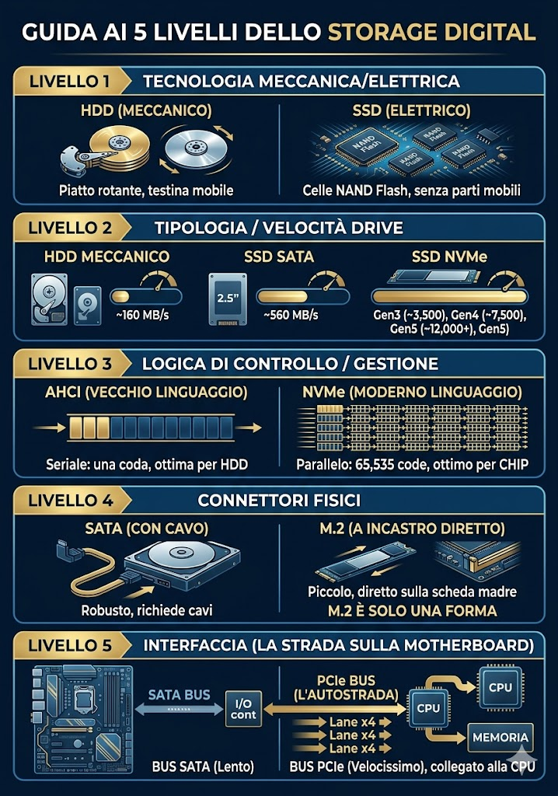

# Libro di testo — Informatica Classe 1

**Versione 0.4** — 24/09/2026
*Il libro di testo della Classe 1: raccoglie in un unico posto gli appunti, la
teoria e le esercitazioni svolte in classe. Cresce a ogni lezione. Due formati:
il PDF (`libro-classe1-vX.Y.pdf`) per leggere e stampare; questo MD è la fonte
versionata, da dare ai ragazzi per la loro AI (NotebookLM/Gemini), così l'AI
spiega e traduce nella loro lingua. La forma segue le regole di formattazione del
corso; la lingua è l'italiano (l'AI fa da ponte per arabo e cinese).*

---

## 0. Come lavoriamo (leggere per prime)
1. Ogni lezione: **carta e penna sul banco** per appunti e schemi a mano.
2. Si lavora **un passo alla volta**, con un risultato concreto da vedere subito.
3. Consegne e materiali stanno su **Google Classroom**; i documenti si scrivono
   con **Google Documenti**.
4. **L'AI aiuta a capire, non a saltare il pensiero**: la prova che hai capito è
   **saperlo spiegare a voce** con parole tue.
5. Chi scrive meglio nella propria lingua può scrivere in **arabo/cinese** e poi
   tradurre in italiano con Google Traduttore.

## 1. Che cos'è l'informatica
1. L'informatica è la scienza che studia come **trattare le informazioni** con
   strumenti automatici: il computer riceve dati (input), li elabora e restituisce
   risultati (output).
2. Il computer da solo non "capisce": esegue **istruzioni** precise che gli diamo.
3. Impareremo a usare bene gli strumenti (computer, Google, Git) e, più avanti, a
   creare noi qualcosa (siti, giochi).

## 2. Il computer e le sue parti
1. **CPU (processore):** il "cervello", esegue tutti i calcoli.
2. **RAM (memoria):** memoria di lavoro, veloce ma **temporanea** (si svuota allo
   spegnimento).
3. **Hard Disk / SSD:** dove si salvano i file in modo **permanente** (restano
   anche da spento).
4. **Scheda madre:** la base che collega e fa comunicare tutti i pezzi.
5. **Scheda video (GPU):** disegna la grafica (immagini, video, giochi).
6. **Alimentatore:** porta la corrente a tutti i pezzi.
7. **Case:** la scatola che contiene e protegge tutto.

### 2.1 Come si assembla (dove va ogni pezzo)
1. La **scheda madre** si fissa alla parete di fondo del **case**.
2. La **CPU** va nello zoccolo (socket) al centro-alto della scheda madre; sopra
   il dissipatore con la ventola.
3. La **RAM** entra negli slot lunghi accanto alla CPU (fino al "clic").
4. La **scheda video** va nello slot PCIe, in basso sulla scheda madre.
5. L'**Hard Disk/SSD** nel vano del case, collegato con un cavo alla scheda madre.
6. L'**alimentatore** in basso nel case; dà corrente a tutti.

### 2.2 Scegliere i pezzi (compatibilità e budget)
1. Con il sito `it.pcpartpicker.com/list/` (modalità **Builder**) si sceglie un
   pezzo per ogni categoria.
2. Il sito **controlla la compatibilità** (avvisa in rosso se due pezzi non vanno
   insieme) e **somma il prezzo totale**.
3. Obiettivo: montare un PC che funzioni **entro un budget** (es. 700 €).

### 2.3 Standard e compatibilità (form factor, PCIe, socket, RAM)
1. **Standard** = misure e forme comuni, decise da tutti, perché i pezzi
   **combacino**. I quattro principali:
2. **Form factor (grandezza della scheda madre e del case):** `ATX` (305×244 mm),
   `microATX` (244×244), `Mini-ITX` (170×170); `AT` è il vecchio standard. Più
   grande = più slot.
3. **Slot PCIe (schede aggiuntive):** `x1, x4, x8, x16` (lunghezze crescenti); nel
   `x16` va la **scheda video**. Versioni `3.0/4.0/5.0` (velocità); `M.2` per gli
   SSD NVMe.
4. **Socket (dove si appoggia la CPU):** Intel = `LGA` (pin nel socket, es.
   `LGA1700`); AMD = `PGA` (pin sulla CPU, es. `AM4`) o `LGA` (`AM5`). CPU e
   scheda madre si comprano **in coppia**.
5. **Processori per marca:** Intel Core `i3/i5/i7/i9`; AMD Ryzen `3/5/7/9`.
6. **RAM (memorie):** `DDR3/DDR4/DDR5`, con la **tacca in posizione diversa** (non
   si scambiano); `DIMM` (desktop) vs `SO-DIMM` (portatili).
7. **Cosa deve combaciare:** case↔scheda madre (form factor), scheda madre↔CPU
   (socket), scheda madre↔RAM (generazione), scheda video↔slot `PCIe x16`.

> [GIALLO] È il "perché" dei controlli che fa PCPartPicker quando si monta il PC.
> Materiale: scheda `standard-hardware` (teoria trilingue con i disegni in scala).

### 2.4 Lo storage: i 5 livelli (dove si salvano i file)

1. **Livello 1 — Tecnologia:** l'**HDD** (meccanico) ha un piatto che gira e una
   testina che si muove; l'**SSD** (elettrico) usa **celle NAND Flash**, senza
   parti in movimento (più veloce e resistente).
2. **Livello 2 — Tipo e velocità:** HDD meccanico ~160 MB/s; **SSD SATA** (2,5")
   ~560 MB/s; **SSD NVMe** molto più veloce (Gen3 ~3.500, Gen4 ~7.500, Gen5
   ~12.000+ MB/s).
3. **Livello 3 — Logica di controllo (il "linguaggio"):** **AHCI** (vecchio):
   seriale, una sola coda, va bene per l'HDD; **NVMe** (moderno): in parallelo,
   fino a 65.535 code, perfetto per i chip dell'SSD.
4. **Livello 4 — Connettore fisico:** **SATA** (con cavo, robusto) oppure **M.2**
   (a incastro diretto sulla scheda madre, piccolo). Attenzione: **M.2 è solo una
   FORMA** del connettore (può essere SATA o NVMe).
5. **Livello 5 — Interfaccia (la "strada" sulla scheda madre):** il **bus SATA**
   è lento e passa da un controller; il **bus PCIe** è velocissimo ed è collegato
   direttamente alla **CPU** (le "corsie" x4).

> [GIALLO] Da ricordare, le tre cose diverse: **M.2** = la forma del connettore ·
> **NVMe/AHCI** = il linguaggio · **PCIe/SATA** = la strada. Il disco più veloce
> oggi è un **SSD NVMe su M.2 collegato via PCIe**.

#### 2.4.1 In parole semplici — la storia dello storage

1. Una volta c'erano solo gli **HDD**: dischi che **girano**, con una **testina**
   che legge e scrive, un po' come la puntina di un giradischi. Funzionano, ma
   sono **lenti** e delicati, perché hanno **parti in movimento**.
2. Poi sono arrivati gli **SSD**: **niente parti in movimento**, salvano tutto in
   **chip di memoria** (NAND Flash), come una chiavetta USB molto evoluta. Sono
   più **veloci**, silenziosi e resistenti agli urti.
3. Ma non tutti gli SSD sono uguali. Un **SSD SATA** usa la **vecchia strada**
   dell'hard disk: è veloce, ma ha un limite (~560 MB/s). Un **SSD NVMe** usa una
   **strada nuova e larghissima**, il **PCIe** (la stessa della scheda video e
   della CPU), e va **molto** più veloce.
4. Tre parole da **non confondere**:
   1. la **FORMA** — `M.2`, il "bastoncino" che si incastra sulla scheda madre;
   2. il **LINGUAGGIO** — `NVMe` o `AHCI`, cioè come il computer "parla" col disco;
   3. la **STRADA** — `PCIe` (autostrada) o `SATA` (strada normale), per dove
      passano i dati.
5. **In pratica:** per far "volare" un computer, la prima cosa da fare è mettere
   un **SSD** (meglio se **NVMe**): è il salto di velocità che si sente di più,
   più ancora che cambiare processore.

> [GIALLO] Immagine mentale: pensa a una **consegna di pacchi**. La **forma** è il
> tipo di furgone, il **linguaggio** è la lingua con cui parli al corriere, la
> **strada** è l'autostrada o la stradina di campagna. Per andare veloce servono
> tutte e tre giuste: furgone adatto (M.2), lingua moderna (NVMe), autostrada (PCIe).

## 3. Utenze e aree di lavoro
1. **Account e password:** ognuno ha il proprio account della scuola; la password
   va tenuta al sicuro e robusta (lunga, con lettere, numeri e simboli).
2. **Le aree:** cartella personale in rete + spazio su **Google Drive**; i file si
   organizzano in **cartelle e sottocartelle** (area logica).
3. **Chiudere bene il computer:** quando hai finito, blocca o disconnetti con
   `Ctrl + Alt + Canc`; non lasciare il PC aperto e incustodito.

## 4. Google Suite e Classroom
1. **Google Documenti:** il programma per scrivere i testi (si salva da solo).
2. **Consegnare un compito su Classroom:** aprire il corso → "Lavori del corso" →
   il compito → "Aggiungi o crea" → "Documenti Google" → scrivere → "Consegna".
3. **Il voto:** l'allievo vede il voto **solo dopo** che il docente clicca
   "Restituisci".

## 5. GitHub e i repository
1. **GitHub** è un sito dove i programmatori **salvano e condividono** il codice
   dei loro progetti e collaborano.
2. **Repository (repo):** la "cartella-progetto" digitale che contiene tutti i
   file **e la storia di ogni modifica** fatta nel tempo.
3. A cosa serve la storia delle modifiche: si può **tornare a una versione
   precedente** se qualcosa va storto, e si capisce chi ha cambiato cosa e quando.
4. **Git** è il sistema che tiene traccia delle modifiche; **GitHub** è il sito
   che ospita i progetti online.

## 6. Sicurezza e regole di laboratorio
1. **Password robuste** e mai condivise; attenzione a e-mail sospette (phishing).
2. **Regole "quando hai finito"**: niente giochi, niente YouTube, niente cose che
   fanno rumore; resti al tuo posto; blocca/esci col `Ctrl + Alt + Canc`.
3. **Se hai finito**: ripassa, fai lo schema a mano sul quaderno, aiuta un
   compagno, prova a spiegare a voce cosa hai capito.

## 7. Esercitazioni svolte
1. **Io e la mia famiglia** — presentazione di sé e della famiglia con Google
   Documenti, consegna su Classroom (anche scrivendo nella propria lingua +
   traduzione).
2. **Ricerca: cos'è GitHub e cos'è un repository** — piccola ricerca in rete,
   scritta in un documento e consegnata su Classroom.
3. **I componenti del PC** — per ogni componente spiegare a cosa serve con parole
   proprie + due domande personali.
4. **Costruisci il tuo PC** — montare un PC compatibile a budget con PCPartPicker
   (Builder) e scrivere la lista con il prezzo totale.
5. **Documento sulla configurazione del PC** — spiegare con parole proprie gli
   standard (form factor, PCIe, socket, processori per marca, memorie) e inserire
   immagini dal web descrivendo la tipologia; consegna su Classroom.

## 8. Glossario (essenziale)
1. **CPU:** processore, il "cervello" del PC.
2. **RAM:** memoria di lavoro veloce e temporanea.
3. **SSD/Hard Disk:** memoria permanente dove si salvano i file.
4. **Repository:** cartella-progetto con i file e la storia delle modifiche.
5. **Commit:** un salvataggio (una "fotografia") delle modifiche fatte.
6. **Compatibilità:** quando due pezzi funzionano bene insieme.
(Il glossario completo multilingue è nel documento `glossario-l2`.)

## 9. Changelog
4. **v0.4 (24/09/2026)**: aggiunta 2.4.1 "In parole semplici — la storia dello storage" (paginetta descrittiva con analogia).
3. **v0.3 (24/09/2026)**: aggiunta 2.4 "Lo storage: i 5 livelli" (HDD/SSD, SATA/NVMe, AHCI/NVMe, connettori SATA/M.2, interfaccia PCIe) con infografica.
2. **v0.2 (24/09/2026)**: aggiunta 2.3 "Standard e compatibilità" (form factor,
   PCIe, socket, processori per marca, RAM) e l'esercitazione "Documento sulla
   configurazione del PC".
1. **v0.1 (21/09/2026)**: prima versione. Come lavoriamo; cos'è l'informatica; il
   computer e le sue parti (+ assemblaggio + scelta pezzi); utenze e aree; Google
   Suite e Classroom; GitHub e repository; sicurezza e regole di laboratorio;
   elenco esercitazioni svolte; glossario essenziale.
