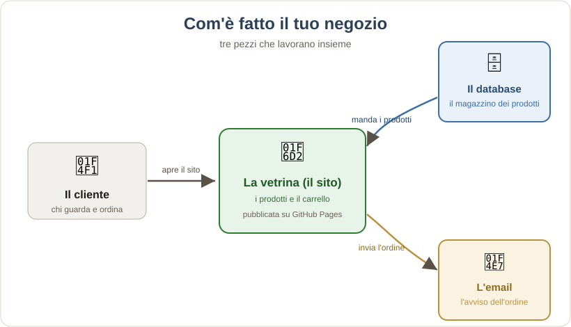
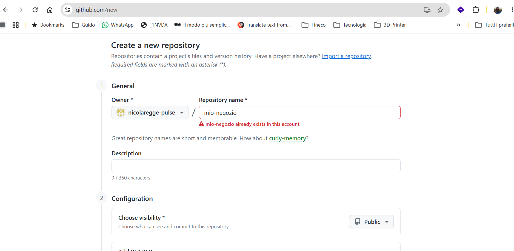
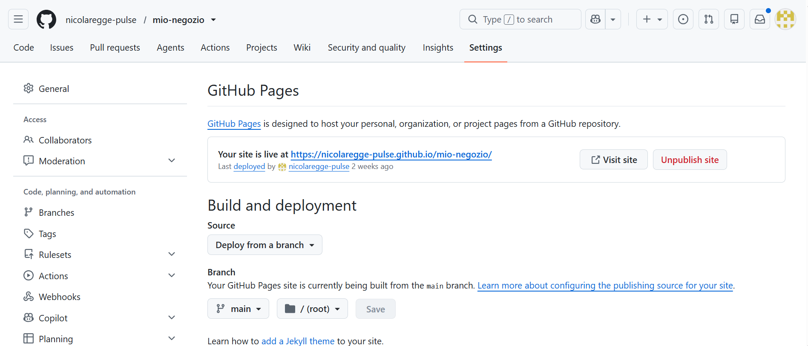
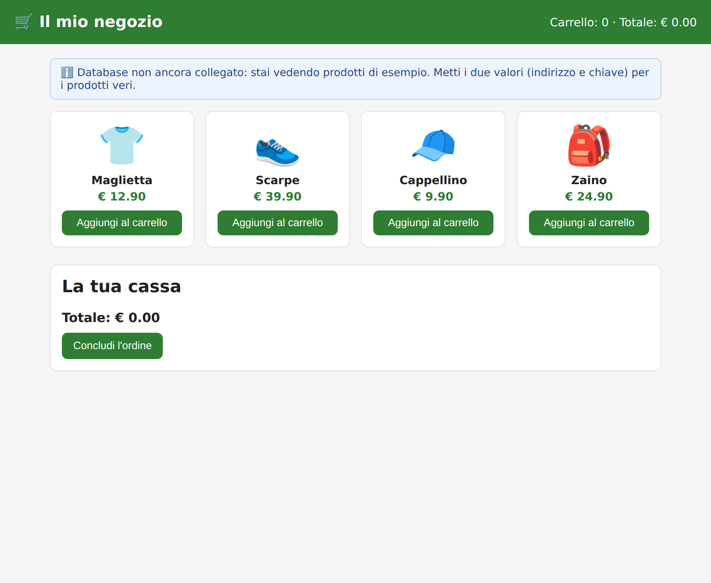
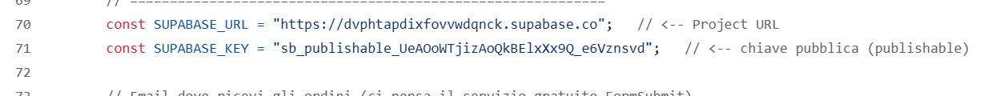
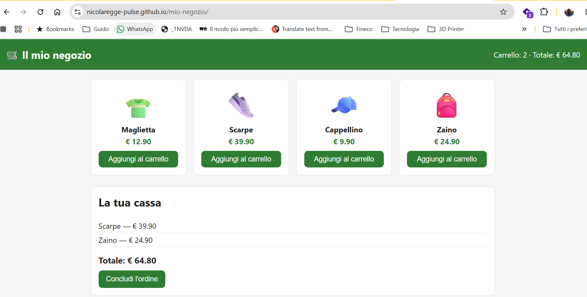
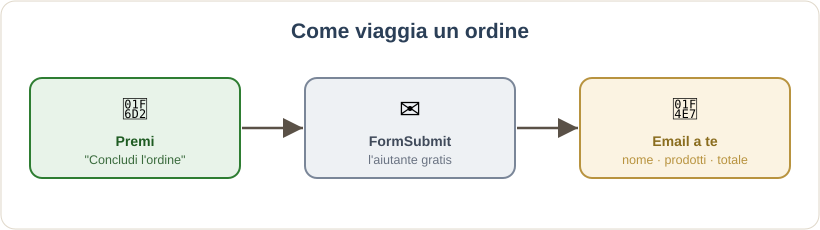
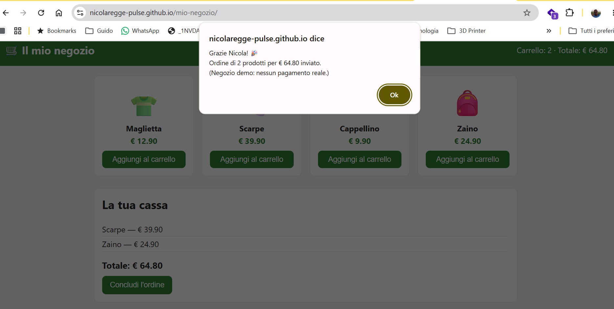
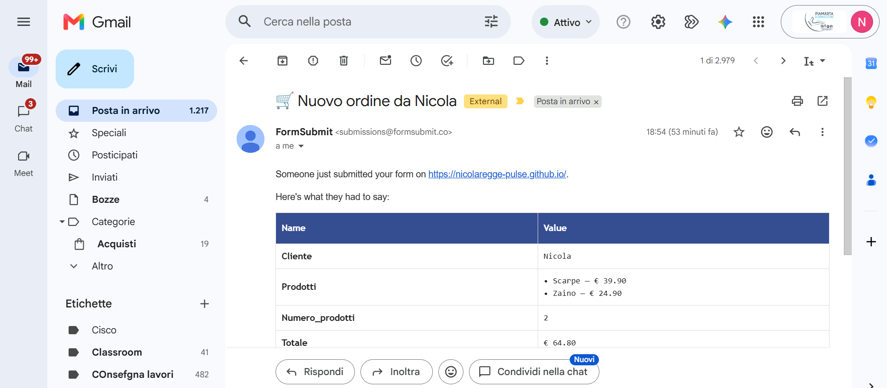
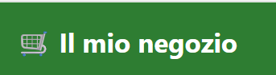

# Progetto: Il Mio Negozio Online 🛒

**Versione 1.3** — 16/08/2026

---

### Un negozio vero, con database ed email — costruito da te

Alla fine di questo progetto avrai un **negozio online** con un **link tuo** da
aprire sul telefono e mostrare a casa. Un negozio vero: i prodotti stanno in un
**database in cloud** (il magazzino della classe), e quando qualcuno "compra" ti
arriva un'**email con l'ordine**. Tutto **gratis** e **senza installare niente**.

> **Come è fatto** (tre pezzi che lavorano insieme):
>
> - **La vetrina** = la pagina che si vede (i prodotti, il carrello).
> - **Il database** = il magazzino dove sono scritti i prodotti.
> - **L'email** = l'avviso che ti arriva quando qualcuno ordina.



Facciamo tutto a **piccole tappe**: a ogni tappa qualcosa **funziona** e lo puoi
**mostrare**. Se ti blocchi, nessun problema: sbagliare è normale, si torna
indietro con un clic.

**Ti serve solo:** un computer con un browser (Chrome/Edge) e un **account
GitHub** (il prof ti dice come averlo). Il **database** lo ha già preparato il
prof per tutta la classe: ti darà due valori da incollare. Niente da installare.

**Ti serve anche il file di partenza:** `modello-negozio.html`. Lo trovi nel
repository del corso (cartella `classe-1/negozio-online/`) oppure te lo dà il
prof. Scaricalo sul computer prima di cominciare.

---

## TAPPA 1 — Metti il negozio ONLINE (la prima vittoria) 🌍

Obiettivo: avere un **link** con il tuo negozio che funziona (con dei prodotti di
esempio). Ci arriviamo in pochi minuti.

### 1A · Crea lo spazio del negozio su GitHub
1. `[BROWSER]` vai su **github.com** e accedi al tuo account.
2. In **alto a destra**, clicca il **`+`** → poi **`New repository`**.
3. Alla voce **`Repository name`**, scrivi un nome, per esempio:
```
mio-negozio
```
4. Poco sotto, lascia selezionato **`Public`** (serve per avere il link gratis).
5. In fondo, clicca il bottone verde **`Create repository`**.



### 1B · Carica il file del negozio
6. Nella pagina appena aperta, nel riquadro azzurro in basso, clicca il link blu **`uploading an existing file`**.
7. **Trascina** dentro l'area grande il file **`modello-negozio.html`**.
8. **Importante:** GitHub vuole che il file si chiami **`index.html`**. In alto, sopra il file caricato, c'è una casellina con il nome: cancella `modello-negozio.html` e scrivi:
```
index.html
```
9. Scendi in fondo e clicca il bottone verde **`Commit changes`**.


### 1C · Accendi il link (GitHub Pages)
10. In alto nella pagina del repository, clicca **`Settings`** (l'ingranaggio).
11. Nel menu a **sinistra**, clicca **`Pages`**.
12. Alla voce **`Source`**, scegli **`Deploy from a branch`**.
13. Sotto, alla voce **`Branch`**, apri il menu e scegli **`main`**.
14. Lascia la cartella su **`/ (root)`** e clicca **`Save`**.



### 1D · Apri il tuo negozio
15. Aspetta **un minuto**, poi **ricarica** la pagina (tasto `F5`).
16. In alto compare un riquadro con *"Your site is live at…"* e un indirizzo tipo `https://iltuonome.github.io/mio-negozio/`.
17. **Clicca quell'indirizzo**: si apre il tuo negozio.



> ✅ **FATTO!** Il tuo negozio è **online**. Aprilo sul telefono e fallo vedere a
> un compagno. Prova ad aggiungere prodotti al carrello: il totale si aggiorna.
> *(I prodotti sono ancora di esempio: nella Tappa 2 arrivano quelli veri.)*

---

## TAPPA 2 — Collega il database della classe 🗄️

Obiettivo: far arrivare nel tuo negozio i **prodotti veri**, presi dal database.

> **Cos'è il database?** È il **magazzino** dove sono scritti i prodotti (nome,
> prezzo, immagine). Il prof ne ha preparato **uno per tutta la classe** e ve lo
> mostra dal vivo. A te basta **collegarti**: non devi crearlo tu.
>
> La chiave che ti dà il prof è **di sola lettura**: puoi **vedere** i prodotti,
> ma non puoi rovinarli. Tranquillo, non rompi niente.

### 2A · Fatti dare i due valori dal prof
1. Chiedi al prof i **due valori** del database della classe:
   - l'**indirizzo** (comincia con `https://` e finisce con `.supabase.co`);
   - la **chiave pubblica** (comincia con `sb_publishable_...`).

### 2B · Mettili nel file del negozio
2. `[BROWSER — GitHub]` vai nel tuo repository **`mio-negozio`** → scheda **`Code`** → clicca il file **`index.html`**.
3. In alto a destra sopra il codice, clicca l'iconcina della **matita** ✏️ (*"Edit this file"*).
4. Cerca queste due righe (verso la metà del file):
```
const SUPABASE_URL  = "";   // <-- CAMBIA QUI
const SUPABASE_KEY  = "";   // <-- CAMBIA QUI
```
5. **Incolla** i due valori del prof **tra le virgolette**, così:
```
const SUPABASE_URL  = "https://xxxxx.supabase.co";
const SUPABASE_KEY  = "sb_publishable_xxxxx";
```
6. In alto a destra, clicca il bottone verde **`Commit changes…`** → poi di nuovo **`Commit changes`**.



### 2C · Guarda il risultato
7. Aspetta un minuto, apri il tuo negozio e **ricarica** (`Ctrl + F5`).

> ✅ **FATTO!** Ora i prodotti arrivano dal **database della classe**.
> **Prova "wow":** quando il prof cambia un prodotto nel database, ricaricate i
> vostri negozi… e cambia in **tutti** insieme! Ecco cos'è un database condiviso.



---

## TAPPA 3 — Ricevi gli ordini via email 📧

Obiettivo: quando qualcuno preme *"Concludi l'ordine"*, ti arriva un'**email**.
Usiamo un aiutante gratuito che si chiama **FormSubmit**.



### 3A · Metti la tua email nel file
1. `[BROWSER — GitHub]` nel tuo repository, apri **`index.html`** e clicca la **matita** ✏️.
2. Cerca questa riga:
```
const EMAIL_ORDINI  = "";   // <-- CAMBIA QUI
```
3. Scrivi la tua email **tra le virgolette**, così:
```
const EMAIL_ORDINI  = "iltuonome@esempio.it";
```
4. Clicca **`Commit changes…`** → **`Commit changes`**.

### 3B · Prova l'ordine
5. Aspetta un minuto, apri il negozio e **ricarica**.
6. Aggiungi qualche prodotto al carrello e premi **`Concludi l'ordine`**.
7. Scrivi il tuo **nome** quando te lo chiede e conferma.



8. **La prima volta** ti arriva un'email da **FormSubmit** con un bottone tipo **`Activate`**: aprila (controlla anche lo **spam**) e cliccalo.


9. Fai un **secondo** ordine di prova: adesso ti arriva l'**email con il riepilogo** (nome, prodotti, totale). 🎉



> ✅ **FATTO!** Il tuo negozio è **completo**: prodotti dal database + ordini via
> email. Roba da tecnico vero.
>
> ⚠️ **Nota:** è un negozio **demo**, non incassa soldi veri (per farlo serve un
> conto aziendale di un adulto). Va benissimo così per imparare e mostrare.

---

## TAPPA 4 — Fallo tuo 🎨

Adesso rendilo **tuo davvero**:
- **Il nome:** nel file `index.html`, cambia la scritta dentro `<h1>🛒 Il mio negozio</h1>` (matita ✏️ → cambia → commit).
- **Il colore:** cerca `--colore: #2e7d32;` e cambia il codice colore (es. `#c0392b` rosso, `#8e44ad` viola).
- **I prodotti:** sono nel database della classe, uguali per tutti. Se vuoi dei prodotti **solo tuoi**, chiedi al prof: si può fare in un secondo momento.

> ✅ **Mostralo!** Fai uno screenshot del tuo negozio e mettilo nel tuo
> **quaderno**. Scrivi due righe: *cos'è*, *come funziona*, *cosa hai cambiato tu*.



---

## La prova del nove 🧠

Sai **spiegare a voce**, con parole tue:
- dove stanno i **prodotti** (nel database della classe) e come fanno ad arrivare in vetrina?
- cosa succede quando premi **"Concludi l'ordine"**?

Se sai raccontarlo, **hai capito davvero** — ed è quello che conta.

---

## Se qualcosa non va 🔧 (succede a tutti)

- **Il link non si apre / pagina bianca:** aspetta un altro minuto, poi ricarica con `Ctrl + F5`. Controlla che il file si chiami **esattamente** `index.html`.
- **I prodotti sono ancora quelli di esempio:** controlla di aver incollato i due valori del prof **tra le virgolette** e di aver fatto **Commit**. Aspetta un minuto e ricarica.
- **L'email non arriva:** controlla lo **spam**; ricorda l'**attivazione** (la prima email di FormSubmit); controlla che la tua email nel file sia scritta giusta.

> Nessun errore ti fa danno: il tuo lavoro è salvato a ogni passo. Un bug è
> normale — **capita a tutti i programmatori, anche ai più bravi.**
