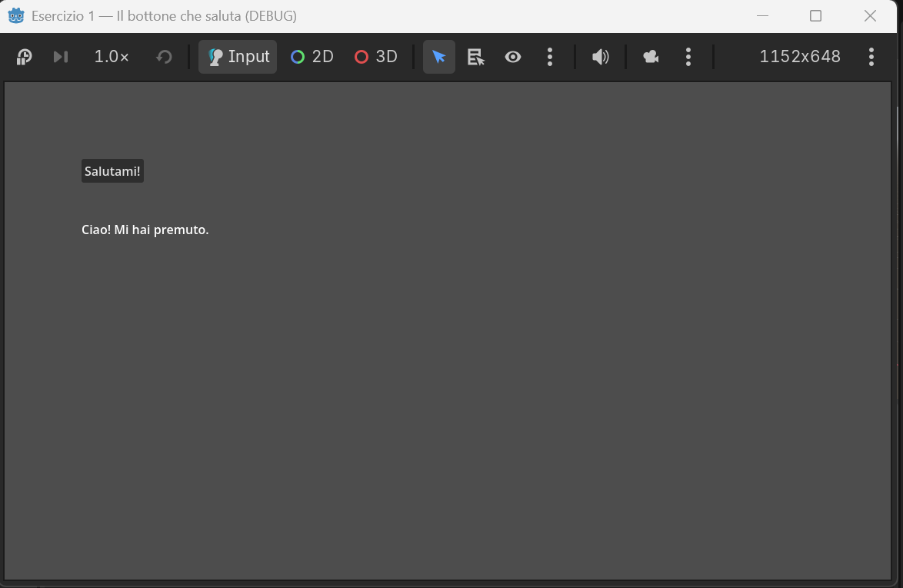
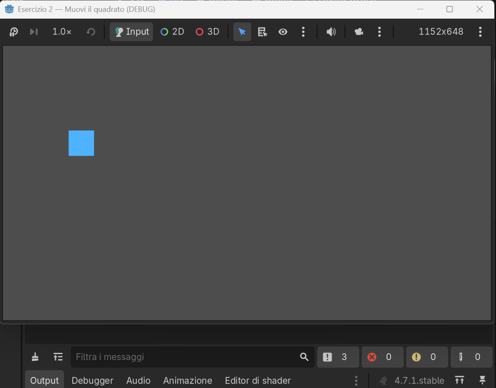
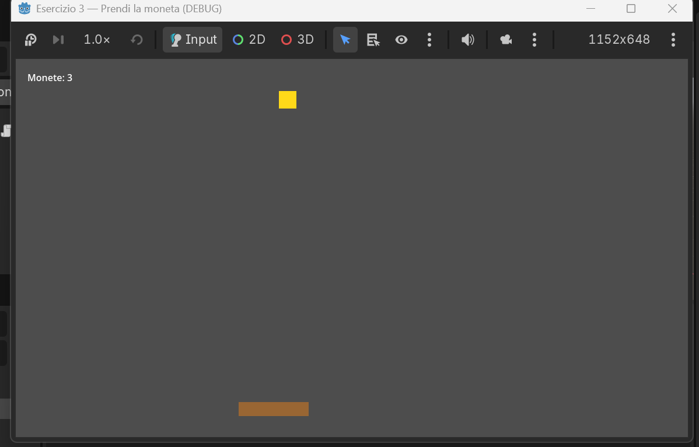
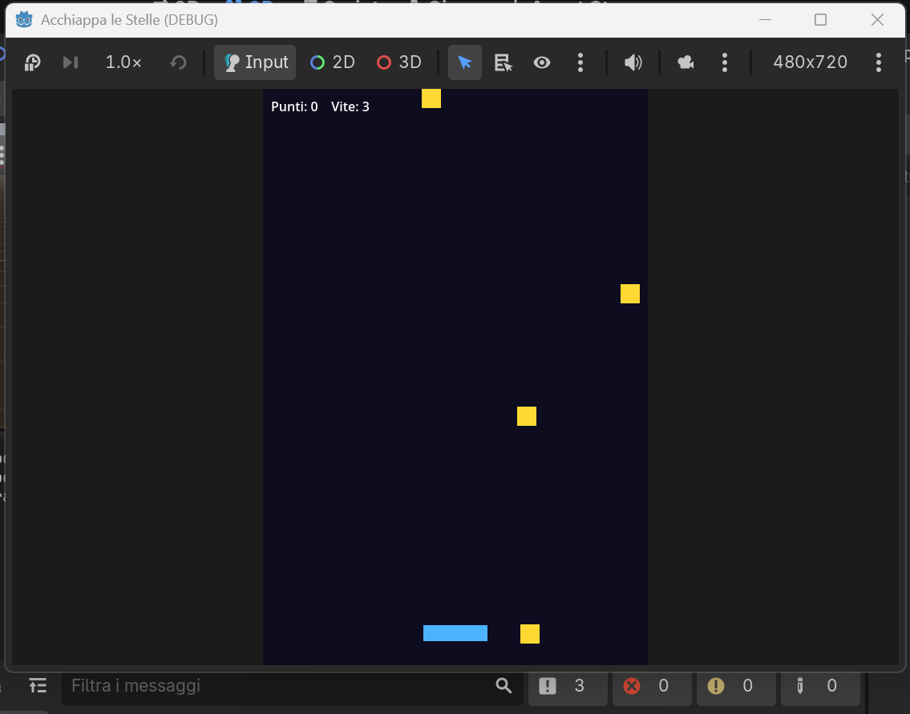

# Eserciziario — Corso di Godot

**Versione 0.12** — 27/07/2026
*Fonte versionata. Da questo file si genera il PDF degli esercizi da consegnare.*

---

## Come funziona ogni esercizio

Ogni esercizio ha **4 livelli di aiuto**. Prova sempre da solo, e apri il
livello successivo **solo se sei bloccato**:

1. 🟢 **Descrizione** — cosa devi ottenere.
2. 🟡 **Aiuto** — un indizio su come fare.
3. 🟠 **La scena** — quali nodi creare, i "mattoncini".
4. 🔴 **Codice completo** — la soluzione da copiare/incollare.

> Regola: se copi il **Codice completo**, poi devi saper **spiegare a voce cosa
> fa, riga per riga**. Se lo sai spiegare, hai imparato lo stesso.

*Nel file `.md` i livelli 2–4 sono a scomparsa: clicca sul triangolino per
aprirli. Nel PDF sono già aperti.*

> **Oltre agli esercizi numerati ci sono i "Progetti BOSS":** giochi già
> pronti, più grossi, che non si copiano riga per riga — si **aprono, si
> giocano e si rendono propri**: cambi colori, titolo, ci metti una tua foto.
> Sono il premio: la cosa figa da mostrare subito agli amici. Il codice è già
> nel repository, lo capirai un pezzo alla volta.

---

## Esercizio 1 — Il bottone che saluta
*Ponte da Lazarus: è il tuo `Button1Click` che cambia una `Caption`!*

### 🟢 Descrizione
Crea una schermata con **un bottone** e **una scritta**. Quando premi il
bottone, la scritta deve cambiare, per esempio da "..." a "Ciao! Mi hai premuto".



**Fallo tuo:** scegli **tu** la frase del saluto e il **colore** della scritta
— così il gioco è già tuo. Nessuno lo farà uguale al tuo!

<details>
<summary>🟡 Aiuto</summary>

- In Godot il bottone è il nodo **Button**, la scritta è il nodo **Label**.
- La proprietà `text` di Godot è come la **Caption** di Lazarus.
- L'evento "click" in Godot si chiama **segnale** `pressed`. Lo colleghi a una
  tua funzione con `bottone.pressed.connect(la_mia_funzione)`.
</details>

<details>
<summary>🟠 La scena — i nodi da creare</summary>

1. Nodo radice: **Node2D**, rinominalo `Main`.
2. Figlio: **Button** → rinominalo **`bottoneScena`**.
3. Figlio: **Label** → rinominalo **`etichettaScena`**.
4. Attacca uno **script** al nodo radice `Main`.
</details>

<details>
<summary>🔴 Codice completo</summary>

```gdscript
extends Node2D

@onready var bottoneVar: Button = $bottoneScena
@onready var etichettaVar: Label = $etichettaScena

func _ready() -> void:
	# Mettiamo il bottone e la scritta in due punti diversi
	bottoneVar.position = Vector2(100, 100)
	bottoneVar.text = "Salutami!"
	etichettaVar.position = Vector2(100, 180)
	etichettaVar.text = "..."
	# FALLO TUO: cambia il colore della scritta (rosso, verde, blu da 0 a 1)
	etichettaVar.add_theme_color_override("font_color", Color(1, 0, 0))
	# Colleghiamo il click del bottone (il segnale "pressed") alla nostra funzione
	bottoneVar.pressed.connect(_quando_premo)

# Questa è come il tuo Button1Click di Lazarus
func _quando_premo() -> void:
	# FALLO TUO: scrivi qui il TUO saluto
	etichettaVar.text = "Ciao! Mi hai premuto."
```
</details>

<details>
<summary>Guida passo passo — costruiamolo insieme</summary>

**Cosa costruiamo, e con quali pezzi.** Facciamo un bottone che saluta. Servono
due pezzi: un **bottone** (quello che l'utente preme) e una **scritta** (dove
compare il saluto). L'idea: quando premi il bottone, la scritta cambia. Prima
mettiamo i due pezzi; il "quando premi, cambia" lo diremo dopo, nel codice.

Fai i passi in ordine. Non passare al successivo finché il precedente non è a posto.

**Passo 1 — Crea il progetto.**
1. `[APP — Godot]`, finestra iniziale (il *Gestore progetti*).
2. In alto a destra, clicca **`Crea`**.
3. Nel nome scrivi **`esercizio1`**, scegli una cartella, poi clicca **`Crea e modifica`**.

**Passo 2 — Entra nel mondo 2D.**
*Perché:* il nostro gioco è in 2D, quindi lavoriamo nell'ambiente 2D. Se restassi in
3D vedresti una griglia in prospettiva che a noi non serve.
1. In alto al centro, nella fila **`2D` `3D` `Script` `Gioco`**, clicca **`2D`**.
2. Ora vedi una tela piatta con dei righelli: è il posto giusto.

**Passo 3 — Crea il nodo radice `Main`.**
*A cosa serve:* è il contenitore principale, il tronco dell'albero; tutti gli altri
pezzi staranno dentro di lui.
1. Nel pannello **`Scena`** (in alto a sinistra), sotto **`Crea un nodo radice:`**, clicca **`Altro nodo`**.
2. Si apre la finestra **`Crea un nuovo Node`**. Nel campo **`Cerca:`** scrivi **`Node2D`**: si mette in cima ed è già selezionato.
3. In basso clicca **`Crea`**.
4. Nel pannello `Scena` compare il nodo **`Node2D`**. Doppio clic sul nome, scrivi **`Main`**, premi **`Invio`**.

> **Perché due strade?** Sotto `Crea un nodo radice:` ci sono anche le scorciatoie
> `Scena 2D`, `Scena 3D`, `Interfaccia utente`, per i nodi più usati. `Altro nodo`
> invece apre la finestra con **tutti** i tipi di nodo. Noi useremo sempre
> `Altro nodo`: così impari l'unica strada che va bene per qualsiasi nodo.

**Passo 4 — Aggiungi il bottone `bottoneScena`.**
*A cosa serve:* è il **bottone** che l'utente cliccherà. Più avanti, nel codice, gli
diremo "quando ti premono, chiama la nostra funzione".
1. Nel pannello `Scena`, clicca **una volta** su **`Main`** (deve restare evidenziato).
2. In alto a sinistra del pannello, clicca l'icona **`+`** (*Aggiungi nodo figlio*).
3. Nella finestra, nel campo **`Cerca:`**, scrivi **`Button`**: si mette in cima ed è già selezionato.
4. In basso clicca **`Crea`**.
5. Sotto `Main` compare **`Button`**. Doppio clic sul nome, scrivi **`bottoneScena`**, premi **`Invio`**.

**Passo 5 — Aggiungi la scritta `etichettaScena`.**
*A cosa serve:* è la **scritta** dove apparirà il saluto; è il pezzo che il giocatore
vedrà **cambiare** — l'effetto del gioco.
1. **Attenzione:** prima clicca di nuovo **una volta** su **`Main`**. Se ora è
   selezionato `bottoneScena`, la scritta finirebbe *dentro* il bottone: sbagliato.
   Deve stare *accanto* al bottone.
2. In alto a sinistra del pannello, clicca l'icona **`+`**.
3. Nella finestra, nel campo **`Cerca:`**, scrivi **`Label`**: si mette in cima.
4. In basso clicca **`Crea`**.
5. Doppio clic sul nuovo nodo `Label`, scrivi **`etichettaScena`**, premi **`Invio`**.

A questo punto, nel pannello `Scena`, l'albero deve essere così:
- `Main`
  - `bottoneScena`
  - `etichettaScena`

**Passo 6 — Attacca lo script a `Main`.**
*A cosa serve:* lo script è il file di codice che dà comportamento a `Main`: è lì che
scriveremo cosa succede quando premi il bottone.
1. Nel pannello `Scena`, clicca con il **tasto DESTRO** del mouse sul nodo **`Main`**.
2. Nel menu che si apre, clicca **`Allega script`**.
3. Si apre una finestra (**`Allega nodo script`**). Non cambiare niente: clicca **`Crea`** in basso.
4. Si apre l'editor del codice: in cima trovi già scritto `extends Node2D`.

**Passo 7 — Metti il codice.**
Il codice completo è nel riquadro **Codice completo** (livello rosso) qui sopra.
1. **Importante: NON copiarlo dal PDF** — si rovina, i primi caratteri si perdono.
   Prendilo dal file su GitHub **`esercizi/01-bottone-che-saluta/main.gd`** (ha il
   **tasto Copia**), oppure scrivilo a mano: è corto, e così lo capisci meglio.
2. Nell'editor del codice, seleziona tutto con **`Ctrl+A`** e cancella con **`Canc`**.
3. Incolla con **`Ctrl+V`** (o scrivi). Attento ai **rientri con TAB**: in GDScript contano.
4. Salva con **`Ctrl+S`**.

**Passo 8 — Prova.**
1. Premi **`F5`**. La prima volta: se chiede di salvare la scena, dai un nome (per
   esempio `main`) e clicca **`Salva`**; se poi chiede la scena principale, clicca
   **`Seleziona corrente`**.
2. Si apre la finestra del gioco. Clicca il bottone: la scritta cambia. **Fatto!**

### Come funziona, riga per riga
- `extends Node2D` — dice "questo script comanda un nodo Node2D", il nostro `Main`.
- `@onready var bottoneVar: Button = $bottoneScena` — prende il nodo `bottoneScena`
  dalla scena e gli dà il soprannome `bottoneVar` (appena la scena è pronta).
- `@onready var etichettaVar: Label = $etichettaScena` — stessa cosa per la scritta.
- `func _ready():` — gira **una volta**, all'avvio.
- `bottoneVar.position = Vector2(100, 100)` — mette il bottone a 100 pixel da sinistra e 100 dall'alto.
- `bottoneVar.text = "Salutami!"` — la scritta sopra il bottone (come la Caption).
- `etichettaVar.position` e `etichettaVar.text = "..."` — mettono la scritta più in basso, con "..." per iniziare.
- `etichettaVar.add_theme_color_override("font_color", Color(1, 0, 0))` — colora la
  scritta di rosso; i tre numeri sono rosso, verde, blu da 0 a 1: cambiali e cambia il colore.
- `bottoneVar.pressed.connect(_quando_premo)` — collega il **click** del bottone alla
  nostra funzione: "quando ti premono, chiama `_quando_premo`".
- `func _quando_premo():` — la nostra funzione, è il tuo `Button1Click` di Lazarus.
- `etichettaVar.text = "Ciao! Mi hai premuto."` — cambia la scritta. Ecco il saluto.
</details>

---

## Esercizio 2 — Muovi il quadrato
*Concetto nuovo: il **game loop**, cioe' `_process`.*

### 🟢 Descrizione
Fai comparire un **quadrato** che puoi muovere in tutte le direzioni con le
**frecce** della tastiera.



<details>
<summary>🟡 Aiuto</summary>

- Un quadrato colorato semplice = nodo **ColorRect**.
- Il movimento va scritto in **`_process(delta)`**: e' la funzione che gira ~60
  volte al secondo. In Lazarus non c'era: il programma stava fermo.
- Le frecce si leggono con `Input.is_action_pressed("ui_left")`, e allo stesso modo `ui_right`,
  `ui_up`, `ui_down`.
- Moltiplica sempre la velocita' per `delta`, cosi' va uguale su ogni PC.
</details>

<details>
<summary>🟠 La scena — i nodi da creare</summary>

1. Nodo radice: **Node2D**, rinominalo `Main`.
2. Figlio: **ColorRect** → rinominalo **`quadratoScena`**.
3. Attacca uno **script** al nodo radice `Main`.
</details>

<details>
<summary>🔴 Codice completo</summary>

```gdscript
extends Node2D

@onready var quadratoVar: ColorRect = $quadratoScena
const VELOCITA: float = 300.0   # pixel al secondo

func _ready() -> void:
	quadratoVar.size = Vector2(60, 60)
	quadratoVar.color = Color(0.3, 0.7, 1.0)   # azzurro
	quadratoVar.position = Vector2(200, 200)

# _process gira a OGNI fotogramma: qui muoviamo il quadrato
func _process(delta: float) -> void:
	if Input.is_action_pressed("ui_left"):
		quadratoVar.position.x -= VELOCITA * delta
	if Input.is_action_pressed("ui_right"):
		quadratoVar.position.x += VELOCITA * delta
	if Input.is_action_pressed("ui_up"):
		quadratoVar.position.y -= VELOCITA * delta
	if Input.is_action_pressed("ui_down"):
		quadratoVar.position.y += VELOCITA * delta
```
</details>

<details>
<summary>Guida passo passo — costruiamolo insieme</summary>

**Cosa costruiamo.** Un quadrato che si muove con le frecce. Serve un solo pezzo:
un **quadrato**. La novità è nel codice: il **game loop** `_process`, che gira da
solo circa 60 volte al secondo e sposta il quadrato mentre tieni premuta una freccia.

**Passo 1 — Crea il progetto.** `[APP — Godot]`, *Gestore progetti*, in alto a destra **`Crea`**, nome **`esercizio2`**, scegli una cartella, **`Crea e modifica`**.

**Passo 2 — Entra nel mondo 2D.** In alto al centro clicca **`2D`** (il gioco è in 2D).

**Passo 3 — Crea il nodo radice `Main`.** Nel pannello **`Scena`**, sotto **`Crea un nodo radice:`**, clicca **`Altro nodo`** → nella finestra, campo **`Cerca:`**, scrivi **`Node2D`** → **`Crea`** → doppio clic sul nodo, scrivi **`Main`**, **`Invio`**.

**Passo 4 — Aggiungi il quadrato `quadratoScena`.**
*A cosa serve:* è il **quadrato** che muoverai, l'oggetto del gioco.
1. Clicca **una volta** su **`Main`**.
2. In alto a sinistra del pannello, clicca l'icona **`+`**.
3. Nella finestra, campo **`Cerca:`**, scrivi **`ColorRect`** → **`Crea`**.
4. Doppio clic sul nodo `ColorRect`, scrivi **`quadratoScena`**, **`Invio`**.

**Passo 5 — Attacca lo script a `Main`.** Clic con il **tasto DESTRO** su **`Main`** → **`Allega script`** → **`Crea`**.

**Passo 6 — Metti il codice.** Prendi il codice dal file su GitHub **`esercizi/02-muovi-il-quadrato/main.gd`** (ha il tasto **Copia**), **non dal PDF**. Nell'editor: **`Ctrl+A`**, **`Canc`**, **`Ctrl+V`**, poi **`Ctrl+S`**.

**Passo 7 — Prova.** Premi **`F5`** (se chiede, salva la scena e clicca **`Seleziona corrente`**). Tieni premute le frecce: il quadrato si muove. **Fatto!**

### Come funziona, riga per riga
- `@onready var quadratoVar: ColorRect = $quadratoScena` — soprannome del quadrato.
- `const VELOCITA: float = 300.0` — quanto veloce si muove (pixel al secondo).
- `func _ready():` — all'avvio dà al quadrato dimensione, colore e posizione.
- `func _process(delta):` — **il game loop**: gira a ogni fotogramma, da solo.
- `if Input.is_action_pressed("ui_left"): quadratoVar.position.x -= VELOCITA * delta`
  — mentre tieni premuta la freccia sinistra, spostalo a sinistra; le altre tre
  righe fanno lo stesso per destra, su, giù.
- `* delta` — moltiplicare per `delta` fa andare il movimento uguale su ogni PC.
</details>

---

## Esercizio 3 — Prendi la moneta
*Mette insieme: movimento + oggetto che cade + punteggio. Verso il gioco vero.*

### 🟢 Descrizione
Un **cestino** in basso, che muovi con le frecce ← →, e una **moneta** che cade
dall'alto. Se la prendi col cestino fai **+1 punto** e la moneta riparte
dall'alto in una colonna a caso. Mostra il punteggio a schermo.



<details>
<summary>🟡 Aiuto</summary>

- Cestino e moneta: due **ColorRect**. Il punteggio: un **Label**.
- Muovi il cestino in `_process`, come nell'Esercizio 2 ma solo sinistra/destra.
- Fai scendere la moneta ogni fotogramma: `moneta.position.y += velocita * delta`.
- Per capire se il cestino "tocca" la moneta usa i rettangoli:
  `Rect2(a.position, a.size).intersects(Rect2(b.position, b.size))`.
- Quando la moneta esce sotto o è presa, rimettila in alto a una `x` a caso.
</details>

<details>
<summary>🟠 La scena — i nodi da creare</summary>

1. Nodo radice: **Node2D**, rinominalo `Main`.
2. Figlio **ColorRect** → **`cestinoScena`**.
3. Figlio **ColorRect** → **`monetaScena`**.
4. Figlio **Label** → **`punteggioScena`**.
5. Attacca uno **script** al nodo radice `Main`.
</details>

<details>
<summary>🔴 Codice completo</summary>

```gdscript
extends Node2D

@onready var cestinoVar: ColorRect = $cestinoScena
@onready var monetaVar: ColorRect = $monetaScena
@onready var punteggioVar: Label = $punteggioScena

const VELOCITA_CESTINO: float = 500.0
const VELOCITA_MONETA: float = 300.0

var punti: int = 0
var larghezza: float

func _ready() -> void:
	larghezza = get_viewport_rect().size.x
	# Cestino in basso
	cestinoVar.size = Vector2(120, 24)
	cestinoVar.color = Color(0.6, 0.4, 0.2)
	cestinoVar.position = Vector2(larghezza / 2.0 - 60, get_viewport_rect().size.y - 60)
	# Moneta
	monetaVar.size = Vector2(30, 30)
	monetaVar.color = Color(1.0, 0.85, 0.1)
	_rimetti_in_alto()
	# Punteggio
	punteggioVar.position = Vector2(20, 20)
	_aggiorna_punteggio()

func _process(delta: float) -> void:
	# Muovi il cestino
	if Input.is_action_pressed("ui_left"):
		cestinoVar.position.x -= VELOCITA_CESTINO * delta
	if Input.is_action_pressed("ui_right"):
		cestinoVar.position.x += VELOCITA_CESTINO * delta
	cestinoVar.position.x = clamp(cestinoVar.position.x, 0, larghezza - cestinoVar.size.x)

	# Fai scendere la moneta
	monetaVar.position.y += VELOCITA_MONETA * delta

	# Presa?
	if Rect2(cestinoVar.position, cestinoVar.size).intersects(Rect2(monetaVar.position, monetaVar.size)):
		punti += 1
		_aggiorna_punteggio()
		_rimetti_in_alto()
	# Persa (uscita sotto)?
	elif monetaVar.position.y > get_viewport_rect().size.y:
		_rimetti_in_alto()

func _rimetti_in_alto() -> void:
	var x := randf_range(0, larghezza - monetaVar.size.x)
	monetaVar.position = Vector2(x, -monetaVar.size.y)

func _aggiorna_punteggio() -> void:
	punteggioVar.text = "Monete: %d" % punti
```
</details>

<details>
<summary>Guida passo passo — costruiamolo insieme</summary>

**Cosa costruiamo.** Un cestino che muovi con le frecce ← → e una moneta che cade;
se la prendi fai +1 e la moneta riparte dall'alto. Servono tre pezzi: il **cestino**,
la **moneta** e il **punteggio** scritto a schermo.

**Passo 1 — Crea il progetto.** `[APP — Godot]`, *Gestore progetti*, in alto a destra **`Crea`**, nome **`esercizio3`**, scegli una cartella, **`Crea e modifica`**.

**Passo 2 — Entra nel mondo 2D.** In alto al centro clicca **`2D`**.

**Passo 3 — Crea il nodo radice `Main`.** Pannello **`Scena`** → **`Altro nodo`** → **`Cerca:`** **`Node2D`** → **`Crea`** → doppio clic, scrivi **`Main`**, **`Invio`**.

**Passo 4 — Aggiungi i tre pezzi.** Ricorda: **prima di ogni pezzo clicca su `Main`**, così i pezzi restano tutti figli di `Main` (accanto, non uno dentro l'altro).
1. Clicca **`Main`** → **`+`** → **`Cerca:`** **`ColorRect`** → **`Crea`** → rinomina in **`cestinoScena`** (*il cestino che muovi*).
2. Clicca **`Main`** → **`+`** → **`Cerca:`** **`ColorRect`** → **`Crea`** → rinomina in **`monetaScena`** (*la moneta che cade*).
3. Clicca **`Main`** → **`+`** → **`Cerca:`** **`Label`** → **`Crea`** → rinomina in **`punteggioScena`** (*la scritta del punteggio*).

L'albero deve essere: `Main` con sotto `cestinoScena`, `monetaScena`, `punteggioScena`.

**Passo 5 — Attacca lo script a `Main`.** Clic con il **tasto DESTRO** su **`Main`** → **`Allega script`** → **`Crea`**.

**Passo 6 — Metti il codice.** Prendi il codice dal file su GitHub **`esercizi/03-prendi-la-moneta/main.gd`** (tasto **Copia**), **non dal PDF**. Nell'editor: **`Ctrl+A`**, **`Canc`**, **`Ctrl+V`**, **`Ctrl+S`**.

**Passo 7 — Prova.** Premi **`F5`** (salva e **`Seleziona corrente`** se te lo chiede). Muovi il cestino con ← → e prendi la moneta: il punteggio sale. **Fatto!**

### Come funziona, riga per riga
- I tre `@onready var ...Var = $...Scena` — i soprannomi di cestino, moneta e punteggio.
- `func _ready():` — dà dimensioni, colori e posizioni; mette la moneta in alto con `_rimetti_in_alto()`.
- `func _process(delta):` — a ogni fotogramma: muove il cestino con le frecce, fa scendere la moneta, e controlla se è **presa** o **persa**.
- `Rect2(...).intersects(Rect2(...))` — è vero se il cestino e la moneta **si toccano** (presa): +1 punto e moneta di nuovo in alto.
- `elif monetaVar.position.y > ...` — se la moneta esce sotto (persa), la rimette in alto.
- `_aggiorna_punteggio()` — scrive a schermo "Monete: N".
</details>

---

## Esercizio 4 — Acchiappa le stelle
*Concetto nuovo: le vite e il Game Over. Il gioco ora si può perdere e finire.*

### 🟢 Descrizione
Una **navetta** in basso, che muovi con le frecce ← →, e una **stella** che cade
dall'alto. Se la prendi con la navetta fai **+1**. Se una stella tocca terra
**perdi una vita**. Parti con **3 vite**: quando arrivi a zero è **GAME OVER** e
premi **INVIO** per ricominciare. È l'Esercizio 3 che cresce.



<details>
<summary>🟡 Aiuto</summary>

- È l'Esercizio 3 con altri vestiti: la **navetta** è il cestino, la **stella** è
  la moneta. Il movimento e la "presa" funzionano allo stesso modo.
- La novità sono due variabili: `vite` (parte da 3) e `in_gioco` (vero/falso).
- Quando una stella esce sotto: `vite -= 1`. Se `vite <= 0`, chiama il Game Over.
- Nel Game Over metti `in_gioco = false` e mostra la Label "GAME OVER".
- In `_process`, se **non** sei più in gioco, aspetta solo il tasto INVIO
  (`ui_accept`) per far ripartire tutto da capo.
</details>

<details>
<summary>🟠 La scena — i nodi da creare</summary>

1. Nodo radice: **Node2D**, rinominalo `Main`.
2. Figlio **ColorRect** → **`navettaScena`**.
3. Figlio **ColorRect** → **`stellaScena`**.
4. Figlio **Label** → **`hudScena`** (punteggio e vite).
5. Figlio **Label** → **`gameoverScena`** (la scritta di fine partita).
6. Attacca uno **script** al nodo radice `Main`.
</details>

<details>
<summary>🔴 Codice completo</summary>

```gdscript
extends Node2D

@onready var navettaVar: ColorRect = $navettaScena
@onready var stellaVar: ColorRect = $stellaScena
@onready var hudVar: Label = $hudScena
@onready var gameoverVar: Label = $gameoverScena

const VELOCITA_NAVETTA: float = 500.0
const VELOCITA_STELLA: float = 300.0
const VITE_INIZIALI: int = 3

var punti: int = 0
var vite: int = VITE_INIZIALI
var in_gioco: bool = true
var larghezza: float

func _ready() -> void:
	larghezza = get_viewport_rect().size.x
	navettaVar.size = Vector2(90, 20)
	navettaVar.color = Color(0.3, 0.7, 1.0)
	navettaVar.position = Vector2(larghezza / 2.0 - 45, get_viewport_rect().size.y - 50)
	stellaVar.size = Vector2(28, 28)
	stellaVar.color = Color(1.0, 0.85, 0.2)
	hudVar.position = Vector2(20, 20)
	gameoverVar.position = Vector2(larghezza / 2.0 - 140, get_viewport_rect().size.y / 2.0 - 20)
	gameoverVar.text = "GAME OVER\nPremi INVIO per ricominciare"
	gameoverVar.visible = false
	_rimetti_in_alto()
	_aggiorna_hud()

func _process(delta: float) -> void:
	if not in_gioco:
		if Input.is_action_just_pressed("ui_accept"):
			_ricomincia()
		return
	if Input.is_action_pressed("ui_left"):
		navettaVar.position.x -= VELOCITA_NAVETTA * delta
	if Input.is_action_pressed("ui_right"):
		navettaVar.position.x += VELOCITA_NAVETTA * delta
	navettaVar.position.x = clamp(navettaVar.position.x, 0, larghezza - navettaVar.size.x)

	stellaVar.position.y += VELOCITA_STELLA * delta

	if Rect2(navettaVar.position, navettaVar.size).intersects(Rect2(stellaVar.position, stellaVar.size)):
		punti += 1
		_aggiorna_hud()
		_rimetti_in_alto()
	elif stellaVar.position.y > get_viewport_rect().size.y:
		vite -= 1
		_aggiorna_hud()
		_rimetti_in_alto()
		if vite <= 0:
			_game_over()

func _rimetti_in_alto() -> void:
	var x := randf_range(0, larghezza - stellaVar.size.x)
	stellaVar.position = Vector2(x, -stellaVar.size.y)

func _game_over() -> void:
	in_gioco = false
	gameoverVar.visible = true

func _ricomincia() -> void:
	punti = 0
	vite = VITE_INIZIALI
	in_gioco = true
	gameoverVar.visible = false
	_rimetti_in_alto()
	_aggiorna_hud()

func _aggiorna_hud() -> void:
	hudVar.text = "Punti: %d    Vite: %d" % [punti, vite]
```
</details>

<details>
<summary>Guida passo passo — costruiamolo insieme</summary>

**Cosa costruiamo.** Una navetta che muovi con le frecce ← → e le stelle che cadono:
se le prendi fai +1, se ne perdi tre è **Game Over**. La novità è nel codice: le
**vite** e il **Game Over** — il gioco ora si può perdere e finire. Servono quattro
pezzi: la **navetta**, la **stella**, la scritta di **punti e vite**, e la scritta
**GAME OVER**.

**Passo 1 — Crea il progetto.** `[APP — Godot]`, *Gestore progetti*, **`Crea`**, nome **`esercizio4`**, scegli una cartella, **`Crea e modifica`**.

**Passo 2 — Entra nel mondo 2D.** In alto al centro clicca **`2D`**.

**Passo 3 — Crea il nodo radice `Main`.** Pannello **`Scena`** → **`Altro nodo`** → **`Cerca:`** **`Node2D`** → **`Crea`** → doppio clic, scrivi **`Main`**, **`Invio`**.

**Passo 4 — Aggiungi i quattro pezzi.** Ricorda: **prima di ogni pezzo clicca su `Main`**, così restano tutti figli di `Main`.
1. Clicca **`Main`** → **`+`** → **`Cerca:`** **`ColorRect`** → **`Crea`** → rinomina in **`navettaScena`** (*la navetta che muovi*).
2. Clicca **`Main`** → **`+`** → **`Cerca:`** **`ColorRect`** → **`Crea`** → rinomina in **`stellaScena`** (*la stella che cade*).
3. Clicca **`Main`** → **`+`** → **`Cerca:`** **`Label`** → **`Crea`** → rinomina in **`hudScena`** (*punti e vite*).
4. Clicca **`Main`** → **`+`** → **`Cerca:`** **`Label`** → **`Crea`** → rinomina in **`gameoverScena`** (*la scritta di fine partita*).

Albero: `Main` con sotto `navettaScena`, `stellaScena`, `hudScena`, `gameoverScena`.

**Passo 5 — Attacca lo script a `Main`.** Clic con il **tasto DESTRO** su **`Main`** → **`Allega script`** → **`Crea`**.

**Passo 6 — Metti il codice.** Prendi il codice dal file su GitHub **`esercizi/04-acchiappa-le-stelle/main.gd`** (tasto **Copia**), **non dal PDF**. Nell'editor: **`Ctrl+A`**, **`Canc`**, **`Ctrl+V`**, **`Ctrl+S`**.

**Passo 7 — Prova.** Premi **`F5`** (salva e **`Seleziona corrente`** se te lo chiede). Muovi la navetta con ← → e prendi le stelle; falne cadere tre per vedere il **GAME OVER**, poi **`Invio`** per ricominciare. **Fatto!**

### Come funziona, riga per riga
- `var vite := 3` e `var in_gioco := true` — le due novità: quante vite hai, e se la partita è in corso.
- `func _process(delta):` — se **non** sei più in gioco, aspetta solo **`Invio`** (`ui_accept`) per ricominciare; altrimenti muove la navetta e fa scendere la stella.
- Presa (`intersects`): +1 punto e stella di nuovo in alto.
- Persa (la stella esce sotto): `vite -= 1`; se `vite <= 0` chiama `_game_over()`.
- `_game_over()` — ferma il gioco e mostra la scritta GAME OVER.
- `_ricomincia()` — rimette punti e vite a posto e riparte.
</details>

> Fallo tuo: cambia il colore e la dimensione della navetta e delle stelle, la
> velocità, o le vite di partenza. Stesso gioco, tema diverso: se al posto delle
> stelle metti gli organi che cadono dal tavolo, hai il **Chirurgo pasticcione**
> (nella cartella `chirurgo-pasticcione/`). Nella cartella `acchiappa-le-stelle/`
> trovi anche una versione più ricca, con tante stelle insieme, da studiare.

---

## Esercizio BOSS — Affonda la Bonomi
*Il primo "progetto boss": una battaglia navale in 3D già giocabile. Si apre, si gioca, si rende proprio.*


### 🟢 Descrizione
La solita battaglia navale, ma **in tre dimensioni**: al posto della griglia a
righe e colonne c'è un **cubo** di celle d'acqua. Dentro è nascosto **un
sottomarino**. Muovi un **mirino** e lanci una **bomba di profondità**: esplode e
colpisce una zona **3×3×3** attorno al punto. Se il sottomarino è lì → **COLPITO!**
Questo gioco è **già fatto**: il tuo compito è **aprirlo, giocarci e farlo tuo**.

<details>
<summary>🟡 Aiuto — come aprirlo e giocarci</summary>

1. `[APP — Godot]` finestra iniziale, il *Gestore progetti*, in alto a destra
   **`Importa`** → scegli la cartella **`battaglia-navale-3d`** e il file
   **`project.godot`** → **`Importa e modifica`**.
2. Premi **`F5`** per eseguire. All'avvio scegli **quanti cubi per lato**, da **4**
   facilissimo, fino a **10** difficile.
3. Comandi, con le lettere disposte come **tre colonne della tastiera**:
   - **Q / A** = Colonna, in rosso · **W / S** = Fila, in verde · **E / D** = Profondità, in giallo
   - **SHIFT + le stesse lettere** = gira il cubo · **dito/mouse trascinato** = gira il cubo
   - **SPAZIO** = lancia la bomba · **↻ / INVIO** = rigioca e richiede di nuovo la difficoltà
</details>

<details>
<summary>🟠 Fallo tuo — la parte più importante</summary>

Apri **`battaglia-navale-3d/main.gd`** e cambia queste cose per rendere il gioco
**tuo**. Dopo ogni modifica premi **`F5`** e guarda l'effetto:

- **I colori dell'acqua e del mirino:** in alto trovi righe tipo
  `const COL_ACQUA := Color(...)` e `const COL_MIRINO := Color(...)`. Cambia i tre
  numeri, rosso verde blu da 0 a 1, e avrai il **tuo** stile.
- **La tua foto al posto di Serena:** metti un file **`serena.jpg`**, una tua foto
  o un meme) nella cartella `battaglia-navale-3d/`: comparirà quando affondi il
  sottomarino, lampeggiando con il teschio dei pirati.
- **Il titolo del gioco:** in `project.godot`, alla voce `config/name="..."`,
  scrivi il **nome che vuoi tu**.
- **La difficoltà di partenza / la potenza della bomba:** prova a cambiare
  `RAGGIO_BOMBA`: 1 è la zona 3×3×3, 2 è la zona 5×5×5, molto più potente.

> **Mostralo:** quando l'hai personalizzato, fai una partita davanti a un
> compagno. "Questo l'ho fatto **io**" vale più di qualsiasi voto.
</details>

<details>
<summary>🔴 Il codice completo — dov'è e com'è fatto</summary>

Il codice **c'è già tutto** ed è versionato nel repository, nel file
**`battaglia-navale-3d/main.gd`**, circa 600 righe. Non va copiato a mano: è il
nostro **progetto boss**, lo leggeremo **un pezzo alla volta**.

Le idee sono le **stesse degli esercizi precedenti**, portate in 3D:
- il **game loop** `_process(delta)` per girare il cubo, come nell'Esercizio 2;
- **leggere i tasti** con `Input.is_key_pressed(...)`, come nel muovere il quadrato;
- **costruire tutto da codice**: celle, luci, telecamera, bottoni, invece che a mano.

> Regola d'oro, valida anche qui: se sai **spiegare a voce** cosa fa un pezzo di
> codice, quel pezzo è tuo. Partiremo dai pezzi più facili, i colori e i comandi,
> e saliremo piano piano.
</details>

---

## Changelog dell'eserciziario

| Versione | Data | Cosa e' cambiato |
|---|---|---|
| 0.1 | 26/07/2026 | Prima stesura: Es.1 bottone/Caption, ponte da Lazarus; Es.2 game loop, muovi il quadrato; Es.3 prendi la moneta, movimento+caduta+punteggio. Formato a 4 livelli di aiuto. |
| 0.2 | 26/07/2026 | Introdotti i "Progetti BOSS", giochi pronti da personalizzare. Aggiunto l'Esercizio BOSS "Affonda la Bonomi", battaglia navale 3D: apri · gioca · fallo tuo · il codice nel repository. |
| 0.3 | 26/07/2026 | Aggiunto lo screenshot del gioco "Affonda la Bonomi" nell'Esercizio BOSS. |
| 0.4 | 26/07/2026 | Stile: sottotitoli degli esercizi senza parentesi, titolo più sottotitolo centrato; blocchi di codice nero-su-bianco su fondo chiaro per stampare senza sprecare toner. |
| 0.5 | 26/07/2026 | Aspetto più sobrio: rimosse icone/emoji; parentesi tolte da titoli e grassetti; screenshot del BOSS spostato in cima all'esercizio; le frasi tra virgolette non si spezzano a fine riga. |
| 0.6 | 26/07/2026 | Versione della copertina senza riquadro, spostata in basso. |
| 0.7 | 26/07/2026 | Tolta la nota per il docente: il libro parla ai ragazzi. Changelog tolto dal PDF. |
| 0.8 | 27/07/2026 | Aggiunta a ogni esercizio (1-3) la foto del risultato (il gioco che gira), cosi' si vede subito dove arrivare. |
| 0.9 | 27/07/2026 | Convenzione dei nomi "parlanti" applicata a tutto il codice: la variabile finisce in "Var" (es. quadratoVar) e il nodo nella scena finisce in "Scena" (es. quadratoScena). Aggiornati i codici completi e le liste dei nodi di tutti gli esercizi. |
| 0.10 | 27/07/2026 | Aggiunto l'Esercizio 4 "Acchiappa le stelle": l'Esercizio 3 che cresce con il concetto nuovo delle vite e del Game Over (il gioco si può perdere e finire), a 4 livelli. Chirurgo pasticcione citato come variante a tema. |
| 0.11 | 27/07/2026 | Inserita la foto del risultato dell'Esercizio 4 (es4-gioca) e allineato l'HUD a "Punti". Aggiunta all'Esercizio 1 la "Guida passo passo — costruiamolo insieme": costruzione a prova di stupido con coordinate complete, più la spiegazione del codice riga per riga. Primo campione del nuovo formato. |
| 0.12 | 27/07/2026 | Controllo completo di tutti gli esercizi con Godot: i codici 1-4 girano puliti e i blocchi dell'eserciziario sono coerenti con i file soluzione (corretta l'incoerenza dell'Es 1, la riga del colore). Aggiunta la guida passo passo (ambiente 2D per primo, nomi esatti dei pulsanti, tasto destro per lo script, codice da copiare dal file e non dal PDF, a cosa serve ogni pezzo) agli Esercizi 2, 3 e 4. Corretto un bug: mancava lo stacco e il titolo dell'Esercizio BOSS dopo l'Esercizio 4. |
